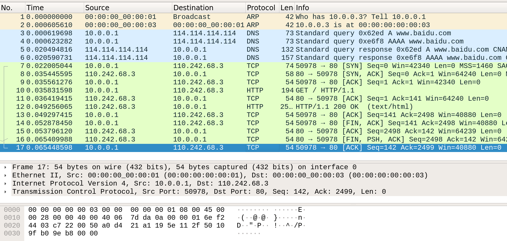
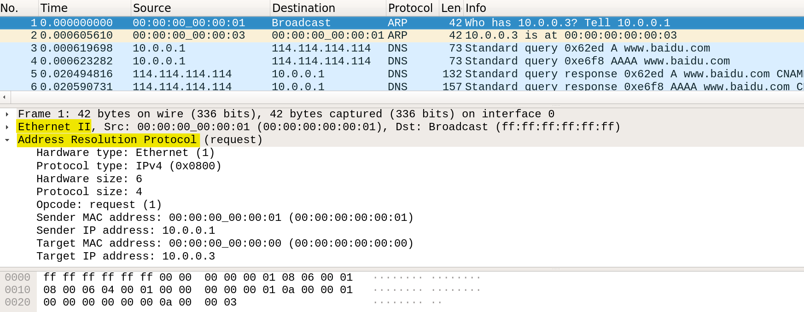
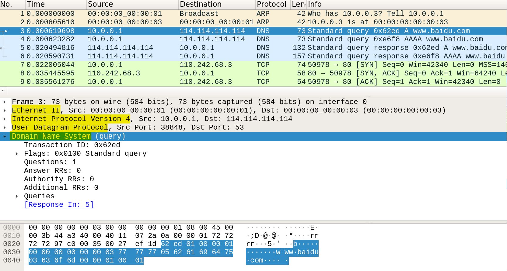
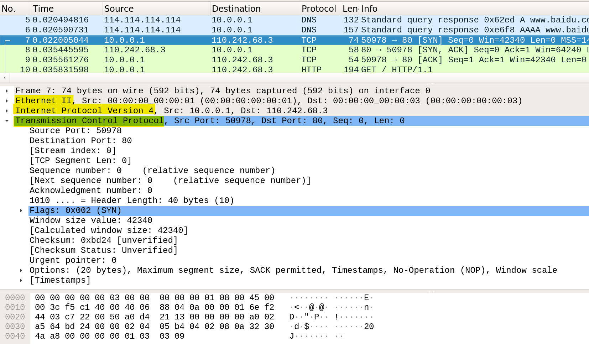
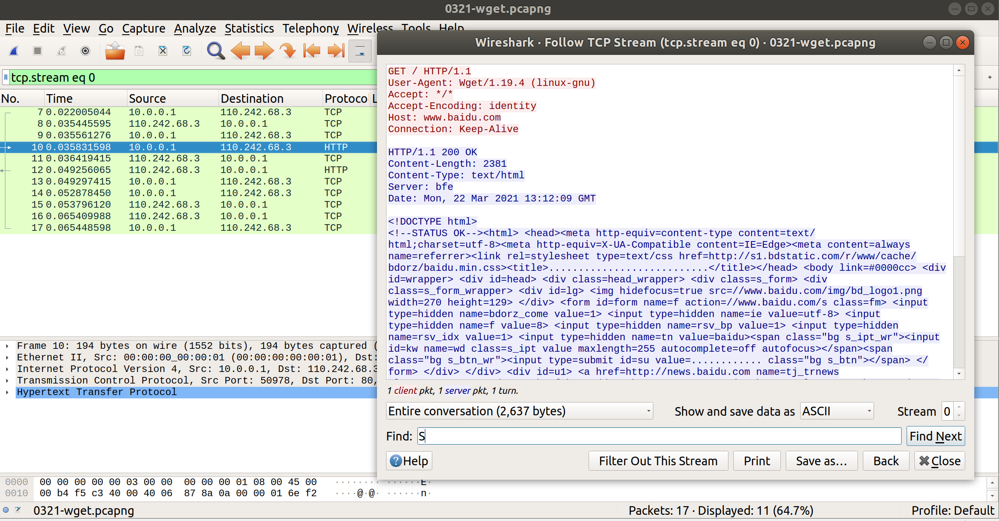
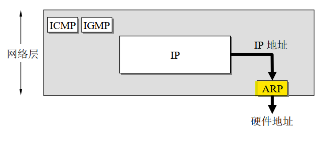

# 互联网协议实验<br/>实验报告

<!--实验报告: 模板不限, 内容包括但不限于实验题目/实验内容/实验流程/实验结果及分析-->

## 实验内容

1. 使用 `wget` 命令下载百度主页的网页文件;
2. 观察此过程中 `wireshark` 的输出;
3. 了解互联网协议的运行机制.

## 实验流程

### 搭建实验网络环境

1. 使用 `mininet` 工具搭建实验网络环境,
   - `--nat` 参数表示将该网络环境连接到互联网,
   - `--mac` 参数使节点的 mac 地址被限制为更小且更易读取的值;
2. 使用 `xterm` 打开 `h1` 节点的虚拟终端;
3. 修改 `/etc/resolv.conf` 文件, 设置 `nameserver` ,
   - 实验使用 `wget` 下载百度主页时, 需要请求域名服务器解析域名 `www.baidu.com`;
4. 打开 `wireshark` , 并将其设置为后台进程.

命令行输入如下:

```
# @bash
$ sudo mn --nat --mac
# @mininet
mininet> xterm h1     # open xterm session for h1
# @xterm(h1)
(h1) # echo "nameserver 114.114.114.114" > /etc/resolv.conf
(h1) # wireshark &
```

### 进行实验

1. 在 `h1` 节点的虚拟终端用 `wget` 命令下载百度的主页.

命令行输入如下:

```
# @xterm(h1)
(h1) # wget www.baidu.com
```

## 实验结果与分析

### `wireshark` 输出: `wget` 请求中的各种协议

调用 `mininet` 创建虚拟网络环境有 `h1` , `h2` 共两个 `host` 节点 , 且它们都与交换节点 `s1` 有链路相连.

在 `mininet` 的命令行界面中检测本地网络环境, 得到如下结果:

```
mininet> nodes
available nodes are:
h1 h2 nat0 s1

mininet> dump
<Host h1: h1-eth0:10.0.0.1 pid=2404>
<Host h2: h2-eth0:10.0.0.2 pid=2406>
<NAT nat0: nat0-eth0:10.0.0.3 pid=2446>
<OVSBridge s1: lo:127.0.0.1,s1-eth1:None,s1-eth2:None,s1-eth3:None pid=2411>
```

结合通过 `ifconfig` 得到的信息, 可以给出下表:

<div style="text-align:center; font-size:9pt"><br>
    表 1&nbsp;&nbsp;虚拟网络环境中的节点信息
</div>

| Nodes    | IP Address | Mac Address       |
| -------- | ---------- | ----------------- |
| Host h1  | 10.0.0.1   | 00:00:00:00:00:01 |
| Host h2  | 10.0.0.2   | 00:00:00:00:00:02 |
| NAT nat0 | 10.0.0.3   | 00:00:00:00:00:03 |
| s1       | -          | -                 |

`wireshark` 在页面下载过程中的抓包结果如图.

<figure style="text-align:center">
    
        <figcaption style="font-size:9pt">
            图 1&nbsp;&nbsp;实验中wireshark的抓包结果
        </figcaption>
</figure>

从图 1 中可以看到, `wget` 命令执行后, `wireshark` 依次抓取到了 `ARP` , `DNS` , `TCP` , `HTTP` 协议的数据包:

1. (1-2 行) 节点`h1` 通过 ARP 协议, 在局域网内广播 ARP 请求分组; 与 ARP 请求分组的 IP 地址信息匹配的节点 `nat0` , 在收到 ARP 请求分组后向节点 `h1` 发送的 ARP 响应分组, 从而使节点 `h1` 确定了节点 `h3` 的硬件地址
2. ;
3. (3-6 行) 节点 `h1` 通过 DNS 协议, 向域名服务器 `114.114.114.114` 请求将域名 `www.baidu.com` 解析为 IP 地址; 域名服务器收到并处理节点 `h1` 的请求后, 将域名 `www.baidu.com` 对应的 服务器 IP 地址 `110.242.68.3` 发送给节点 `h1`;
4. (7-17 行) 节点 `h1` 向服务器 `110.242.68.3` 发起 HTTP GET 请求; 服务器 `110.242.68.3` 向节点 `h1` 发送 HTTP 响应; 该过程中使用 TCP 连接进行可靠的数据传输.

### `wireshark` 输出: 不同层次的协议封装

ARP 协议包的封装: (在网络体系结构中的顺序自下而上, 下同) Ethernet < ARP

<figure style="text-align:center">
    
        <figcaption style="font-size :9pt">
            图 2&nbsp;&nbsp;ARP 协议包的封装
        </figcaption>
</figure>

DNS 协议包的封装: Ethernet < IP < UDP < DNS

<figure style="text-align:center">
    
        <figcaption style="font-size :9pt">
            图 3&nbsp;&nbsp;DNS 协议包的封装
        </figcaption>
</figure>

TCP 协议包的封装: Ethernet < IP < TCP

<figure style="text-align:center">
    
        <figcaption style="font-size :9pt">
            图 4&nbsp;&nbsp;TCP 协议包的封装
        </figcaption>
</figure>

承载 HTTP 协议的 TCP 协议包的封装: Ethernet < IP < TCP < HTTP

<figure style="text-align:center">
    
        <figcaption style="font-size :9pt">
            图 5&nbsp;&nbsp;承载 HTTP 协议的 TCP 协议包的封装
        </figcaption>
</figure>

### `wireshark` 输出: TCP 承载 HTTP 协议

在抓取的几种协议包中, HTTP 协议比较特殊, 它是由 TCP 协议的连接承载的. 在 `wireshark` 中使用 `Follow TCP Stream` 查看 TCP 数据流:

<figure style="text-align:center">
    
        <figcaption style="font-size :9pt">
            图 6&nbsp;&nbsp;TCP 数据流中的 HTTP GET 请求
        </figcaption>
</figure>

从图 6 可以看到, 该条 TCP 数据包的数据流中承载了 HTTP GET 请求.

### 调研: `wireshark` 抓取到的几种网络协议

<!--调研说明wireshark抓到的几种协议 ARP, DNS, TCP, HTTP-->

#### ARP 协议

TCP/IP 体系中, 网络层使用的是 IP 地址, 但在实际网络的链路上 (即数据链路层) 传输数据帧时, 必须使用该网络的硬件地址. 因此, 已知机器的 IP 地址且需要找出其相应的硬件地址是一种常见的情况. 此时就需要用到**地址解析协议** ARP (Address Resolution Protocol), 它在计算机网络体系结构中的位置是网络层 (因为解析出的硬件地址是在数据链路层使用, 也被认为可以归入数据链路层).

下图说明了 ARP 协议在网络层中的位置和作用.

<figure style="text-align:center">
    
        <figcaption style="font-size :9pt">
            图 7&nbsp;&nbsp;ARP 协议在网络层中的位置和作用
        </figcaption>
</figure>

ARP 协议通过网络地址来定位 MAC 地址, 网络地址在这里指 IP 地址; 而 MAC 地址是一个用来确认网络设备位置的地址, 它在网络中唯一地标识一个网卡.

ARP 协议的具体行为:

1. 每一台主机都设有一个 ARP cache, 用来存放局域网中各主机和路由器的 IP 地址到 硬件地址的映射表, 以便主机向局域网中其他机器发送信息时查询;
2. 如果主机 A 在给目标设备 B 发送信息时发现 ARP cache 中没有目标设备 B 的硬件地址, 则主机 A 自动运行 ARP:
   1. 主机 A 在本局域网广播发送一个 ARP 请求分组,
   2. 本局域网上的所有主机上运行的 ARP 进程都收到该 ARP 请求分组,
   3. 若某台主机 B 的 IP 地址与 ARP 请求分组中要查询的 IP 地址一致, 就收下这个 ARP 请求分组, 并向发送 ARP 请求分组的主机发送 ARP 响应分组, 响应分组中写入了主机 B 的硬件地址,
   4. 主机 A 在收到主机 B 的 ARP 响应分组后, 就在其 ARP cache 中写入主机 B 的 IP 地址到硬件地址的映射.

#### DNS 协议

日常生活中发送网络请求时, 通常使用的是容易记忆的主机名字, 如 `www.baidu.com` , 但实际上在与互联网上的某台主机通信时, 必须要知道它的 IP 地址. 因此需要**域名系统** DNS (Domain Name System) 将主机名字转换为对应的 IP 地址.

现在的 DNS 是一个联机分布式数据库系统, 并采用 C/S 方式为需要名字解析服务的主机提供服务. 互联网上分布着许多域名服务器, 他们共同完成了域名到 IP 地址的解析.

DNS 服务的基本解析过程:

1. 当某一个应用进程需要把主机名解析为 IP 地址时, 该应用进程就调用解析程序, 并成为 DNS 的一个客户, 把待解析的域名放在 DNS 请求报文中, 以 UDP 用户数据报的方式发送给本地域名服务器;
2. 本地域名服务器在查找域名后, 把对应的 IP 地址放在回答报文中返回, 应用进程获得目的主机的 IP 地址后即可进行通信;
3. 若本地域名服务器不能回答该请求, 则此域名服务器就暂时成为 DNS 中的另一个客
   户, 并向其他域名服务器发出查询请求; 这种过程直至找到能够回答该请求的域名服务器为止.

#### TCP 协议

**传输控制协议** TCP (Transmission Control Protocol) 是 TCP/IP 体系中位于运输层的一个非常复杂的协议, 下面列出了它的主要特点:

1. TCP 是面向连接的协议: 应用程序在使用 TCP 协议之前, 需要先建立 TCP 连接 (通过 "三次握手" ) , 在数据传送完毕之后, 必须释放已经建立的 TCP 连接;
2. 单条 TCP 连接是点对点的连接, 不存在对多的 TCP 连接;
3. TCP 提供可靠交付的服务, 提供全双工通信, 且它的传输是一种面向字节流的传输 (对于被它传输的数据, 它是透明的);
4. TCP 还具有流量控制, 拥塞控制等机制.

#### HTTP 协议

**超文本传送协议** HTTP (HyperText Transfer Protocol) 是面向事务的应用层协议, 它使用 TCP 连接进行可靠的传送.

HTTP 协议本身是无连接的, 也就是说, 虽然通信的双方需要建立 TCP 连接, 但是在交换 HTTP 报文之前不需要事先建立 HTTP 连接.

另外, HTTP 协议是无状态的, 它不会记忆对客户的响应历史, 这种特性简化了服务器的设计, 使得服务器更容易支持大量并发的 HTTP 请求.

### 调研: 网络协议在 `wget` 下载过程中的运行机制

<!--调研解释h1下载baidu页面的整个过程; 几种协议的运行机制-->

本实验在 `Ubuntu 18.04` 为环境的主机中使用 `mininet` 工具创建了虚拟网络环境, 并通过 NAT 模式接入 Internet. NAT 模式可以看作虚拟网络环境将 `Ubuntu` 主机作为路由器, 从而连接到 Internet.

#### 确定同一局域网内设备的硬件地址: ARP 协议

虚拟网络环境通过 NAT 模式连接到 Internet 需要借助 NAT 节点 `nat0` , 因此, 在使用 `wget` 下载时, 主机 `h1` 需要知道局域网中 `nat0` 节点的硬件地址, 此过程使用了 ARP 协议.

节点 `h1` 在局域网中广播 ARP 请求分组寻找节点 `nat0` 的硬件地址, 节点 `nat0` 确认 IP 地址匹配后向节点 `h1` 发送 ARP 响应分组, 从而使节点 `h1` 确定了节点 `nat0` 网络地址与硬件地址之间的对应.

#### 名字解析: DNS 协议

节点 `h1` 与 `www.baidu.com` 通信时需要知道这个主机名字对应的 IP 地址, 为此, 它需要借助 DNS 进行名字解析.

虚拟网络环境中的节点 `h1` 通过 DNS 协议, 向域名服务器 `114.114.114.114` 请求将域名 `www.baidu.com` 解析为 IP 地址; 域名服务器收到并处理节点 `h1` 的请求后, 将域名 `www.baidu.com` 对应的 服务器 IP 地址 `110.242.68.3` 发送给节点 `h1`.

DNS 请求报文采用了 UDP 用户数据报的方式, 目的是减小开销.

#### 向服务器发起请求: TCP 协议与 HTTP 协议

为了下载 `www.baidu.com` 的主页内容, 节点 `h1` 需要与服务器 `110.242.68.3` 通信并发送 HTTP 请求.

节点 `h1` 向服务器 `110.242.68.3` 发起 HTTP GET 请求; 服务器 `110.242.68.3` 向节点 `h1` 发送 HTTP 响应; 具体过程如下表:

<div style="text-align:center; font-size:9pt"><br>
    表 2&nbsp;&nbsp;节点与服务器的 TCP 和 HTTP 交互
</div>

| 序号 | 方向 | 协议 | 内容                    | Seq  | Ack  |
| ---- | ---- | ---- | ----------------------- | ---- | ---- |
| 7    | S->C | TCP  | `h1` 发送 SYN           | 0    | -    |
| 8    | C->S | TCP  | 服务器发送 SYN/ACK      | 0    | 1    |
| 9    | S->C | TCP  | `h1` 发送 ACK           | 1    | 1    |
| 10   | S->C | HTTP | `h1` 发送 HTTP GET 请求 | -    | -    |
| 11   | C->S | TCP  | 服务器发送 ACK          | 1    | 141  |
| 12   | C->S | HTTP | 服务器发送 HTTP 响应    | -    | -    |
| 13   | S->C | TCP  | `h1` 发送 ACK           | 141  | 2498 |
| 14   | S->C | TCP  | `h1` 发送 FIN/ACK       | 141  | 2498 |
| 15   | C->S | TCP  | 服务器发送 ACK          | 2498 | 142  |
| 16   | C->S | TCP  | 服务器发送 FIN/PSH/ACK  | 2498 | 142  |
| 17   | S->C | TCP  | `h1` 发送 ACK           | 142  | 2499 |

关于表格内容的说明:

1. "**方向**" 一列的 'C' 和 'S' 分别表示 "服务器" 和 "节点 `h1`" ;
2. TCP 连接的建立经过 "三次握手", 即序号为 7, 8, 9 的三行;
3. TCP 连接的拆除经过 "四次挥手", 即序号为 14, 15, 16, 17 的四行;
4. 序号为 9, 10, 11, 12 的四行进行的是 HTTP 数据传输过程;
5. 主机和服务器交换 HTTP 报文的过程中均使用 TCP 而非 UDP, 目的是确保数据传输的可靠性.

## 参考资料

1. [Mininet Walkthrough - Mininet](http://mininet.org/walkthrough/)
2. 谢希仁.计算机网络(第七版)
3. [地址解析协议 - 维基百科, 自由的百科全书](https://zh.wikipedia.org/wiki/地址解析协议)
