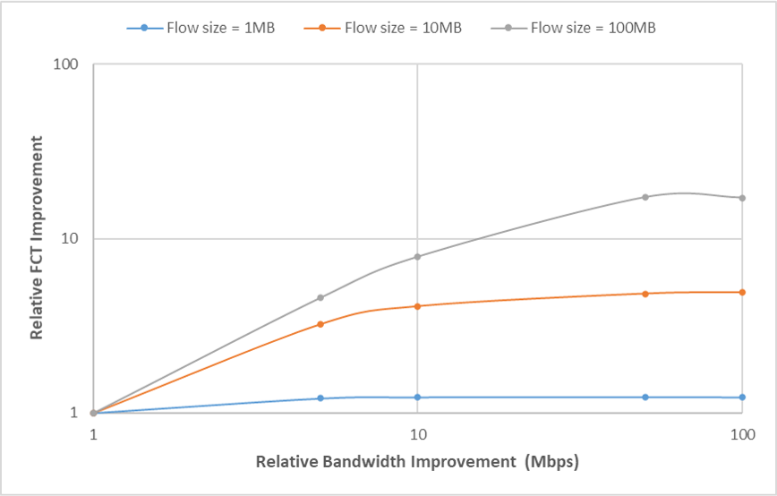

# 流完成时间实验<br/>实验报告

<!--实验报告：模板不限，内容包括但不限于实验题目、实验内容、实验流程、实验结果及分析-->

## 实验内容

1. 利用 `fct_exp.py` 脚本复现关于流完成时间提升与带宽提升的关系图;
2. 调研解释图中的现象.

## 实验流程

在给定的带宽. 延迟和文件大小的前提下进行以下实验:

1. 按需要修改 `fct_exp.py` 中的参数 `bw` 和 `delay` , 并用该脚本搭建实验网络环境;
2. 在节点 `h2` 创建指定大小的文件;
3. 在节点 `h1` 使用 `wget` 命令从节点 `h2` 下载刚刚创建的文件;
4. 记录流完成时间.

命令行输入依次为 (假设带宽 = 10 MB/s, 延迟 = 10 ms, 文件大小 = 1MB) :

```
# @bash
$ sudo python fct_exp.py
# @mininet
mininet> xterm h1 h2
# @h2
(h2) # dd if=/dev/zero of=1MB.dat bs=1M count=1
# @h1
(h1) # wget http://10.0.0.2/1MB.dat
```

## 实验结果与分析

### 查看不同条件下的流完成时间

变化带宽 (10 Mbps/ 100 Mbps/ 1 Gbps) , 延迟 (10 ms/ 100 ms) 及文件大小 (1 MB/ 10 MB/ 100 MB) , 每一个条件组合进行 5 次实验, 分别记录流完成的平均速率. 取 5 次实验流完成平均速率的均值, 并用文件大小和流完成速率均值计算平均流完成时间.

在不同的延迟条件下, 变化文件大小和带宽, 得到下面的两份表格; 基于本次实验的步骤, 下文中 "文件大小" 和 "流大小" 两词混用.

<div style="text-align:center; font-size:9pt"><br>
    表 1&nbsp;&nbsp;流完成时间与带宽和流大小的关系 (延迟 = 10ms)
</div>

| Flow Size (MB) | BandWidth (Mbps) | Average FCT (s) |
| -------------- | ---------------- | --------------- |
| 1              | 10               | 0.887           |
| 1              | 50               | 0.258           |
| 1              | 100              | 0.175           |
| 1              | 500              | 0.132           |
| 1              | 1000             | 0.133           |
| 10             | 10               | 8.818           |
| 10             | 50               | 1.939           |
| 10             | 100              | 1.076           |
| 10             | 500              | 0.466           |
| 10             | 1000             | 0.423           |
| 100            | 10               | 87.873          |
| 100            | 50               | 18.109          |
| 100            | 100              | 9.948           |
| 100            | 500              | 3.757           |
| 100            | 1000             | 3.687           |

<div style="text-align:center; font-size:9pt"><br>
    表 2&nbsp;&nbsp;流完成时间与带宽和流大小的关系 (延迟 = 100ms)
</div>

| Flow Size (MB) | BandWidth (Mbps) | Average FCT (s) |
| -------------- | ---------------- | --------------- |
| 1              | 10               | 1.469           |
| 1              | 50               | 1.211           |
| 1              | 100              | 1.191           |
| 1              | 500              | 1.189           |
| 1              | 1000             | 1.191           |
| 10             | 10               | 9.434           |
| 10             | 50               | 2.929           |
| 10             | 100              | 2.305           |
| 10             | 500              | 1.954           |
| 10             | 1000             | 1.918           |
| 100            | 10               | 88.496          |
| 100            | 50               | 19.357          |
| 100            | 100              | 11.236          |
| 100            | 500              | 5.133           |
| 100            | 1000             | 5.155           |

比较两张表格上的数据, 可以初步得出以下结论:

1. 文件大小和带宽大小相同时, 延迟越高, 流完成时间越长;
2. 延迟和文件大小相同时, 带宽越大, 流完成时间越短;
3. 延迟和带宽大小相同时, 文件越大, 流完成时间越长;

### 复现关于流完成时间的实验结果

依据实验要求, 选择表 2 中的数据作为原始数据, 进行进一步处理. 利用 "Average FCT" 列的数据, 计算每一条实验记录相对于带宽为 10 Mbps 情形的 FCT 相对提升 (Relative FCT Improvement) , 得到下表:

<div style="text-align:center; font-size:9pt"><br>
    表 3&nbsp;&nbsp;流完成时间提升与带宽和流大小的关系 (延迟 = 100ms)
</div>

| Flow Size (MB) | BandWidth (Mbps) | Relative FCT Improvement |
| -------------- | ---------------- | ------------------------ |
| 1              | 10               | 1.0000                   |
| 1              | 50               | 1.2136                   |
| 1              | 100              | 1.2336                   |
| 1              | 500              | 1.2360                   |
| 1              | 1000             | 1.2336                   |
| 10             | 10               | 1.0000                   |
| 10             | 50               | 3.2208                   |
| 10             | 100              | 4.09245                  |
| 10             | 500              | 4.8283                   |
| 10             | 1000             | 4.9189                   |
| 100            | 10               | 1.0000                   |
| 100            | 50               | 4.5717                   |
| 100            | 100              | 7.8761                   |
| 100            | 500              | 17.2389                  |
| 100            | 1000             | 17.1681                  |

依数据作图, 使用对数坐标:

<figure style="text-align:center">
    
        <figcaption style="font-size :9pt">
            图 1&nbsp;&nbsp;FCT 提升与带宽提升的关系
        </figcaption>
</figure>
图中横坐标为带宽, 单位为 Mbps; 纵坐标为 FCT 提升率.

从图中可以看到, 对于给定大小的文件, 增加带宽一般可以提高流传输速率, 从而缩短流完成时间. 然而, 随着带宽的变化, FCT 提升并非线性变化, 当带宽逐渐增大, FCT 提升逐渐放缓.

此外, 在带宽较大时, FCT 提升率基本稳定在一个范围内, 所以上图中每一个数据系列的最后两个数据点在误差范围内仍符合以上结论.

### 调研: 流完成时间与流大小/带宽/延迟的关系

慢启动 (slow-start) 算法和拥塞避免 (congestion avoidance) 算法都是 TCP 传输中使用的拥塞控制方法之一, 它们在此次实验里进行的 TCP 传输中表现如下:

1. 当主机开始发送数据时, 由小到大逐渐增大拥塞窗口 `cwnd` ;
2. (慢启动算法) 在拥塞窗口 `cwnd` 到达慢开始门限 `ssthresh` 之前, 每经过一个传输轮次, 就将拥塞窗口加倍;
3. (拥塞控制算法) 当拥塞窗口 `cwnd` 超过 `ssthresh` 之前, 停止使用慢启动算法, 改用拥塞控制算法, 每经过一个往返时间 RTT, 就将拥塞窗口 +1 (而不是加倍);
4. ...

慢启动算法既保证了传输的效率, 又避免了大量数据的突发性传输造成网络拥塞.

分析产生图中实验结果的原因:

1. "100 MB 文件实验组较之其他实验组, 带宽较小时 FCT 提升被限制": 带宽较小时, 拥塞窗口很容易就到达慢开始门限, 因此平均传输速率不大, FCT 提升有限;
2. "FCT 提升并非随带宽增加线性增长, 且最终趋于平缓": 由于采用慢启动算法, 到达最大传输速率的时间相对于总传输时间是一个不可忽视的量, 因此传输速率无法随带宽增加而线性增长, 最终趋于平缓正是因为慢启动算法下传输速率提升的时间较长, 甚至接近于文件的传输时间.

## 参考资料

1. 谢希仁.计算机网络(第七版)
