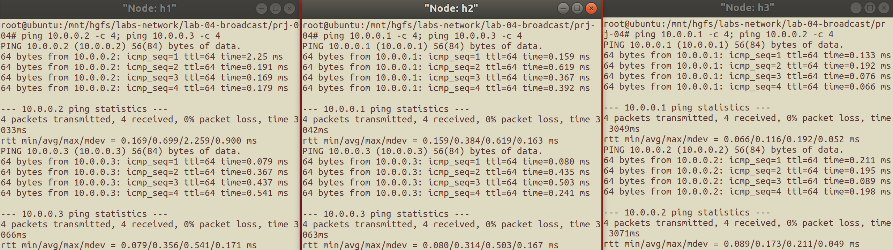
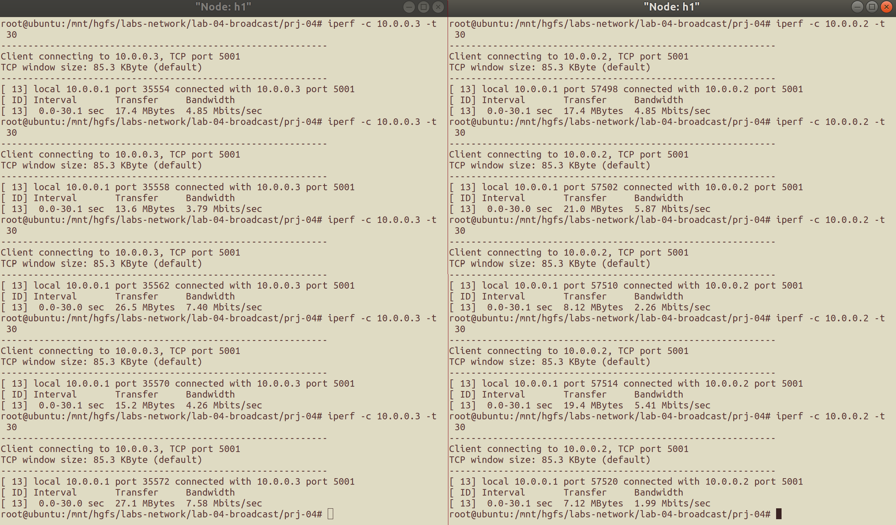
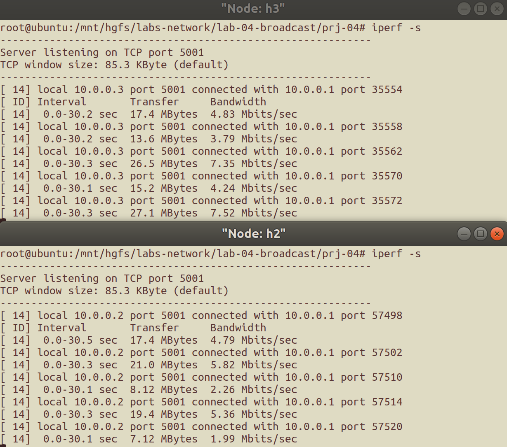
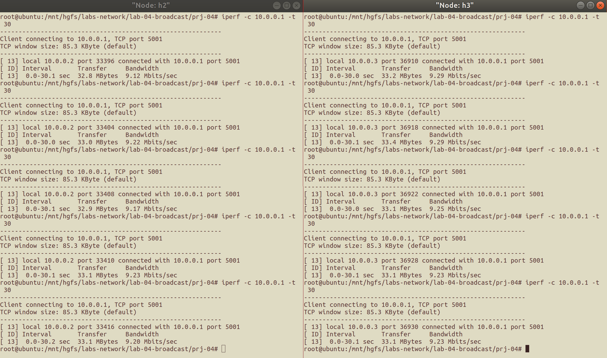
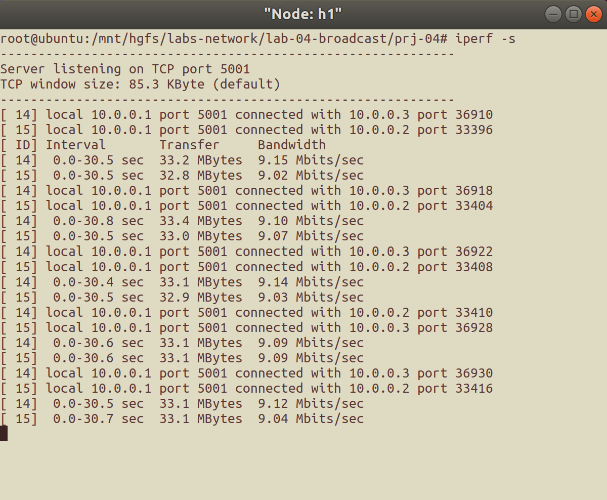
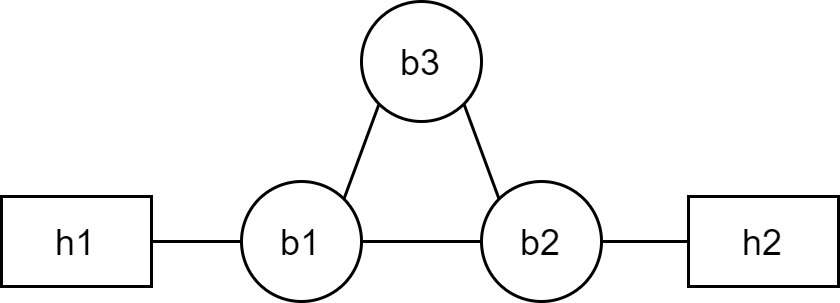
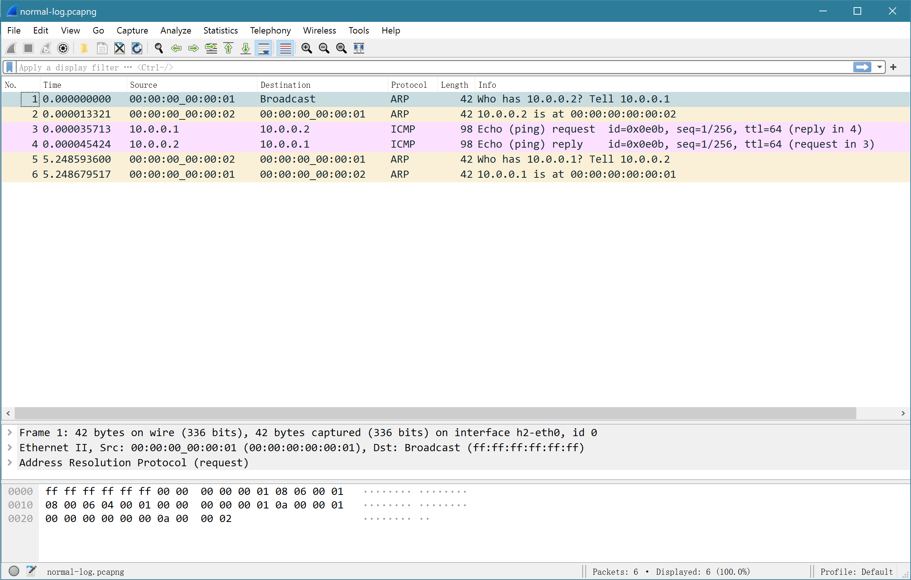
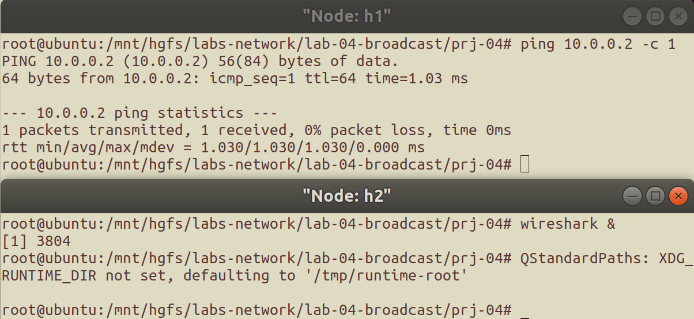
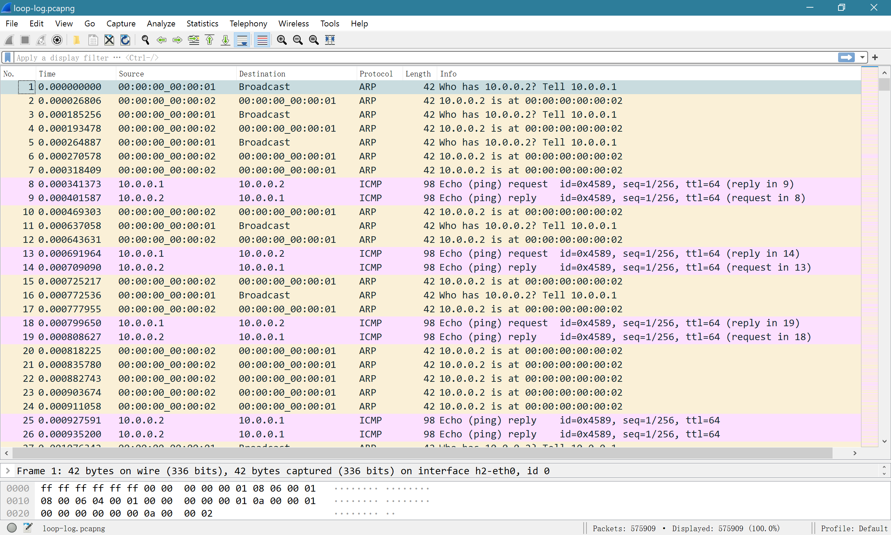

# 广播网络实验<br/>实验报告

<!--实验报告：模板不限, 内容包括但不限于实验题目、实验内容、实验流程、实验结果及分析-->

## 实验内容

1. 实现节点广播的 `broadcast_packet` 函数;
2. 从一个端节点 `ping` 另一个端节点, 验证广播网络能够正常运行;
3. 在 `three_nodes_bw.py` 搭建的虚拟网络环境中进行 `iperf` 测量, 验证广播网络的效率: (对比以下两种场景)
   - `h1` 为 Client, `h2` 和 `h3` 为 Server;
   - `h1` 为 Server, `h2` 和 `h3` 为 Client;
4. 自己动手构建环形拓扑, 验证该拓扑下节点广播会产生数据包环路.

## 实验流程

### 实现节点广播函数并验证

节点广播函数 `broadca_packet` 在 `hub` 节点上运行, 对于当前接收到的消息, 它遍历全局的节点链表, 并向当前接收消息的端口[^1]之外的所有节点转发消息.

[^1]: 即消息发送方对应链路的端口

具体函数实现中, 参考 `list.h` 中的链表实现, 采用宏定义 `list_for_each_entry` 实现链表的顺序遍历:

```c
void broadcast_packet(iface_info_t *iface, const char *packet, int len)
{
    // 暂存当前循环中的节点
    iface_info_t *iface_node;
    // for 循环遍历
    list_for_each_entry(iface_node, &instance->iface_list, list){
        if (iface_node != iface) // 当前节点非发送方节点, 则转发消息
            iface_send_packet(iface_node, packet, len);
    }
}
```

`make` 编译得到 `hub` ; 使用 `three_nodes_bw.py` 搭建网络环境, 在节点 `b1` 上运行 `hub` 程序, 在节点 `h1`, `h2`, `h3` 上两两互相 `ping` 对方, 结果如下, 可知广播网络能正常运行:

<figure style="text-align:center">
    
    <figcaption style="font-size:9pt">
        图 1 &nbsp;&nbsp; 广播网络运行验证结果
    </figcaption>
</figure>

### 验证广播网络的效率

在广播网络的 "Client-Server 对" 上验证广播网络的效率:

1. Server 端使用命令 `iperf -s` ;
2. Client 端使用命令 `iperf -c <server ip> -t 30` .

下面展示测量结果, 数据处理/分析见 "实验分析" .

#### 以 `h1` 为 Client, `h2` 和 `h3` 为 Server

该场景下的测量结果如图 2, 图 3 所示.

图 2 左为 `h1` 向 `h3` 发包时的命令行输出, 右为 `h1` 向 `h2` 发包时的命令行输出:

<figure style="text-align:center">
    
    <figcaption style="font-size:9pt">
        图 2 &nbsp;&nbsp; iperf 测量结果 (Client 端)
    </figcaption>
</figure>

图 3 上为 `h3` 收包时的命令行输出, 下为 `h2` 收包时的命令行输出:

<figure style="text-align:center">
    
    <figcaption style="font-size:9pt">
        图 3 &nbsp;&nbsp; iperf 测量结果 (Server 端)
    </figcaption>
</figure>

#### `h2` 和 `h3`为 Client, `h1` 为 Server

该场景下的测量结果如图 4, 图 5 所示.

图 4 左为 `h2` 向 `h1` 发包时的命令行输出, 右为 `h3` 向 `h1` 发包时的命令行输出:

<figure style="text-align:center">
    
    <figcaption style="font-size:9pt">
        图 4 &nbsp;&nbsp; iperf 测量结果 2 (Client 端)
    </figcaption>
</figure>

图 5 为 `h1` 收包时的命令行输出:

<figure style="text-align:center">
    
    <figcaption style="font-size:9pt">
        图 5 &nbsp;&nbsp; iperf 测量结果 2 (Server 端)
    </figcaption>
</figure>

### 构建环形拓扑, 复现数据包环路

#### 网络拓扑脚本改写

仿照 `three_nodes_bw.py` 修改得到 `loop_nodes_bw.py` 脚本, 关键修改如下:

```python
class BroadcastTopo(Topo):
    def build(self):
        h1 = self.addHost('h1', mac='00:00:00:00:00:01')
        h2 = self.addHost('h2', mac='00:00:00:00:00:02')
        b1 = self.addHost('b1', mac='00:00:00:00:00:b1')
        b2 = self.addHost('b2', mac='00:00:00:00:00:b2')
        b3 = self.addHost('b3', mac='00:00:00:00:00:b3')

        self.addLink(h1, b1, bw=20)
        self.addLink(b1, b2, bw=20)
        self.addLink(b2, b3, bw=20)
        self.addLink(b3, b1, bw=20)
        self.addLink(b2, h2, bw=20)


if __name__ == '__main__':
    # ...
    h1, h2, b1, b2, b3 = net.get('h1', 'h2', 'b1', 'b2', 'b3')
    h1.cmd('ifconfig h1-eth0 10.0.0.1/8')
    h2.cmd('ifconfig h2-eth0 10.0.0.2/8')
    clearIP(b1)
    clearIP(b2)
    clearIP(b3)
    # ...
```

此外, 在 `addHost` 的参数中指定 `mac` 地址, 以使 `wireshark` 抓包结果更明显.

该脚本构建的网络拓扑如下:

<figure style="text-align:center">
    
    <figcaption style="font-size:9pt">
        图 6 &nbsp;&nbsp; 使用 loop_nodes_bw.py 脚本构建的网络拓扑示意图
    </figcaption>
</figure>

#### 对照组 (无环路网络拓扑)

首先测试在无环路的网络拓扑中 `ping` 命令的抓包结果:

1. 使用 `loop_nodes_bw.py` 脚本构建虚拟网络环境;
2. 在 `b1`, `b2` 节点上启动 `hub` 程序, **`b3` 节点不做操作**;
3. 从 `h1` 节点用 `ping 10.0.0.2 -c 1` 向 `h2` 发包.

得到的抓包结果:

<figure style="text-align:center">
    
    <figcaption style="font-size:9pt">
        图 7 &nbsp;&nbsp; 无环路的网络拓扑中的 ping 命令抓包结果
    </figcaption>
</figure>

#### 实验组 (复现数据包环路)

1. 使用 `loop_nodes_bw.py` 脚本构建虚拟网络环境;
2. 在 `b1`, `b2`, `b3` 节点上启动 `hub` 程序;
3. 从 `h1` 节点用 `ping 10.0.0.2 -c 1` 向 `h2` 发包:

<figure style="text-align:center">
    
    <figcaption style="font-size:9pt">
        图 8 &nbsp;&nbsp; 复现数据包环路的命令行输入
    </figcaption>
</figure>

得到的结果:

<figure style="text-align:center">
    
    <figcaption style="font-size:9pt">
        图 9 &nbsp;&nbsp; 含环路的网络拓扑中的 ping 命令抓包结果
    </figcaption>
</figure>

从图 9 中可以看到, 在有环路的网络中, 广播会不断地转发, 包会一直存在于链路上, 从而造成通信资源的浪费.

## 实验结果与分析

### 广播网络的效率

根据以上实验记录, 计算得到以下的带宽测量结果:

<div style="text-align:center; font-size:9pt"><br>
    表 1 &nbsp;&nbsp; 带宽测量结果 (h1 为 Client, h2 和 h3 为 Server)
</div>

|      主机节点       | 平均带宽 (Mbps) |
| :-----------------: | :-------------: |
|        `h2`         |      4.044      |
|        `h3`         |      5.546      |
| `h1` (send to `h2`) |      4.076      |
| `h1` (send to `h3`) |      5.576      |
|     `h1` (sum)      |      9.652      |

<div style="text-align:center; font-size:9pt"><br>
    表 2 &nbsp;&nbsp; 带宽测量结果 (h1 为 Server, h2 和 h3 为 Client)
</div>

|       主机节点        | 平均带宽 (Mbps) |
| :-------------------: | :-------------: |
|         `h2`          |      9.188      |
|         `h3`          |      9.258      |
| `h1` (recv from `h2`) |      9.050      |
| `h1` (recv from `h3`) |      9.120      |
|      `h1` (sum)       |     18.170      |

进而可以得知两种情形下的链路利用效率情况, 如下:

<div style="text-align:center; font-size:9pt"><br>
    表 3 &nbsp;&nbsp; 链路利用效率 (h1 为 Client, h2 和 h3 为 Server)
</div>

|  链路   | 链路利用效率 |
| :-----: | :----------: |
| `h1-b1` |    48.26%    |
| `h2-b1` |    40.44%    |
| `h3-b1` |    55.46%    |

<div style="text-align:center; font-size:9pt"><br>
    表 4 &nbsp;&nbsp; 链路利用效率 (h1 为 Server, h2 和 h3 为 Client)
</div>

|  链路   | 链路利用效率 |
| :-----: | :----------: |
| `h1-b1` |    90.85%    |
| `h2-b1` |    91.88%    |
| `h3-b1` |    92.58%    |

可以看出, `h1` 为 Server 时的链路利用效率高于 `h1` 为 Client 时的链路利用效率, 比例约为 $2:1$. 这个现象的产生与该网络拓扑是广播网络有关:

1. 当 `h1` 为 Client 时, 它向 `h2` 和 `h3` 分别使用 `iperf` 发包, 但本实验实现的广播网络 hub 会向除当前接收消息的端口外的所有端口转发信息, 因此实际上 `h1` 向 `h2` 和 `h3` 均发送了双份的数据包, 又由于 `h2-b1` 和 `h3-b1` 的链路带宽被限制在 10 Mbps, 因此 `h1` 的总发包带宽不能超过 10 Mbps ,而非 `h1-b1` 链路的带宽上限 20 Mbps;
2. 当 `h1` 为 Server 时, `h1` 的收包带宽上限是 20 Mbps, 而 `h2` 和 `h3` 的发包带宽上限之和刚好是 20 Mbps, 并且带宽是双向的, `h2` 和 `h3` 接收对方的包不会影响它们各自的发包带宽, 因此此时 `h1` 的收包带宽不会受到来自广播网络特性的影响.

可以看到, 该实验实现的广播网络, 对于任何消息都会向除了消息发送方外的所有端口发送消息, 而实际应用中很多消息都是点对点发送的, 因此广播网络中的链路利用效率实际上并不高, 链路的通信资源有很大程度的浪费.

此外, 所有链路的实际带宽都明显未达到带宽上限, 这与 TCP 慢启动机制和 Hub 节点的处理时间等因素有关系.

### 数据包环路的产生

为了分析数据包环路的产生, 首先分析在 `h1` 进行 `ping 10.0.0.2 -c 1` 操作时, `ping` 数据包在链路上的流动:

1. `h1` 向链路发送 1 个 `ping` request, `b1` 收到了这个 `ping` request, 并转发给了 `b2` 和 `b3`;
2. `b2` 将这个 request 转发给了 `b3` 和目标节点 `h2`, `b3` 将这个 request 转发给了 `b2` 和 `b1`;
   - 因此 `b2` 一共收到了 2 次 request, 它一共向 `h2` 发送了 2 次 request, 向 `b1` 发送了 1 次来自 `b3` 的 request, 向 `b3` 发送了 1 次来自 `b1` 的 request;
3. 接下来 `h1` 收到了 2 个 `ping` reply, `b1` 收到了 2 个 `ping` request 包, 它向 `h1` 发送了 2 个(无响应), 向 `b2` 和 `b3` 各发送了一个, 然后这些 request 又被转发到了 `h2` ,`h2` 继续发送着 `ping` reply...

因为该广播网络的特性, `ping` request 包会一直不断地被 3 个 hub 节点转发, 并且形成环路, 同时 request 会被不断地转发到 `h2` 节点, 而 `h2` 节点又会不断地发送 `ping` reply, 这就是数据包环路和它带来的极大的通信资源浪费.

从上面的推理可以看出, 链路中的 `ping` reply 数量要远远多于 `ping` request. 用 python 脚本统计了 8.26 s 内在 `h2` 节点抓包的结果, 如下:

```
552    times: 'Who has 10.0.0.2? Tell 10.0.0.1'
164    times: 'Who has 10.0.0.1? Tell 10.0.0.2'
77585  times: '10.0.0.2 is at 00:00:00:00:00:02'
11030  times: '10.0.0.1 is at 00:00:00:00:00:01'
555    times: 'Echo (request) ...'
79130  times: 'Echo (reply) ...'
0      times: (other info)
```

统计结果验证了推断, 佐证了前面对 `ping` 数据包在链路上流动情况的分析.

## 实验反思

在验证广播网络的效率时, 本来希望在 Client 端使用脚本 `measure.sh` 进行多次测量, 从而方便处理, 脚本内容如下:

```sh
#!/bin/bash

number=0
while [ "$number" -lt 5 ]; do
  echo "Number = $number"
  iperf -c $1 -t 30
  number=$((number + 1))
done

```

实际实验中发现, 不论是使用脚本执行命令还是使用 `;` 连接多条命令, Server 端都会出现 ID 为 `[SUM]` 字样的结果, 且会出现与正常结果相差较大的结果.

查阅资料后猜想, 这可能是因为用 `;` 连接多条命令/使用脚本测量都会造成命令直接间隔过短, 使 `iperf` 程序将收包误判为多线程并发的任务. 如果测试任务被判定为多线程, 带宽测试就可能受到线程调度等因素的影响. 查阅 `iperf` 的文档, 并没有找到足够好的替代方式, 因此, 为了不影响实验的准确性, 仍然使用手动单步执行的方案完成实验.

写完实验报告以后又尝试了一下, 发现只要在脚本里加入 `sleep <time>` 语句, 让两次 `iperf -c <host> -t 30` 命令之间间隔适当长度的时间, 即可避免这种误判. 今后写测试脚本的时候也需要仔细关注实验程序依赖的特性, 编写合适的脚本.

## 参考资料

1. [How do you use iPerf? - IBM Support](https://www.ibm.com/support/pages/how-do-you-use-iperf)
