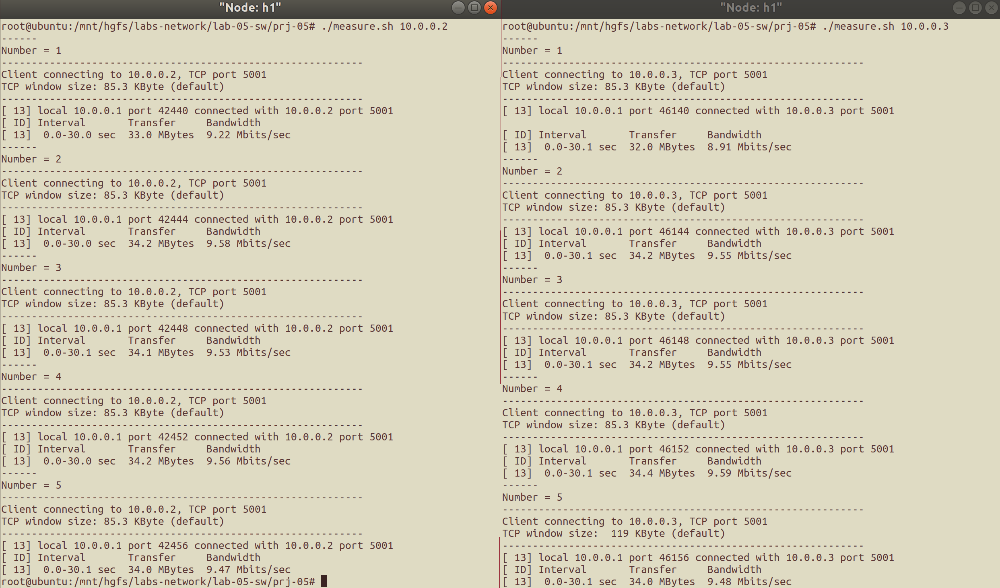
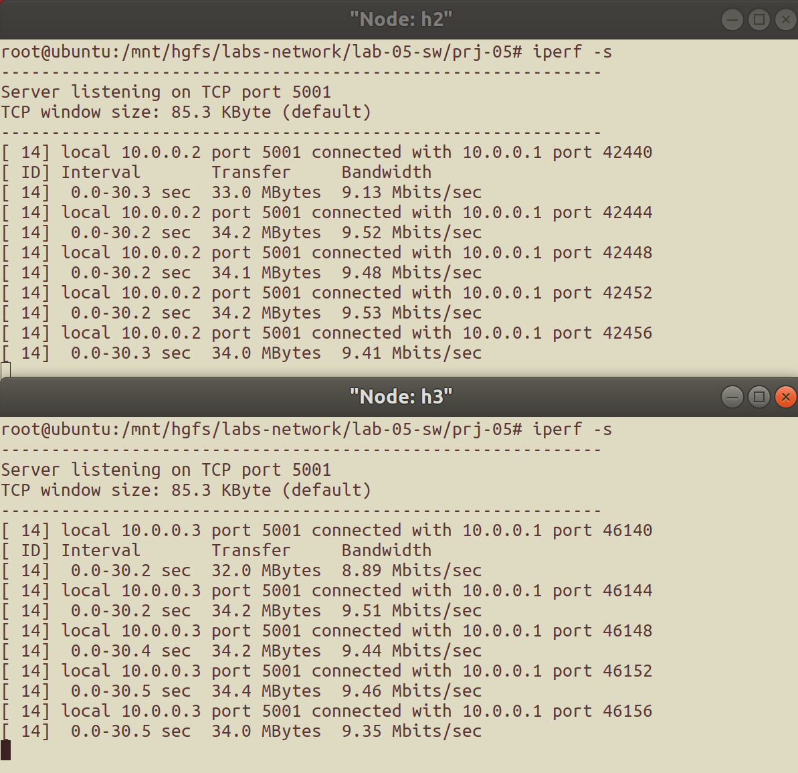
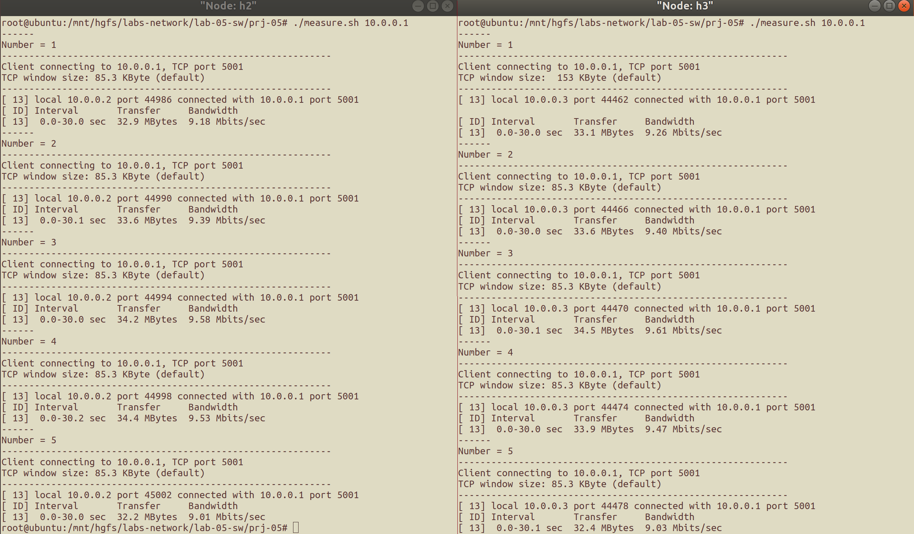
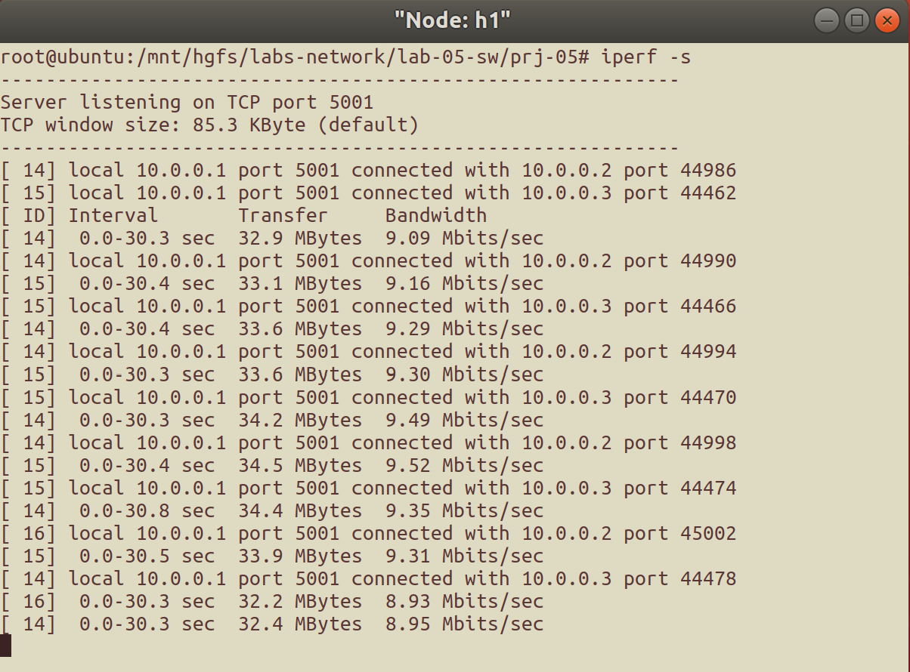
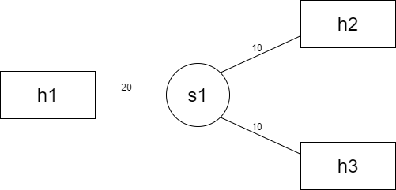

# 交换机转发实验<br/>实验报告

<!--实验报告: 模板不限, 内容包括但不限于实验题目/实验内容/实验流程/实验结果及分析-->

## 实验内容

1. 补充实现 `switch` 程序:
   - 交换机转发表的维护: 实现对转发表的查/增/删操作 (位于数据结构 `mac_port_map` 中) ;
   - 交换机转发/广播行为: 实现数据包的转发和广播操作;
2. 使用 `iperf` 和给定的拓扑进行实验, 对比交换机转发与集线器广播的性能.

## 实验流程

### 维护交换机转发表

相较于使用集线器 (hub) 的广播网络, 使用交换机 (switch) 的网络通过维护交换机转发表减少不必要的广播, 以减少不必要的通信资源浪费.

交换机维护转发表的过程中, 主要有以下 3 种基本操作:

1. 查询操作: 在转发表种查询数据包目的 MAC 地址对应的转发条目;
2. 插入操作: 根据转发条目存在与否, 选择更新条目的访问时间 (条目存在), 或增加新的条目 (条目不存在);
3. 老化操作: 每秒遍历一次转发表, 删除超过 30 秒未访问的转发条目.

#### 转发表的数据结构

从头文件中可知转发表的数据结构, 各部分如下:

```c
typedef struct {
	struct list_head hash_table[HASH_8BITS]; // 转发表主体
	pthread_mutex_t lock;                    // 互斥锁
	pthread_t thread;                        // 线程标识符
} mac_port_map_t;
```

其中, 转发表主体是一个 `list_head` 类型的数组, 数组的每个元素都是一个链表头, 对于某个哈希值, 所有同一哈希值的转发表条目都存储在同一个链表中, 因此在查找/插入/删除条目时需要先根据 MAC 地址计算得到哈希值来判断对哪一个链表进行操作.

#### 同步机制

为了正常实现网络的功能, 对转发表的操作采用互斥锁作为同步机制, 以保证对转发表的操作不会引起混乱.

实际的实验中, 对转发表进行操作的函数都遵守如下的格式:

```c
// 操作函数示例
ret_t foo_func(param, ...){
  // 获取互斥锁: 进入临界区
  pthread_mutex_lock(&mac_port_map.lock);

  // 计算哈希值, 得到链表头
  u8 hash_val = hash8(mac, ETH_ALEN);
  struct list_head *head;
  head = &(mac_port_map.hash_table[hash_val]);
  // foo...

  // 释放互斥锁: 退出临界区
  pthread_mutex_unlock(&mac_port_map.lock);
}
```

#### 查询操作

<!-- ! 代码的注解都还没写, 别忘了啊 kora -->

查询操作由 `lookup_port` 函数实现.

得到应操作的链表头之后, 遍历这个列表, 查询是否有与传入的硬件地址相同的条目:

- 如果查询命中, 则返回该条目对应的端口信息 `iface_found` (类型为 `iface_info_t` );
- 如果查询不命中, 则返回 `NULL`.

代码实现如下:

```c
// lookup the mac address in mac_port table
iface_info_t *lookup_port(u8 mac[ETH_ALEN]) {
  // 获取互斥锁: 进入临界区
  pthread_mutex_lock(&mac_port_map.lock);

  // 计算哈希值, 得到链表头
  u8 hash_val = hash8(mac, ETH_ALEN);
  struct list_head *head;
  head = &(mac_port_map.hash_table[hash_val]);

  // 查询转发表中是否存在与传入的硬件地址对应的条目
  mac_port_entry_t *pos;
  iface_info_t *iface_found;
  iface_found = NULL;
  list_for_each_entry(pos, head, list) { // 遍历链表
    if (strcmp((char *)(pos->mac), (char *)mac) == 0) {
      iface_found = pos->iface; break; // 查询命中, 中断遍历
    }
  }

  // 释放互斥锁: 退出临界区
  pthread_mutex_unlock(&mac_port_map.lock);
  // 返回找到的条目对应的 iface, 条目不存在则返回 NULL
  return iface_found;
}
```

#### 插入操作

插入操作由 `insert_mac_port` 函数实现. 该函数在转发表内更新数据包目的硬件地址对应的条目.

遍历机制与之前相同. 为了简洁起见, 将以下两种情况合一处理:

- 硬件地址对应条目已在转发表中: 将该条目的末次访问时间 `visited` 设为当前时间;
- 硬件地址对应条目未在转发表中: 插入对应的 "端口-硬件地址" 条目.

代码实现如下:

```c
// insert the mac -> iface mapping into mac_port table
void insert_mac_port(u8 mac[ETH_ALEN], iface_info_t *iface) {
  // 获取互斥锁: 进入临界区
  pthread_mutex_lock(&mac_port_map.lock);

  // 计算哈希值, 得到链表头
  u8 hash_val = hash8(mac, ETH_ALEN);
  struct list_head *head;
  head = &(mac_port_map.hash_table[hash_val]);

  // 遍历链表
  mac_port_entry_t *pos, *q;
  list_for_each_entry_safe(pos, q, head, list) {
    if (strcmp((char *)pos->mac, (char *)mac) == 0) {
      pos->visited = time(NULL);
      pthread_mutex_unlock(&mac_port_map.lock);
      return; // 查询命中: 更新后退出
    }
  }
  // 查询不命中, 将对应条目插入转发表
  pos = (mac_port_entry_t *)malloc(sizeof(mac_port_entry_t));
  strcpy((char *)(pos->mac), (char *)mac);
  pos->iface = iface;
  pos->visited = time(NULL);

  list_add_tail(&pos->list, head);

  // 释放互斥锁: 退出临界区
  pthread_mutex_unlock(&mac_port_map.lock);
}
```

#### 老化操作

老化操作由 `sweep_aged_mac_port_entry` 函数实现. 该函数每秒钟被调用一次, 用以清理转发表中超过 30 s 未访问的条目.

遍历机制与之前相同. 在遍历过程中, 一旦发现一个条目的上次访问时间 `visited` 与当前时间相差 30 s 以上, 则立刻删除该条目.

当前时间使用 `time(NULL)` 获取.

代码实现如下:

```c
// sweeping mac_port table, remove the entry which has not been
// visited in the last 30 seconds.
int sweep_aged_mac_port_entry() {
  // 获取互斥锁: 进入临界区
  pthread_mutex_lock(&mac_port_map.lock);
  // 获取当前时间
  time_t now = time(NULL);

  // 利用链表头数组, 遍历所有的链表
  for (int i = 0; i < HASH_8BITS; i++) {
    // 循环体内容: 遍历当前链表
    struct list_head *head;
    head = &mac_port_map.hash_table[i];
    mac_port_entry_t *pos, *q;
    list_for_each_entry_safe(pos, q, head, list) {
      if (now - pos->visited > MAC_PORT_TIMEOUT) { // > 30 s
        list_delete_entry(&pos->list); free(pos);  // 删除条目
      }
    }
  }

  // 释放互斥锁: 退出临界区
  pthread_mutex_unlock(&mac_port_map.lock);
  return 0;
}
```

### 基于转发表的交换机行为

<!-- 广播函数: 复用 -->

交换机使用 `handle_packet` 函数处理数据包. 该函数调用 `insert_mac_port` 函数进行转发表的更新, 调用 `lookup_port` 函数查询转发表, 并根据查询情况判断使用广播或单播.

代码实现如下:

```c
// handle packet
// 1. if the dest mac address is found in mac_port table, forward it; otherwise,
// broadcast it.
// 2. put the src mac -> iface mapping into mac hash table.
void handle_packet(iface_info_t *iface, char *packet, int len) {
  struct ether_header *eh = (struct ether_header *)packet;
  log(DEBUG, "the dst mac address is " ETHER_STRING ".\n",
      ETHER_FMT(eh->ether_dhost));

  // 查询(更新)源 MAC 地址转发表条目
  insert_mac_port(eh->ether_shost, iface);
  // 查找目的 MAC 地址转发表条目
  iface_info_t *dest = lookup_port(eh->ether_dhost);

  if (!dest) // 转发表内无硬件地址记录, 广播
    broadcast_packet(iface, packet, len);
  else       // 转发表内有硬件地址记录, 单播
    iface_send_packet(dest, packet, len);

  free(packet);
}
```

### 测试: 交换机 (switch) vs 集线器 (hub)

在广播网络的 "Client-Server 对" 上验证广播网络的效率:

1. Server 端使用命令 `iperf -s` ;
2. Client 端借助脚本 `measure.sh` 多次执行命令 `iperf -c <server ip> -t 30` 以获得均值.

下面展示测量结果, 数据处理/分析见 "实验分析" .

#### 以 `h1` 为 Client, `h2` 和 `h3` 为 Server

该场景下的测量结果如图 2, 图 3 所示.

图 2 左为 `h1` 向 `h2` 发包时的命令行输出, 右为 `h1` 向 `h3` 发包时的命令行输出:

<figure style="text-align:center">
    
    <figcaption style="font-size:9pt">
        图 2 &nbsp;&nbsp; iperf 测量结果 (Client 端)
    </figcaption>
</figure>

图 3 上为 `h3` 收包时的命令行输出, 下为 `h2` 收包时的命令行输出:

<figure style="text-align:center">
    
    <figcaption style="font-size:9pt">
        图 3 &nbsp;&nbsp; iperf 测量结果 (Server 端)
    </figcaption>
</figure>

#### 以 `h2` 和 `h3`为 Client, `h1` 为 Server

该场景下的测量结果如图 4, 图 5 所示.

图 4 左为 `h2` 向 `h1` 发包时的命令行输出, 右为 `h3` 向 `h1` 发包时的命令行输出:

<figure style="text-align:center">
    
    <figcaption style="font-size:9pt">
        图 4 &nbsp;&nbsp; iperf 测量结果 2 (Client 端)
    </figcaption>
</figure>

图 5 为 `h1` 收包时的命令行输出:

<figure style="text-align:center">
    
    <figcaption style="font-size:9pt">
        图 5 &nbsp;&nbsp; iperf 测量结果 2 (Server 端)
    </figcaption>
</figure>

## 实验结果与分析

### 数据处理

使用交换机进行实验, 并根据实验数据记录, 计算得以下的带宽测量结果:

<div style="text-align:center; font-size:9pt"><br>
    表 1 &nbsp;&nbsp; 带宽测量结果 (h1 为 Client, h2 和 h3 为 Server)
</div>

|      主机节点       | 平均带宽 (Mbps) |
| :-----------------: | :-------------: |
| `h1` (send to `h2`) |      9.472      |
| `h1` (send to `h3`) |      9.416      |
|        `h2`         |      9.414      |
|        `h3`         |      9.330      |
|     `h1` (sum)      |     18.888      |

<div style="text-align:center; font-size:9pt"><br>
    表 2 &nbsp;&nbsp; 带宽测量结果 (h1 为 Server, h2 和 h3 为 Client)
</div>

|       主机节点        | 平均带宽 (Mbps) |
| :-------------------: | :-------------: |
|         `h2`          |      9.338      |
|         `h3`          |      9.354      |
| `h1` (recv from `h2`) |      9.230      |
| `h1` (recv from `h3`) |      9.248      |
|      `h1` (sum)       |     18.478      |

### 链路利用效率: 比较与分析

整合上次实验和这次实验的测试结果, 得到相同网络拓扑下使用集线器和交换机时的链路利用效率情况, 如下:

<div style="text-align:center; font-size:9pt"><br>
    表 3 &nbsp;&nbsp; 同一网络拓扑中的链路利用效率 (h1 为 Client, h2 和 h3 为 Server)
</div>

|  链路   | 链路利用效率 (使用 Hub) | 链路利用效率 (使用 Switch) |
| :-----: | :---------------------: | :------------------------: |
| `h1-b1` |         48.26%          |           94.14%           |
| `h2-b1` |         40.44%          |           93.30%           |
| `h3-b1` |         55.46%          |           94.44%           |

<div style="text-align:center; font-size:9pt"><br>
    表 4 &nbsp;&nbsp; 链路利用效率 (h1 为 Server, h2 和 h3 为 Client)
</div>

|  链路   | 链路利用效率 (使用 Hub) | 链路利用效率 (使用 Switch) |
| :-----: | :---------------------: | :------------------------: |
| `h1-b1` |         90.85%          |           93.38%           |
| `h2-b1` |         91.88%          |           93.54%           |
| `h3-b1` |         92.58%          |           92.39%           |

从表中可以看到, 在下图所示的网络拓扑中,

1. h1 为 Server, h2 和 h3 为 Client 的情况下:

   使用集线器和交换机的网络, 链路利用效率无太大变化;

2. h1 为 Client, h2 和 h3 为 Server 的情况下:

   使用交换机的网络, 链路利用效率远远高于使用集线器的网络, 且基本能达到 "h1 为 Server, h2 和 h3 为 Client" 情形下的链路利用效率, 也就是说, 传输带宽接近带宽上限.

<figure style="text-align:center">
    
    <figcaption style="font-size:9pt">
        图 5 &nbsp;&nbsp; 网络拓扑示意图
    </figcaption>
</figure>

这主要是因为使用交换机的网络维护了一张转发表, 当它知道目的硬件地址和端口之间的对应关系时, 不需要向除接收消息的端口之外的所有端口广播消息, 只需要向一个端口发送消息, 大大节约了链路通信资源.

此外, 实验中的网络拓扑较为简单, 转发表的维护开销较小, 因而传输带宽比较接近带宽上限 (网络传输中其他协议也有开销).

## 思考题

<!-- 请将上述思考/调研结果写到实验报告中 -->

### 1.交换机在转发数据包时有两个查表操作: 根据源 MAC 地址, 根据目的 MAC 地址. 为什么在查询源 MAC 地址时更新老化时间, 而查询目的 MAC 地址时不更新呢?

> 提示:
>
> 1. 查询目的 MAC 地址时是否有必要更新;
> 2. 如果更新的话, 当一个主机从交换机的一个网口切换到了另一个网口, 会有什么问题?

<!--问了别人;; 因为没回复的话更新了也没用, 有回复的话在回复过来时候它会变成新的源而被记录?-->

#### (1) 查询源 MAC 地址时更新转发表的好处

在查询包的源 MAC 地址时, MAC 地址和消息接收端口都是已知的, 并且都是即时信息, 因此能准确地插入条目或者更新条目的访问时间.

#### (2) 查询目的 MAC 地址时不更新转发表的原因 (inspired by hint 1)

查询包的目的 MAC 地址时, 没有必要更新条目的访问时间.

根据目的 MAC 地址的主机收包后的行为, 分情况分析:

1. 如果目的主机有回复, 则此时目的主机作为回复包的源 MAC 地址, 访问时自然会被更新;
2. 如果目的主机无回复 (即没有向交换机发送回复包), 则该主机的 MAC 地址和交换机端口的对应关系无从得知, 因而也无法更新;
   - 一个不回复的目的主机, 本身也没有更新其条目的必要.

#### (3) 查询目的 MAC 地址时更新转发表会带来的问题 (inspired by hint 2)

假设在查询目的 MAC 地址时更新转发表, 如果此时目的主机从交换机的一个网口换到了另一个网口, 则这个包可能会发往错误的端口并更新访问时间, 除非该主机向交换机发包引起转发表的更新, 否则错误的 "端口-MAC 地址" 映射在老化之前会一直放在转发表中, 此时每次向该主机发包都会发向错误的端口, 从而也收不到正确的回复.

### 2. 网络中存在广播包, 即发往网内所有主机的数据包, 其目的 MAC 地址设置为全 `0xFF` , 例如 ARP 请求数据包. 这种广播包对交换机转发表逻辑有什么影响?

基本上不影响交换机转发表的逻辑.

对于一个广播包, 在发包的时候, `lookup_port` 函数一定无法在转发表中找到对应于 MAC 地址 `ff:ff:ff:ff:ff:ff` 的转发表条目. 这是因为添加转发表条目只发生在查询并更新 "源 MAC 地址-源硬件地址" 的过程中, 而全 `0xFF` 的硬件地址作为广播包的保留地址, 是不可能出现在源 MAC 地址中的. 因此, 交换机收到广播包后一定会转发, 并且它收到的对被转发消息的回复也一定是单播.

发送广播包的需求与交换机转发表 "找不到条目" 这一分支的逻辑是匹配的, 因此对交换机转发表的逻辑不会有影响.

### 3. 理论上, 足够多个交换机可以连接起全世界所有的终端. 请问, 使用这种方式连接亿万台主机是否技术可行? 并说明理由.

理论上似乎交换机是可以无限扩展的, 但实际上, 对于世界范围的网络, 只使用交换机连接亿万台主机在技术上是不现实的, 原因大致有:

1. 网络的组成: 交换机虽然有一定的扩展能力, 但是扩展的效率并不高, 如果要用交换机连接海量主机, 转发表的查找/维护开销都将会变得非常大, 同时也会占用巨大的存储空间, 严重影响效率;
2. 通路确认: 交换机数量也会影响交换机之间确定通路的时间开销: 生成树算法的时间复杂度是 $O(n\log n)$ , 并且生成树算法还是一个需要实时运行的过程, 因此若使用交换机连接亿万台主机, 确定通路的时间开销将会增加到一个不适合实际网络的程度;
3. 泛用性: 仅使用交换机, 会限制网络协议的种类; 现在的互联网实际上由许多异构的网络组成, 如 Ethernet, WiFi 等, 只使用交换机转发会大大增加处理的复杂度和适配难度, 交换机转发表可能难以实现甚至无法实现.
