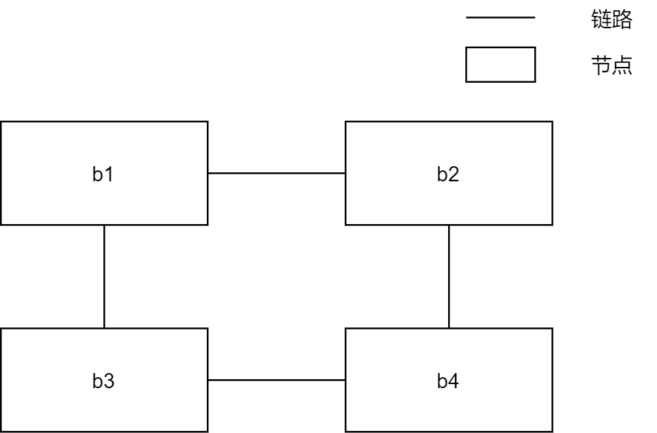
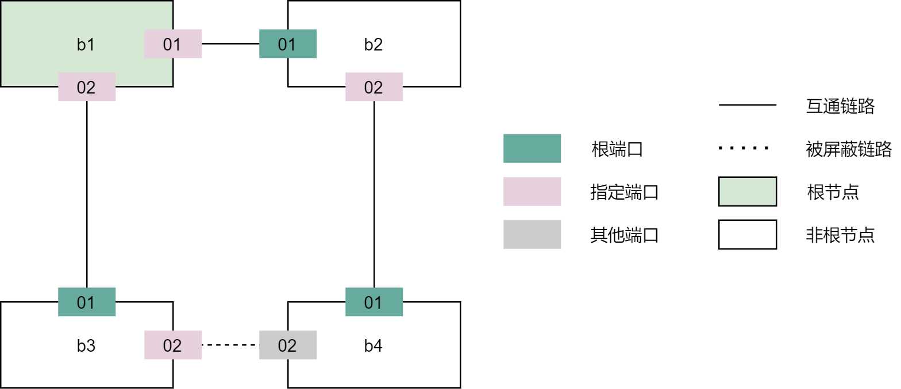
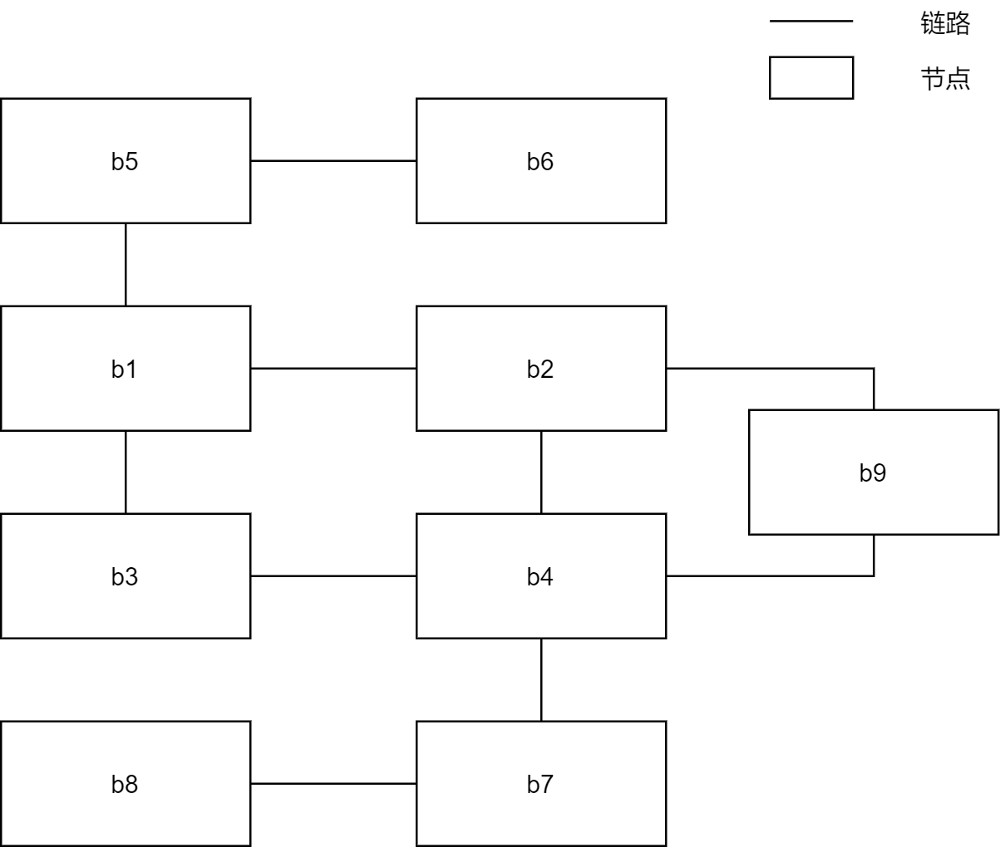
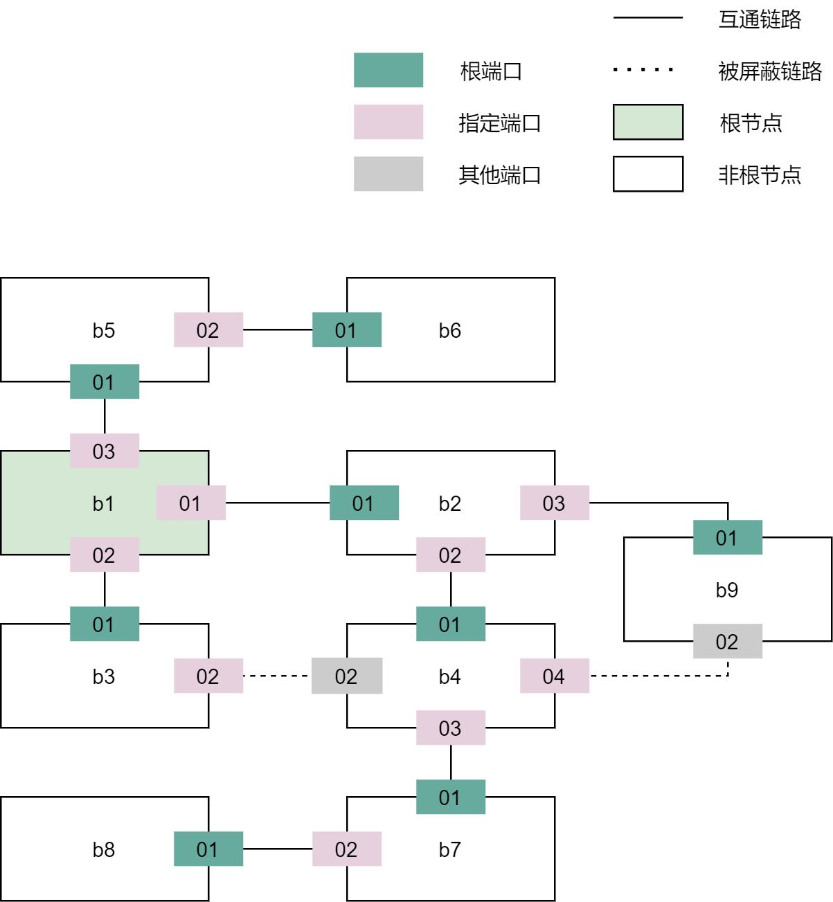
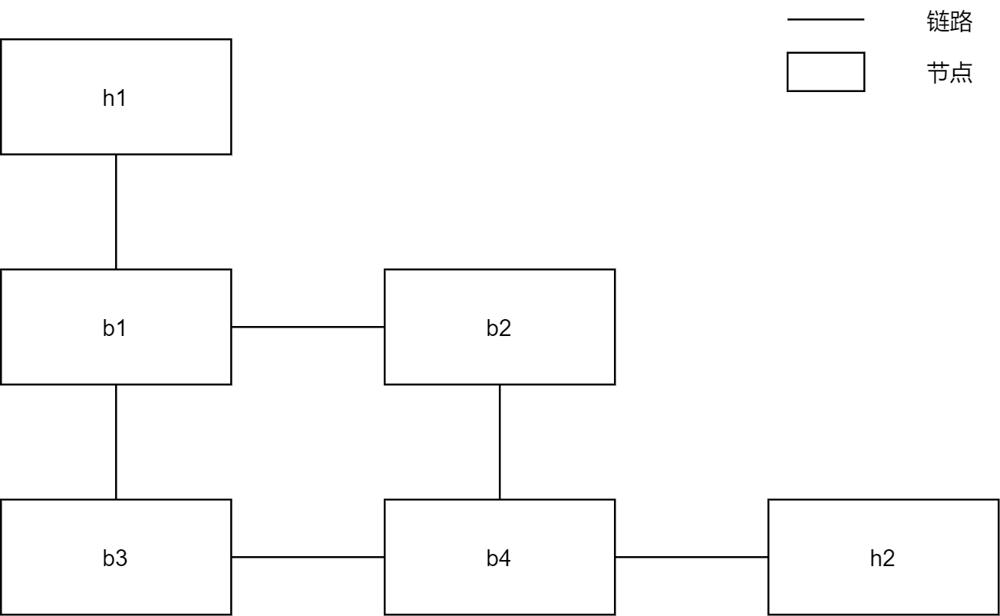
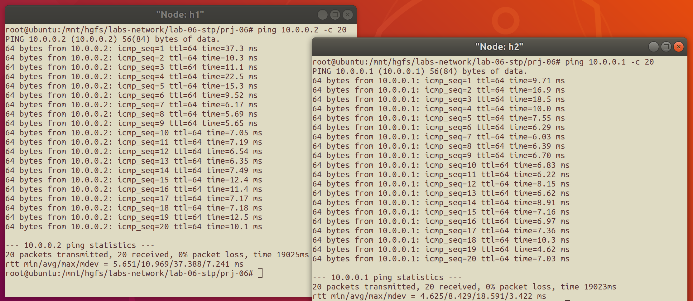
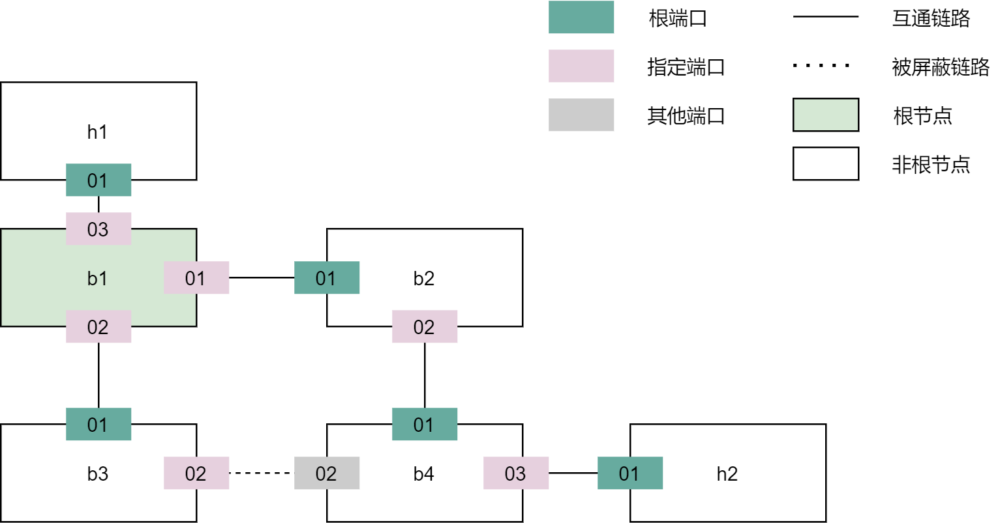
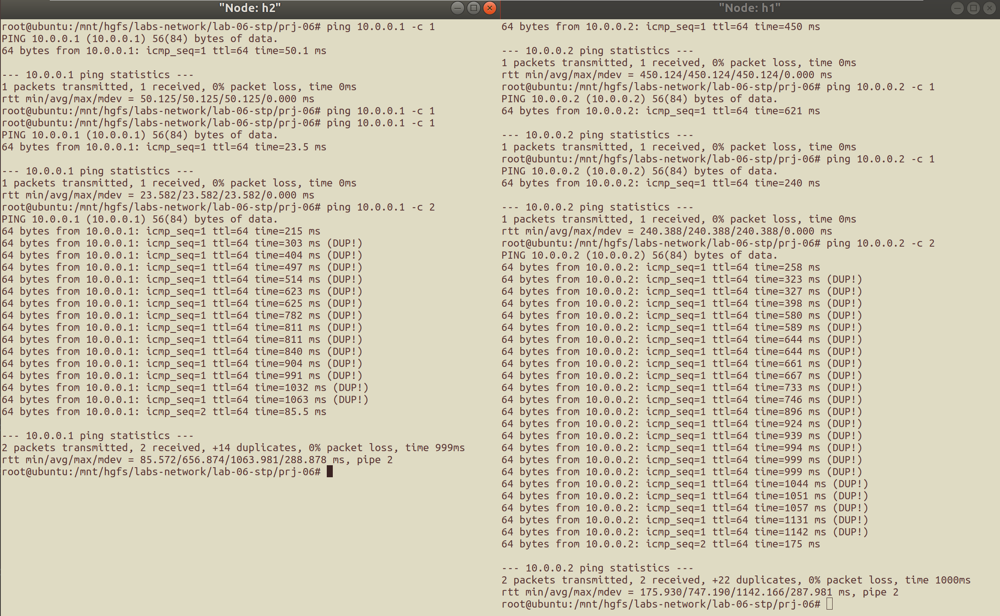

# 生成树机制实验<br/>实验报告

<!--实验报告: 模板不限, 内容包括但不限于实验题目、实验内容、实验流程、实验结果及分析-->

## 实验内容

1. 在所给实验框架内实现生成树运行机制, 并计算输出给定的四节点拓扑下的最小生成树拓扑;
2. 构造一个不少于 7 个节点, 冗余链路不少于 2 条的拓扑, 使用 `stp` 程序计算输出最小生成树拓扑;
3. 在给定的四节点拓扑基础上, 添加两个端节点, 结合上一次实验中的交换机转发代码, 尝试构建生成树之后进行转发表学习和数据包转发 (不要求稳定运行).

## 实验流程

### 完善生成树运行机制的框架

#### 工具函数

`port_config_wrt()` 函数: 将 `config` 中的信息写入 `p` .

```c
// in stp.c
static void port_config_wrt(struct stp_config *config, stp_port_t *p) {
  // write config(net) to p(host)
  p->designated_root = ntohll(config->root_id);
  p->designated_cost = ntohl(config->root_path_cost);
  p->designated_switch = ntohll(config->switch_id);
  p->designated_port = ntohs(config->port_id);
}
```

`port_cmp()` 函数: 比较端口 `p0` 和 `p1` 的优先级, 当且仅当`p1` 优先时返回 `1` .

```c
// in stp.c
u32 port_cmp(stp_port_t *p0, stp_port_t *p1) {
  if (p0->designated_root != p1->designated_root)         // 认为的根节点
    return (p0->designated_root > p1->designated_root);
  else if (p0->designated_cost != p1->designated_cost)    // 到根节点的开销
    return (p0->designated_cost > p1->designated_cost);
  else if (p0->designated_switch != p1->designated_switch)// 上一跳节点 ID
    return (p0->designated_switch > p1->designated_switch);
  else                                                    // 上一跳端口 ID
    return (p0->designated_port >= p1->designated_port);
}
```

#### `config` 消息处理逻辑

##### (1) 比较优先级: 本端口 `config` 消息 vs 收到的 `config` 消息

比较优先级使用了上述 `port_cmp()` 函数,

- 若本端口的 `config` 消息优先级更高, 则说明该网段应通过本端口连接根节点, 直接转入发 `config` 消息阶段即可;
- 若收到的 `config` 消息优先级更高, 则说明应通过对方端口连接根节点, 因此需要一系列的更新处理, 见下面的小节.

##### (2) [收到的 `config` 消息优先级更高] 更新节点信息

首先需要将本端口的 `config` 消息替换为收到的 `config` 消息, 在代码中, 把 `config` 消息中的有关信息更新到端口数据结构中即可:

```c
    port_config_wrt(config, p);
```

接着, 需要遍历端口, 更新节点状态, 得到新的根端口并更新各个端口的 `config` .

A. 选择根端口:

- 选择非指定端口中优先级最高的端口为根端口, 通过该端口连接到根结点;
- 如果不存在, 则该节点是根结点;

B. 更新端口 `config` :

- 指定端口: 更新根节点和路径开销信息;
- 非指定端口: 优先级最高的 1 个将成为指定端口.

代码实现如下:

```c
    for (int i = 0; i < stp->nports; ++i) {
      // 选择优先级最高的端口
      if (!prior_port || port_cmp(prior_port, &stp->ports[i]))
        prior_port = &stp->ports[i];
      // 选择非指定端口中优先级最高的端口
      if (!stp_port_is_designated(&stp->ports[i]))
        if (!root_port || port_cmp(root_port, &stp->ports[i]))
          root_port = &stp->ports[i];
    }

    // A. 选择根端口
    bool is_root = stp_is_root_switch(stp); // 检查原初是否根节点
    stp->root_port = root_port;
    if (root_port) { // 根端口存在 => 'root port'即为根端口
      stp->designated_root = root_port->designated_root;
      stp->root_path_cost = root_port->designated_cost + root_port->path_cost;
    } else {         // 根端口不存在 => 该节点是根节点
      stp->designated_root = stp->switch_id;
      stp->root_path_cost = 0;
    }

	// B. 更新端口 config
    for (int i = 0; i < stp->nports; ++i) {
      if (!stp_port_is_designated(&stp->ports[i]))
        continue;
      stp->ports[i].designated_root = stp->designated_root;
      stp->ports[i].designated_cost = stp->root_path_cost;
    }
```

若该节点原本是根节点, 并且此时变成了非根节点, 则停止 hello 计时器:

```c
    // if root->not root, stop timer
    if (is_root && !stp_is_root_switch(stp))
      stp_stop_timer(&stp->hello_timer);
```

最后, 同样要将消息从该节点的每个指定端口转发出去.

### 交换机转发与生成树机制的结合

将交换机转发机制和生成树机制结合起来, 首先要做的就是区分出交换机转发的数据包和生成树机制中的 config 消息.

已知生成树的 config 消息目的地址默认设为 `eth_stp_addr[]={0x01, 0x80, 0xC2, 0x00, 0x00, 0x01}`, 则可以用库函数 `memcmp()` 比较说明收到数据包的种类, 接到的包当且仅当 `memcmp()` 返回 0 时是 config 消息.

此外, 由于生成树算法只从逻辑上停止在某些链路上传递消息, 并非物理上切断, 因此发送方还是有可能向 `Alternative` 端口发送消息, 故 `Alternative` 端口收到消息时应当将其丢弃.

```c
// in main.c
void handle_packet(iface_info_t *iface, char *packet, int len) {
  ...
  // 收到的是数据包
  if (memcmp(eh->ether_dhost, eth_stp_addr, sizeof(*eth_stp_addr)) != 0) {
    // AP 收包, 则丢弃消息
    if (!stp_port_not_alt(iface->port)) return;

    // 根据目的地址选择广播/单播
    insert_mac_port(eh->ether_shost, iface);
    iface_info_t *dest = lookup_port(eh->ether_dhost);
    if (dest != NULL) {
      if (stp_port_not_alt(dest->port)) iface_send_packet(dest, packet, len);
    } else broadcast_packet(iface, packet, len);

    free(packet); return;
  }
  // 收到的是 config 消息
  ...
}
```

出于同样的理由, `Alternative` 端口也无法发送消息, 因此引入 `stp_port_not_alt()` 函数, 修改之前完成的广播函数的逻辑.

`stp_port_not_alt()` 函数当且仅当 `stp_port_t *p` 为 `Alternative` 端口时返回 0 , 其余时刻都返回 1:

```c
static bool stp_port_not_alt(stp_port_t *p) {
  return ((p->designated_switch == p->stp->switch_id && //dsg port => 1
           p->designated_port == p->port_id) ||
          (p->port_id == p->stp->root_port->port_id && // root port => 1
           p->stp->root_port));
}
```

利用 `stp_port_not_alt()` 函数判断当前端口是否被允许发送消息, 从而真正利用生成数机制的特性, 避免引起广播风暴:

```c
// in broadcast.c
void broadcast_packet(iface_info_t *iface, const char *packet, int len) {
  iface_info_t *iface_node, *q;
  list_for_each_entry_safe(iface_node, q, &instance->iface_list, list) {
    if ((iface_node != iface) && stp_port_not_alt(iface_node->port))
      iface_send_packet(iface_node, packet, len);
  }
}
```

## 实验结果与分析

### 验证: 生成树程序

#### 四节点拓扑

脚本 `four_node_ring.py` 对应的网络拓扑如下:



运行该脚本进行测试, 得到结果如下:

```txt
NODE b1 dumps:
INFO: this switch is root.
INFO: port id: 01, role: DESIGNATED.
INFO: 	designated ->root: 0101, ->switch: 0101, ->port: 01, ->cost: 0.
INFO: port id: 02, role: DESIGNATED.
INFO: 	designated ->root: 0101, ->switch: 0101, ->port: 02, ->cost: 0.

NODE b2 dumps:
INFO: non-root switch, designated root: 0101, root path cost: 1.
INFO: port id: 01, role: ROOT.
INFO: 	designated ->root: 0101, ->switch: 0101, ->port: 01, ->cost: 0.
INFO: port id: 02, role: DESIGNATED.
INFO: 	designated ->root: 0101, ->switch: 0201, ->port: 02, ->cost: 1.

NODE b3 dumps:
INFO: non-root switch, designated root: 0101, root path cost: 1.
INFO: port id: 01, role: ROOT.
INFO: 	designated ->root: 0101, ->switch: 0101, ->port: 02, ->cost: 0.
INFO: port id: 02, role: DESIGNATED.
INFO: 	designated ->root: 0101, ->switch: 0301, ->port: 02, ->cost: 1.

NODE b4 dumps:
INFO: non-root switch, designated root: 0101, root path cost: 2.
INFO: port id: 01, role: ROOT.
INFO: 	designated ->root: 0101, ->switch: 0201, ->port: 02, ->cost: 1.
INFO: port id: 02, role: ALTERNATE.
INFO: 	designated ->root: 0101, ->switch: 0301, ->port: 02, ->cost: 1.
```

据此可画出运行生成树算法之后的拓扑:


可见算法在该拓扑上正确运行.

#### 自行构建的拓扑 (9 节点)

脚本 `new_topo.py` 对应的网络拓扑如下:



运行该脚本进行测试, 根据输出, 画出运行生成树算法之后的拓扑:



可见算法在该拓扑上正确运行.

### 验证: 交换机学习转发表和生成树机制的结合

以脚本 `four_node_ring.py` 为基础编写了脚本 `six_node.py` , 它在 b1 ~ b4 上运行 stp 程序; 对应的网络拓扑如下:



运行脚本, 等待一定时间, 然后尝试在 h1 和 h2 上互相发出 ping 命令, 得到结果如下:



上图说明 h1 和 h2 可以正常互相 ping 通.

使用 dump 脚本验证得到如下的实际生成树拓扑:



两种机制结合的实现得到了验证.

## 思考题

<!-- 请将思考/调研结果写到实验报告中 -->

### 1. 调研说明标准生成树协议中, 如何处理网络拓扑变动的情况.

> (1) 当节点加入时? (2) 当节点离开时?

**总览**: 交换机监测到端口发生变化 → 通知根交换机拓扑变化情况 → 根交换机将情况扩散到整个网络. 过程中用到了三种 BPDU: TCN[^1], TCA[^2],以及 TC[^3].

1. 某台交换机检测到拓扑变化, 于是从根端口向上一跳的交换机发送 TCN;
2. 在向根交换机节点传递消息的过程中, 下游通过根端口向上游发送 TCN, 上游使用 TCA 向相邻的下游确认;
3. 根交换机收到 TCN 后, 使用 TCA 向给它发送 TCN 的交换机确认, 并向外广播, 发送 TC 位被设置的 BPDU, 最后整个广播域都将知道这一变化.

因此, 节点的加入和离开都由交换机来检测, 并且都可以归为 "拓扑变化" 归一处理.

### 2. 调研说明标准生成树协议是如何在构建生成树过程中保持网络连通的.

> 提示: 用不同的状态来标记每个端口, 不同状态下允许不同的功能 (Blocking, Listening, Learning, Forwarding 等).

标准生成树协议中, 端口有以下几种状态:

- 阻塞状态 (Blocking): 不接收或者转发数据, 接收但不发送 BPDU, 不进行地址学习;
- 侦听状态 (Listening): 不接收或者转发数据, 接收并发送 BPDU, 不进行地址学习;
- 学习状态 (Learning): 不接收或者转发数据, 接收并发送 BPDU, 开始进行地址学习;
- 转发状态 (Forwarding): **接收或者转发数据**, 接收并发送 BPDU, 进行地址学习;
- 禁用状态 (Disabled): 不接收任何数据;

从上面几条可以看到, 转发状态是唯一一个可以接收和发送用户数据的状态. 因此, 在现实生活中, 网络管理员可以通过配置端口的状态, 仅把工作线路置为转发状态, 其余通过设置合适的状态, 使它保持维护网络拓扑 (作为备份), 但不参与网络的用户数据传输 (不出现环路).

这样, 网络拓扑在具有冗余的同时, 也能规避运行中的环路, 从而保持了网络的连通.

### 3. 实验中的生成树机制效率较低, 调研说明快速生成树机制的原理.

实验中生成树机制效率较低, 标准生成树效率也不高, 因为 STP 协议 (IEEE 802.1D) 虽然能够解决环路问题, 但是收敛速度慢, 不能应付网络拓扑频繁变化的情况, 快速生成树 (RSTP, IEEE 802.1w) 协议在 STP 基础上的改进主要是为了实现网络拓扑快速收敛.

RSTP 比 STP 收敛更快, 有以下三方面的因素:

1. 提高信息时效性: BPDU 报文的发送

   1. STP 中的 BPDU 报文是对于某种变化而发送的, 并需要等待 BPDU 的老化时间, 在没有收到 BPDU 报文时, 下游的交换机并不能确定自己与上有交换机之间的链路是否发生故障;
   2. RSTP 中根交换机会每隔 hello time 就发送一次 BPDU, 非根交换机也会定时发送包含它自身信息的 BPDU (不管有没有收到 BPDU 报文), 因此下游交换机可以根据 "一段时间内未收到来自根交换机发送 BPDU" 这一信息认为自己和上游交换机的链路出现故障, 并进行老化;

2. 实现转发状态的迅速转换: 依托边缘端口和链路类型特性
   1. 边缘端口: 指直接连接终端站点的网桥端口; 被配置为边缘端口的端口可以直接跳过侦听和学习状态而进入转发状态, 节省了状态转换的时间, 从而加快了收敛速度;
   2. 链路类型: RSTP 下, 链路被分为点到点链路和共享式链路, 链路类型由端口的双工模式自动派生 (全双工=点对点, 半双工=共享); 在点对点链路下, RSTP 端口能快速转换到转发状态;
3. 鼓掌时的快速状态转换: 替代端口和备份端口
   1. 替代端口从其他网桥接收更有用的 BPDU, 并且它是阻塞的端口; 它提供了通往根网桥的替代路径, 从而可以在根端口出现故障时替换它;
   2. 备份端口从其所在的网桥接收更有用的 BPDU, 并且它是阻塞的端口; 它未同一个分段提供了冗余的连通性, 在该分段出现故障时有可能连接到根网桥作为替换.

总体而言, RSTP 通过引入更复杂的设计使得转发状态的转换更迅速也更灵活, 对故障的响应更快, 因而也更能应付更复杂多变的网络环境.

## 实验反思

在调试过程中, 曾经遇到过这样的问题:



如图所示, 将交换机转发表和生成树机制结合后, `ping` 时遇到了 `dup` 错误, 这说明交换机转发表并没有利用生成树机制的结果规避环形拓扑, 从而导致了广播风暴. 最后经排查发现是因为没有对 `Alternative` 端口的收发加以限制. 加上这部分逻辑之后, 不再触发 `dup` 错误.

出现这个错误的根本原因在于没有全面地考虑到端口的状态, 导致忽略了一些状况; 而网络编程最需要的就是考虑到每一种可能, 这样才能避免发生预期之外的行为, 保证网络系统的稳定性和可维护.

## 其他问题

此外, 在实验过程中参考了很多 PPT 中给出的现成结论, 有一些暂时还没有理解, 记录如下:

1. 收到的 `config` 消息优先级高于本端口消息优先级时需要更新节点状态, 为什么根端口应该满足 (1) **该端口是非指定端口** (2) 该端口的优先级要高于所有剩余非指定端口? (主要是第 1 条)
2. 如果一个端口为非指定端口, 且其 `config` 较网段内其他端口优先级更高, 那么该端口成为指定端口; 这是为什么呢?

## 参考资料

1. [How Spanning Tree Protocol (STP) select Root Port, Spanning Tree Root Port selection](https://www.omnisecu.com/cisco-certified-network-associate-ccna/how-spanning-tree-protocol-stp-select-root-port.php)

2. [STP 的拓扑变化机制 - 华为](https://support.huawei.com/enterprise/zh/doc/EDOC1100092149/9a3f8a78?idPath=24030814|21782164|21782167|22318564|6691579)

3. "IEEE Standard for Local and metropolitan area networks--Media Access Control (MAC) Bridges and Virtual Bridged Local Area Networks--Amendment 20: Shortest Path Bridging," in IEEE Std 802.1aq-2012 (Amendment to IEEE Std 802.1Q-2011 as amended by IEEE Std 802.1Qbe-2011, IEEE Std 802.1Qbc-2011, IEEE Std 802.1Qbb-2011, IEEE Std 802.1Qaz-2011, and IEEE Std 802.1Qbf-2011) , vol., no., pp.1-340, 29 June 2012, doi: 10.1109/IEEESTD.2012.6231597.

4. [[CCNA 图文笔记]-22-STP 生成树协议实例详解| QingSword.COM](https://www.qingsword.com/qing/636.html#CCNA-STP-14)

5. [生成树协议\_百度百科](https://baike.baidu.com/item/%E7%94%9F%E6%88%90%E6%A0%91%E5%8D%8F%E8%AE%AE/1309781?fromtitle=%E7%94%9F%E6%88%90%E6%A0%91&fromid=10284070)

6. [交换机生成树协议 - CSDN](https://blog.csdn.net/angle1020/article/details/80052062)

7. [STP 生成树协议 RSTP 快速生成树 - 博客园](https://www.cnblogs.com/centos2017/p/7896809.html)

8. [了解快速生成树协议 (802.1w) - Cisco](https://www.cisco.com/c/zh_cn/support/docs/lan-switching/spanning-tree-protocol/24062-146.html#anc3)

   <!--脚注-->

   [^1]: TCN (Topology Change Notification) , 拓扑改变通知.
   [^2]: TCA (Topology Change Acknowledgement) , 拓扑改变确认.
   [^3]: TC (Topology Change) , 拓扑改变.
