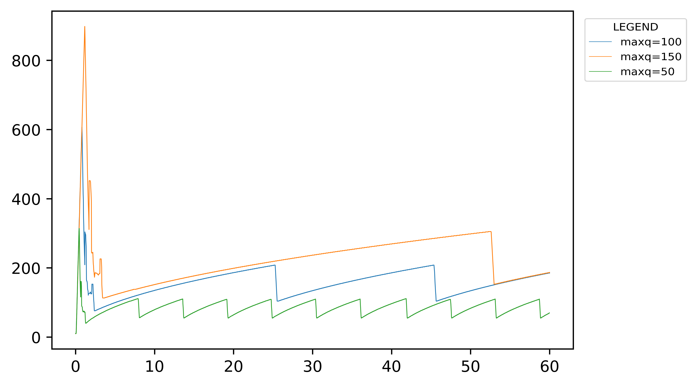
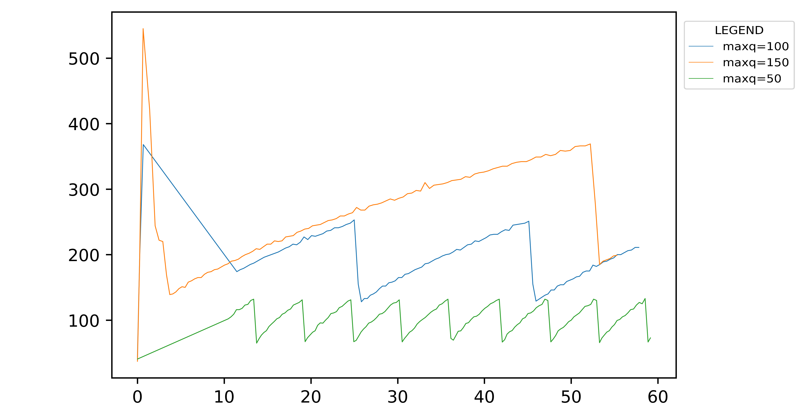
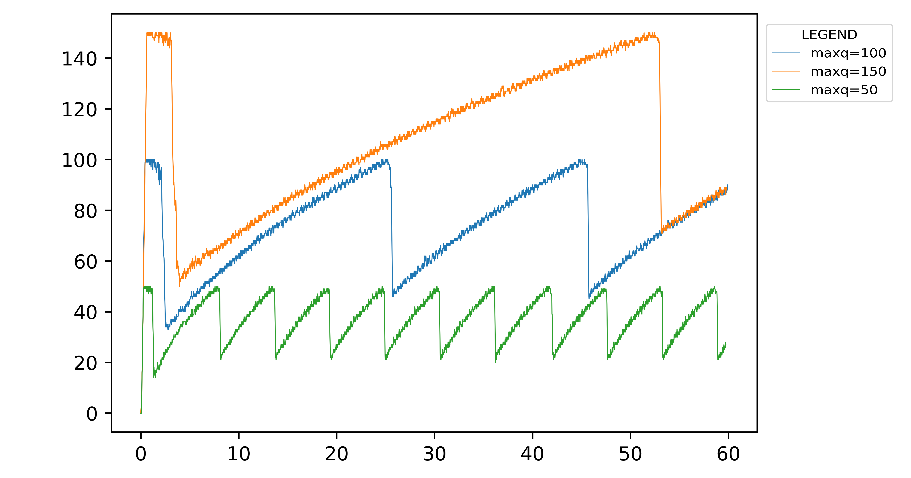
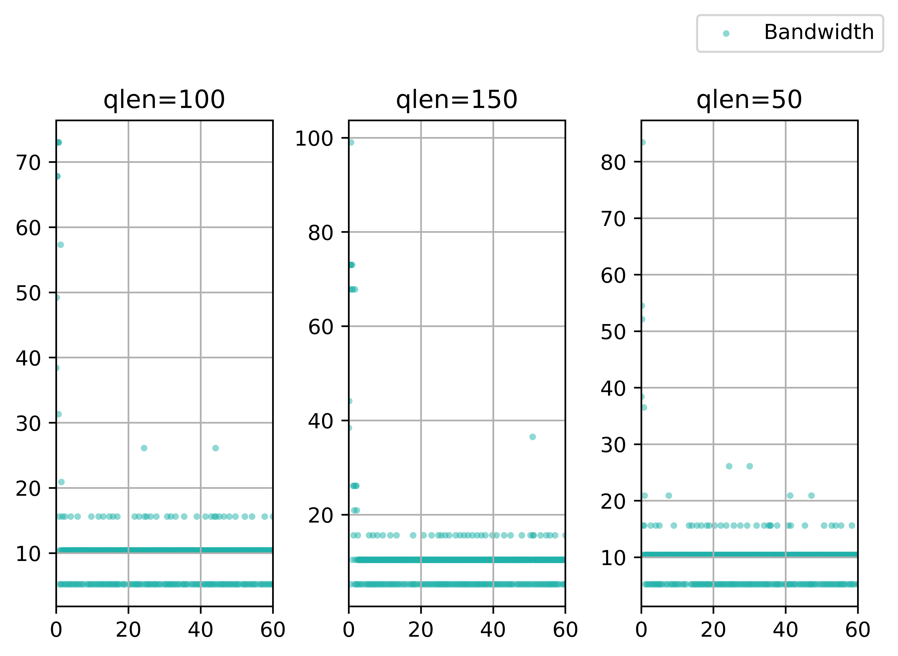
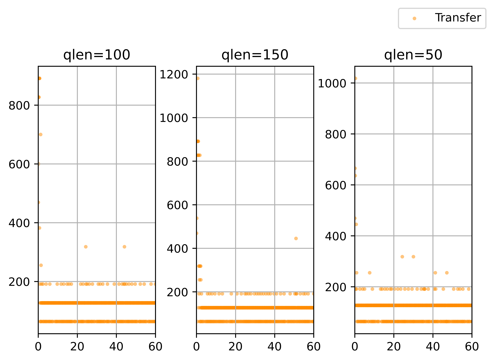
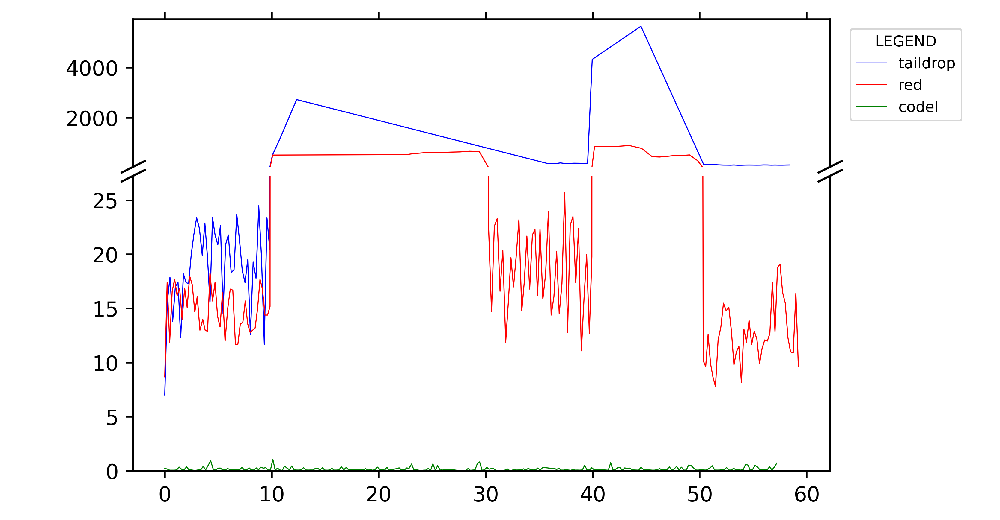
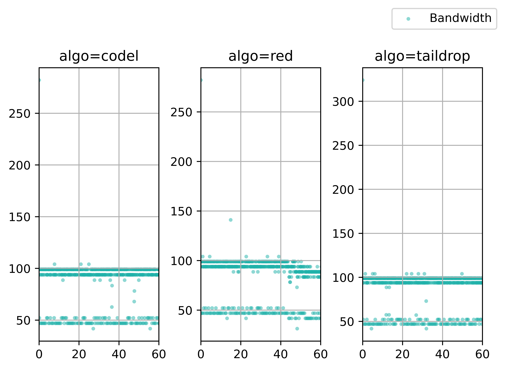
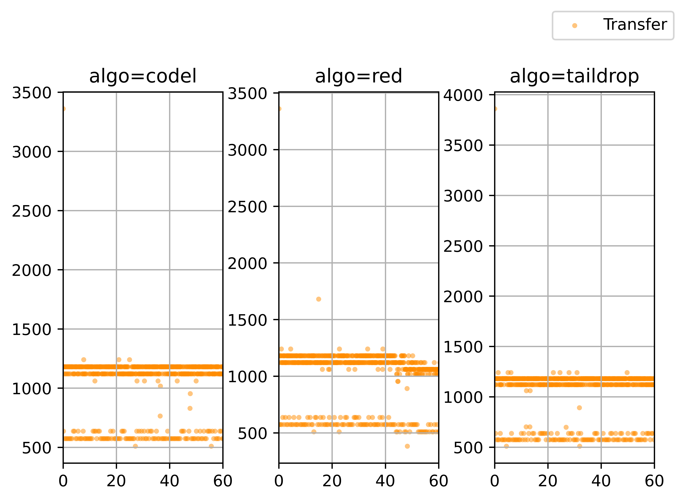
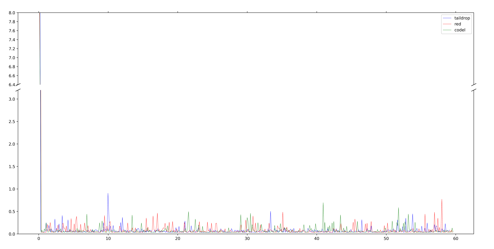

# 数据包队列管理实验 实验报告

<!--实验报告: 模板不限, 内容包括但不限于实验题目、实验内容、实验流程、实验结果及分析-->

## 实验内容

1. 复现 bufferbloat 问题, 改变 r1-eth1 的最大队列大小, 考察其对 iperf 吞吐率, 拥塞窗口值(cwnd), 队列长度(qlen) 和往返延迟(rtt) 等指标的影响;
2. 选择不同的算法解决 bufferbloat 问题, 对论文 [nichols2012] [^1] 中使用不同算法和动态带宽时测得的的 RTT 结果进行复现.

## 实验流程

> 下面提到的文件均位于 `prj-07` 这一目录下.

基于实验流程的标准化和自动化, 为两部分实验分别编写了两个脚本:

- `ex_rp.sh` : 用于复现 bufferbloat 问题, 可以传入任意数量的 maxq 选项一并进行测试;
- `ex_mt.sh` : 用于复现 bufferbloat 问题的解决, 每次执行均会测试全部三种算法下的情形.

每次脚本执行前均删除全部旧有的记录, 避免任何因 I/O 及重定向问题造成的误差. 

脚本运行时, 借助 `tee` 程序 (`tee -a` , append 模式) 留下记录, 方便数据核查.

得到实验记录文件后, 使用 python 的 re 辅助数据处理, matplotlib 作图:

- `fig_rp_single.ipynb` : 用于处理复现 bufferbloat 问题的相关数据, 并将每一组测量的不同数据都放置在单独的图表上, 方便观察单组数据的趋势;
- `fig_rp.ipynb` : 用于处理复现 bufferbloat 问题的相关数据, 并将同一数据不同 maxq 的测量结果画在同一张图上, 便于比对和分析;
- `fig_mt.ipynb` : 用于处理复现解决方案的相关数据, 并采用截断图的形式, 将 RTT 数据绘制在同一张图表上;
- `fig_ipf.ipynb` : 用于处理所有的 iperf 测试结果, 并采用子图并列的形式为 Transfer 和 Bandwidth 在 60 秒内的变化绘制图表.

## 实验结果与分析

### 复现 bufferbloat 问题

#### CWND

<!--CWND-->

<!--RTT-->

<!--qlen-->

<!--iperf 的结果-->

### 解决 bufferbloat 问题

<!--rtt的结果 -->

<!--iperf 的结果-->

## 思考题

<!-- 请将思考/调研结果写到实验报告中 -->

### 拥塞控制机制对 Bufferbloat 的影响

<!--
前文中提到，导致Bufferbloat问题的三个关键因素：队列长度，队列管理机制，和拥塞控制机制。同时，分别从上述三个角度都可以解决Bufferbloat问题。调研分析两种新型拥塞控制机制（BBR [Cardwell2016], HPCC [Li2019]），阐述其是如何解决Bufferbloat问题的。
-->

## 实验反思

在复现解决 bufferbloat 问题的实验中, 有时候会遇到类似于下面这样的图,  RTT 表现和预期相去甚远:

并且, 如果不使用 gnome shell 而是外部 ssh 连接的 shell, 发生这种情况的概率就会非常大.

对于此问题, 具体原因尚不清楚, 不过或许跟 ssh 协议以及 mininet 的网络模拟环境特性有关.

## 参考资料

<!--脚注-->

[^1]: K. Nichols et al., Controlling Queue Delay, ACM Queue 2012.