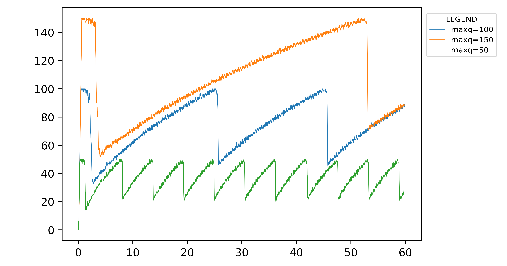
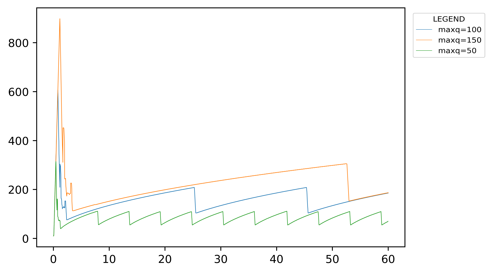
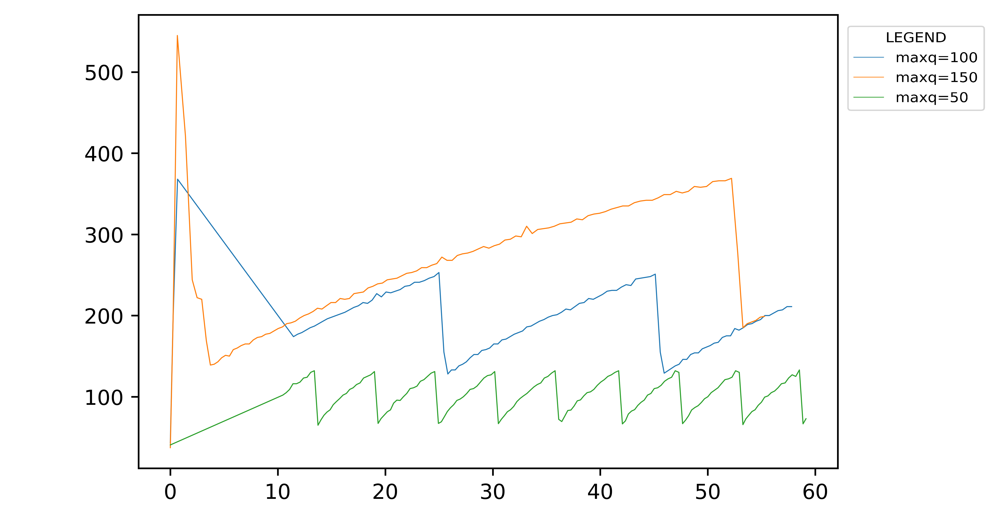
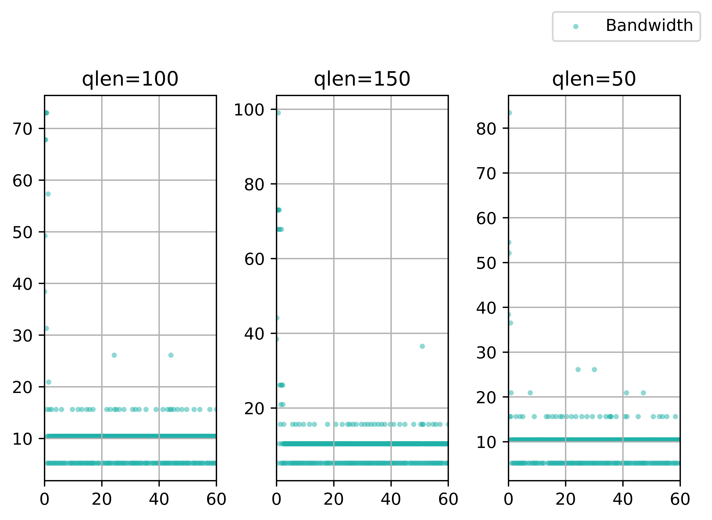
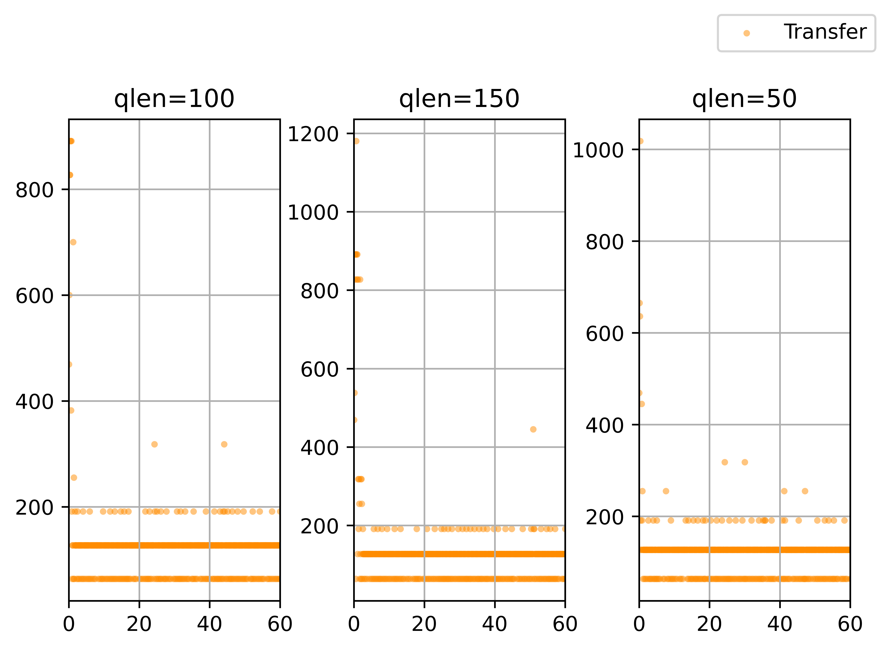
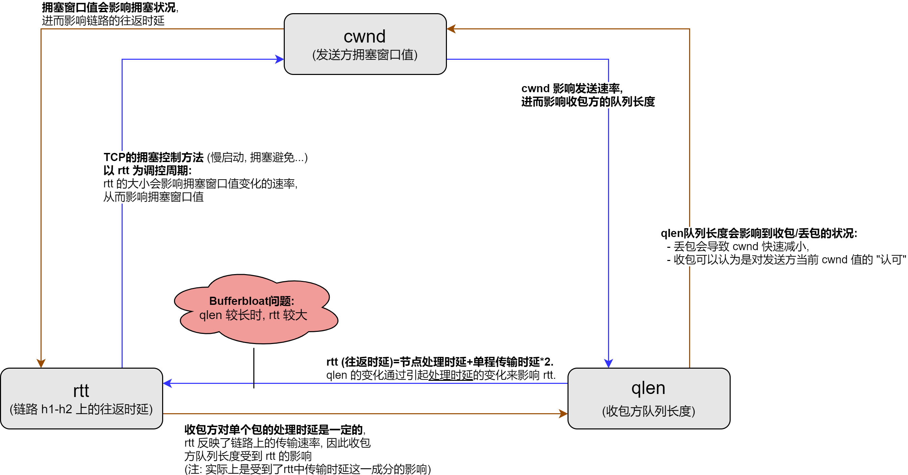
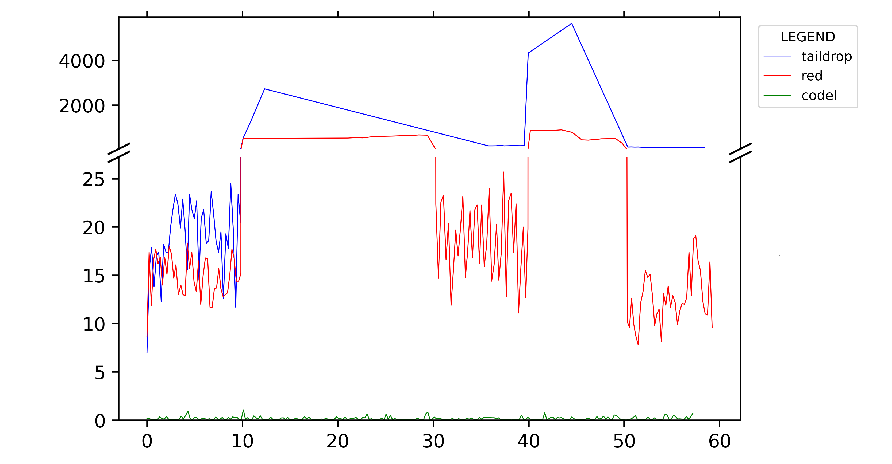
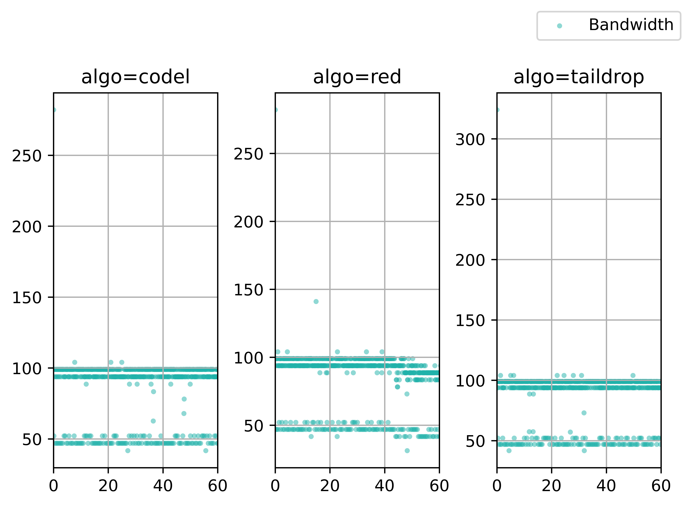
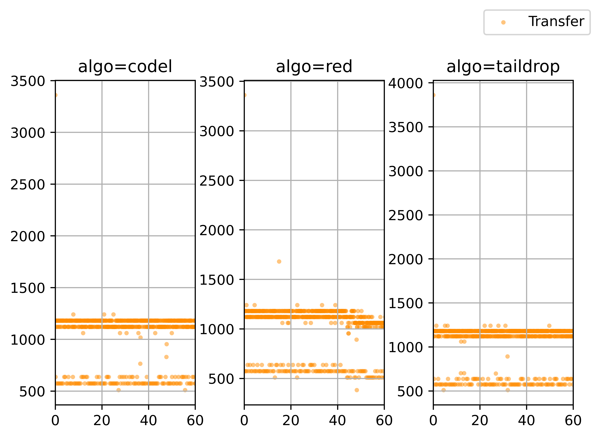
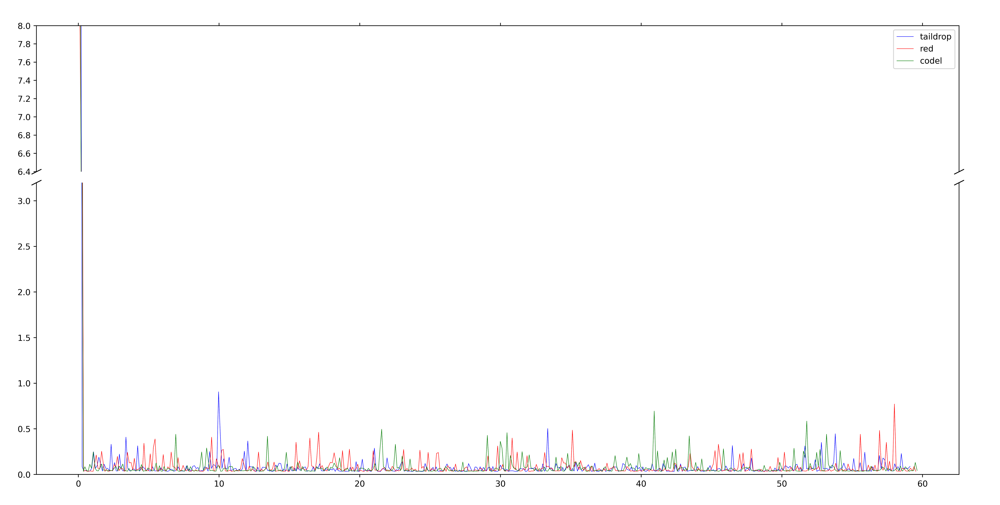

# 数据包队列管理实验 实验报告

<!--实验报告: 模板不限, 内容包括但不限于实验题目/实验内容/实验流程/实验结果及分析-->

## 实验内容

1. 复现 bufferbloat 问题, 改变 r1-eth1 的最大队列大小, 考察其对 iperf 吞吐率, 拥塞窗口值(cwnd), 队列长度(qlen) 和往返延迟(rtt) 等指标的影响;
2. 选择不同的算法解决 bufferbloat 问题, 对论文 [nichols 2012] [^1] 中使用不同算法和动态带宽时测得的的 RTT 结果进行复现.

## 实验流程

> 下面提到的文件均位于 `prj-07` 这一目录下.

### 数据采集

基于实验流程的标准化和自动化, 为两部分实验分别编写了两个脚本:

- `ex_rp.sh` : 用于复现 bufferbloat 问题, 可以传入任意数量的 maxq 选项一并进行测试;
- `ex_mt.sh` : 用于复现 bufferbloat 问题的解决 (采用不同的队列管理算法) , 每次执行均会测试全部三种算法下的情形.

每次脚本执行前均删除全部旧有的记录, 避免任何因 I/O 及重定向问题造成的误差.

脚本运行时, 借助 `tee` 程序 (`tee -a` , append 模式) 留下记录, 方便数据核查.

### 数据处理

得到实验记录文件后, 使用 python 的 re 辅助数据处理, matplotlib 作图:

- `fig_rp_single.ipynb` : 用于处理复现 bufferbloat 问题的相关数据, 并将每一组测量的不同数据都放置在单独的图表上, 方便观察单组数据的趋势;
- `fig_rp.ipynb` : 用于处理复现 bufferbloat 问题的相关数据, 并将同一数据不同 maxq 的测量结果画在同一张图上, 便于比对和分析;
- `fig_mt.ipynb` : 用于处理复现解决方案的相关数据, 并采用截断图的形式, 将 RTT 数据绘制在同一张图表上;
- `fig_ipf.ipynb` : 用于处理所有的 iperf 测试结果, 并采用子图并列的形式为 Transfer 和 Bandwidth 在 60 秒内的变化绘制图表.

## 实验结果与分析

### 复现 bufferbloat 问题

#### QLEN (=Queue Length)

<figure style="text-align:center">
    
    <figcaption style="font-size :9pt">
        图 1&nbsp;&nbsp;qlen 值随时间 (单位: s) 变化曲线图
    </figcaption>
</figure>

上图为接收方 qlen ([实时]队列长度, 下同) 随时间变化的曲线.

从图中可以看到, 不同的 maxq (最大队列长度, 下同) 值下, qlen 的变化趋势大致相同, 主要有以下三个时期:

1. **迅速增长期**: 首先, 从 0 开始, 迅速增加到峰值 (=maxq) ;
2. **快速下降期**: 接着, 较为快速地回落到谷值 (≈maxq/3) ;
3. **周期性变化期**: 之后, 在峰值和谷值之间周期性变化, 在周期中先缓慢增长后迅速下降.

接收方队列长度发生变化是由于包的收发, 在收包时队列逐渐变长, 丢包时发送速率骤降, 队列长度亦随之变短.

从图 1 中可以看到, 随着 maxq 值的增加, "周期性变化期" 内的 **变化周期** 也越大. 这是因为 maxq 值越大时, 队列到达满的速度越慢, 因而变化周期越长.

#### CWND

<figure style="text-align:center">
    
    <figcaption style="font-size :9pt">
        图 2&nbsp;&nbsp;CWND 值随时间 (单位: s) 变化曲线图
    </figcaption>
</figure>

上图为发送方 cwnd (拥塞窗口数量, 下同) 随时间变化的曲线.

从图中可以看到, 不同的 maxq 值下, cwnd 的变化趋势大致相同, 主要有以下三个时期:

1. **迅速增长期**: 首先, 从 0 开始, 迅速增加到峰值 (大约是 maxq 值的 6 倍) ;
2. **快速下降期**: 接着, 较为快速地回落到较低值 (接近 maxq 值的水平) ;
3. **周期性变化期**: 之后, 在这个较低值和一个较高值 (大约是 maxq 值的 2 倍) 之间作周期性变化, 在周期中先缓慢增长后迅速下降.

发送方拥塞窗口数量发生升降变化是因为收包/丢包情况有变化, 在收包时拥塞窗口数量逐渐上升, 发生丢包时拥塞窗口数量下降, 体现了 TCP 拥塞控制算法的动态调控.

从图 2 中可以看到, cwnd 值除了绝对数值大小不同之外, "周期性变化期" 内的**变化周期** 随着 maxq 值的变大会变长. 产生这种现象是因为 maxq 值越大, 队列到达满的速度越慢, 因而总体的变化周期就变长了.

#### RTT

<figure style="text-align:center">
    
    <figcaption style="font-size :9pt">
        图 3&nbsp;&nbsp;RTT 值 (单位: ms) 随时间 (单位: s) 变化曲线图
    </figcaption>
</figure>

上图为 RTT (往返时延, 下同) 随时间变化的曲线.

从图中可以看到, maxq 值为 100 和 150 时, RTT 的变化趋势大致相同:

1. **迅速增长期**: 首先, 从 0 开始, 迅速增加到峰值;
2. **下降期**: 接着, 逐渐回落到较低值;
3. **周期性变化期**: 之后, 在这个较低值和一个较高值之间作周期性变化, 在周期中先缓慢增长后迅速下降.

而 maxq 值为 50 时, 趋势与以上描述中的 "周期性变化期" 一致..

RTT 发生升降变化是因为收包/丢包情况有变化:

1. 测试刚开始时, 由于接收队列快速增长, RTT 增加较快, 随后队列缩短, RTT 相应减少;
2. 在之后的时间里, RTT 也随着队列的增长/缩短而增加/减少, 因为队列长度的波动周期性明显, 所以 RTT 变化的周期性也非常明显.

在 maxq 值较小时, RTT 前期峰值不明显或无峰值, 后期波动幅度也较小. 这是因为较小的 maxq 值限制了队列长度的波动幅度, 从而也限制了 RTT 的波动幅度; 这从侧面佐证了上面讨论的队列长度对 RTT 影响的特性.

#### iperf 吞吐率

下面的两张散点图 (图 4 和图 5) 展示了不同 maxq 值下 iperf 测试的带宽 (Bandwidth) 和传输数据大小 (Transfer) 记录:

<figure style="text-align:center">
    
    <figcaption style="font-size :9pt">
        图 4&nbsp;&nbsp;iperf 测量中 Bandwidth 值 (单位: Mbps) 随时间 (单位: s) 变化曲线图
    </figcaption>
	 
    
    <figcaption style="font-size :9pt">
        图 5&nbsp;&nbsp;iperf 测量中 Transfer 值 (单位: KB) 随时间 (单位: s) 变化曲线图
    </figcaption>
</figure>

结合原始数据记录, 随着 maxq 值的增加, 接收方队列长度变长, iperf 传输数据大小的方差会增加, 同时峰值带宽也会增加 (≈ 带宽的方差增加);

#### QLEN, CWND 和 RTT 之间的关系

实际上, qlen, cwnd 和 rtt 三个量之间是互相影响的, 这种互相影响的本质就是 TCP 拥塞控制方法等机制. 他们之间的关系图如下:

<figure style="text-align:center">
    
    <figcaption style="font-size :9pt">
        图 6&nbsp;&nbsp; qlen, cwnd 和 rtt 的关系示意图
    </figcaption>
</figure>

在实际的网络中有不少像这样的动态调控机制, 各个量之间通过一定的依赖关系形成负反馈回路, 从而维系网络中某一层次或某一部分的动态平衡.

### 解决 bufferbloat 问题

#### RTT

> 脚本中动态改变带宽的函数设定的链路带宽情形如下表所示:
>
> | 时间范围 | 链路带宽 (单位: Mbps) |
> | -------- | --------------------- |
> | ~10s     | 100                   |
> | ~20s     | 10                    |
> | ~30s     | 1                     |
> | ~40s     | 50                    |
> | ~50s     | 1                     |
> | ~60s     | 100                   |

<figure style="text-align:center">
    
    <figcaption style="font-size :9pt">
        图 7&nbsp;&nbsp;RTT 值 (单位: ms) 随时间 (单位: s) 变化曲线图
    </figcaption>
</figure>
上图中展示了 RTT 在不同的队列管理算法下的表现. 对比几条曲线, 可得到以下结论:

1. 作为对照组, tail drop 算法下链路的 RTT 表现并不好, 2/3 以上的时间内, 其 RTT 都远超正常的链路时延, 且该指标几乎全时段劣于其他两种算法; 此外, 带宽急剧变化会让使用 tail drop 算法的链路 RTT 发生较大的波动;
2. CoDel 算法表现最优, 它的 RTT 指标在测试全程中都保持在非常低的水平, 并且在带宽发生变化时波动不明显;
3. RED 算法表现次优, 它的 RTT 指标明显优于对照组, 但也远远劣于 CoDel 算法的表现; 另外, 在带宽急剧变化时, 使用 RED 算法的链路 RTT 也会有一定波动, 但波动的程度介于另外两组算法之间;

4. 每当带宽骤降时, tail drop 算法下的 RTT 就会骤升 (曲线导数突然增加), 或者直接大量丢包 (曲线拟合时因为缺少一些时间对应的点位而出现尖端形状);
5. 带宽骤升时, RED 算法下 RTT 会立刻下降, 这是因为 RED 算法采用的是 "提前丢包" 的机制, 当带宽骤升时, TCP 拥塞控制方法导致 cwnd 等指标提升, 故时延迅速下降.

#### iperf 吞吐率

下面的两张散点图 (图 8 和图 9) 展示了采用不同算法解决 bufferbloat 问题时 iperf 测试的带宽 (Bandwidth) 和传输数据大小 (Transfer) 记录:

<figure style="text-align:center">
    
    <figcaption style="font-size :9pt">
        图 8&nbsp;&nbsp;iperf 测量中 Bandwidth 值 (单位: Mbps) 随时间 (单位: s) 变化曲线图
    </figcaption>
	 
   
    <figcaption style="font-size :9pt">
        图 9&nbsp;&nbsp;iperf 测量中 Transer 值 (单位: KB) 随时间 (单位: s) 变化曲线图
    </figcaption>
</figure>

<!-- 随着 maxq 值的增加, 接收方队列长度变长, iperf 传输数据大小的方差会增加, 同时峰值带宽也会增加 (≈ 带宽的方差增加). -->

结合原始数据记录, 并将图 8 和图 9 与前面的图 4 和 图 5 进行对比, 可以得到一些有趣的结论:

1. 整体来看, 采用三种算法之后, 单位时间内测得的带宽与传输数据大小都大大提升:
   1. 带宽提升大约在 5-8 倍不等;
   2. 单位时间传输数据大小提升大约在 3-7 倍不等;
2. 不采用任何算法规避 bufferbloat 问题时, 单位时间传输数据大小有一定概率为 0 , 采用任意一种算法都能够规避这种情况 (至少在我的实验数据中没有出现 Transfer=0.00 的记录), 这说明实验中任意一种算法都能使对链路资源的利用变得更充分.

## 思考题

<!-- 请将思考/调研结果写到实验报告中 -->

### 拥塞控制机制对 Bufferbloat 的影响

> 前文中提到, 导致 Bufferbloat 问题的三个关键因素: 队列长度, 队列管理机制, 拥塞控制机制. 同时, 分别从上述三个角度都可以解决 Bufferbloat 问题.
>
> 调研分析两种新型拥塞控制机制 (BBR [Cardwell 2016], HPCC [Li 2019]) , 阐述其是如何解决 Bufferbloat 问题的.

传统的 TCP 拥塞控制算法通常将丢包作为降低传输速率的信号, 这种做法虽然有效, 但是在实际网络中, 可能造成丢包的原因除了拥塞之外还有很多, 比如包错误, 负载过大过小等. BBR 和 HPCC 都不是按照这种常规设计的, 它们都试图从丢包以外的因素入手实现动态调控.

#### BBR 算法

BBR 算法受 TCP WestWood 算法的启发, 通过改良慢启动算法, 持续敏捷探测拥塞窗口, 力求更好地利用链路带宽资源.

为了阐释其理论, 首先考虑排队论中的 Little's Law.

令 $L$ 是队列容量, $\lambda$ 是排队者的到达速率, $W$ 代表排队者逗留时间, 则有公式

$$
L=\lambda W,
$$

在链路中, 可以将 $L$ 看作链路上流动的数据总量 (inflight) , $\lambda$ 看作带宽, $W$ 看作时延. 当数据传输 (发包) 达到稳定时, 满足 $L=\lambda W$, 显然, $W$ 和 $\lambda$ 的都与 $L$ 线性相关.

已知时延下限为 $RT_{prop}$, 带宽上限为 $BtlBw$, 则理论上网络状态的最优解是

$$
L=RT_{prop}\times BtlBw,
$$

其中 $L$ 为时延带宽积 (BDP).

这个 "最优解" 实际的含义是: 时延带宽积满载的情形下, 链路利用率最高.

由于 $RT_{prop}$ 和 $BtlBw$ 是动态变化的, 为此 BBR 算法需要为网络建模:

1. $RTT=RT_{prop}+\eta$, 其中 $\eta$ 表示噪声, 因此某一时刻的 $RT_{prop}$ 不可能低于该时段内最小的 RTT, 由此便可以通过某段时间的最小 RTT 来估算 $RT_{prop}$;
2. 同样的道理, 传输速率不可能超过最大带宽, 在一个区间内采样传输数据总量, 可以通过计算单位时间内数据传输量计算 $BtlBw$ .(注: 不借助 RTT, 否则无法据此计算正确的链路负载)

按以上方案建模, 通过 BBR 状态机实现监测-调控的负反馈闭环系统, 其中监测的内容是链路负载情况 (Inflight):

$$
Inflight = RTT \times BandWidth,
$$

BBR 状态机中有 StartUp (慢启动), DRAIN (排空), ProbeBW (带宽探测), ProbeRTT (时延探测) 四个状态, 它们各自有不同的 pacing_gain 和 cwnd_gain 参数, 分别决定 pacing rate (实际发包速率) 和 cwnd (拥塞窗口数量).

总之, BBR 的目的是让管道的负载 (inflight) 无限接近管道 BDP 而尽可能不超过 BDP, 因为拥塞当且仅当负载超过 BDP 时发生.

#### HPCC

HPCC 算法借助能提供细粒度信息的新型网络设备硬件, "超越" 了传统的拥塞控制方法, 在大规模高速的 RDMA (Remote Direct Memory Access, 远地直接内存访问) 场景[^2]下具有相当显著的优势. 它的提出者认为它有可能 "替代" 传统的 TCP .

HPCC 算法的主要原理如下:

1. 使用新型网络设备硬件 INT (In-Network Telemetry, 网络内遥测) 得到精确的 Link Load Information (链路负载信息);
2. 在数据包的 ACK 的驱动下, 直接根据链路负载信息计算更新合适的发送速率.

HPCC 通过硬件升级, 突破了传统拥塞控制中 "迭代式" 调整链路的方法, 能高效调控链路收发水平, 从而快速使链路利用效率达到理想值.

## 实验反思

在复现解决 bufferbloat 问题的实验中, 有时候会遇到类似于下面这样的图, RTT 表现和预期相去甚远:

<figure style="text-align:center">
    
    <figcaption style="font-size :9pt">
        图 10&nbsp;&nbsp;一张无规律可言的 RTT 值 (单位: ms) 随时间 (单位: s) 变化曲线图
    </figcaption>
</figure>

并且, 如果不使用 gnome shell 进行实验, 而是使用外部终端通过 ssh 方式连接主机, 发生这种情况的概率就会非常大.

关于此问题, 具体原因尚不清楚, 不过或许跟 ssh 协议以及 mininet 的网络模拟环境特性有关.

## 参考资料

1. [Li 2019] Y. Li et al., HPCC: High precision congestion control. ACM SIGCOMM 2019
2. [Cardwell 2016] N. Cardwell et al., BBR: Congestion-Based Congestion Control Measuring bottleneck bandwidth and round-trip propagation time, ACM Queue, 2016

<!--脚注-->

[^1]: K. Nichols et al., Controlling Queue Delay, ACM Queue 2012.
[^2]: 如云上的分布式存储, 大规模机器学习, 高性能计算等.
