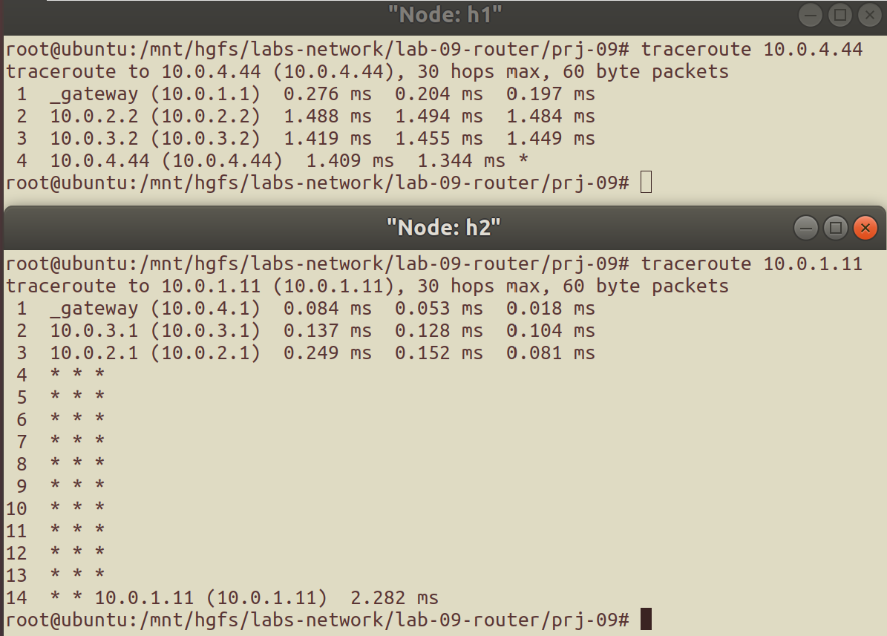

# 路由器转发实验<br/>实验报告

<!--实验报告: 模板不限, 内容包括但不限于实验题目、实验内容、实验流程、实验结果及分析-->

## 实验内容

1. 补充完成路由器程序, 在指定网络拓扑上运行, 验证其功能;
2. 构建符合要求的自定网络拓扑, 测试路由器程序是否能正确完成其功能;

## 实验流程

下面主要介绍程序的完成思路.

### 维护 ARP Cache

ARP 协议即地址解析协议, 能够实现 IP 地址和硬件地址的转换, 从而支持链路层以上的各服务, IP 层 ICMP 协议的 PING 服务便是其中一例. 在 ARP 协议中, 节点将已知的 IP 地址-硬件地址映射存放在 ARP Cache 里, 对那些硬件地址未知的 IP 地址, 节点通过 ARP 广播的方式寻找正确的地址映射, 并在收到目的结点的 ARP 单播回复后将映射信息存入 ARP Cache.

维护 ARP Cache 以下基本操作:

1. (已有) 初始化 ARP Cache, 删除 ARP Cache;
2. (待补充) 查找映射条目, 插入请求条目, 插入映射条目, 老化时效性不佳的条目.

#### 查找映射条目

遍历 ARP Cache 的映射表项, 查找命中则返回 1, 否则返回 0 :

```c
int arpcache_lookup(u32 ip4, u8 mac[ETH_ALEN]) {
  pthread_mutex_lock(&arpcache.lock);
  // traverse the table to find
  for (int i = 0; i < MAX_ARP_SIZE; ++i) {
    if (arpcache.entries[i].valid == 0)
      continue;
    if (arpcache.entries[i].ip4 == ip4) {
      // whether there is an entry with the same IP
      // and mac address with the given arguments
      memcpy(arpcache.entries[i].mac, mac, ETH_ALEN);
      pthread_mutex_unlock(&arpcache.lock);
      return 1;
    }
  }
  pthread_mutex_unlock(&arpcache.lock);
  return 0;
}
```

#### 插入请求条目

遍历 ARP 请求链表, 若表中已有从同一端口收到的对同一地址的 ARP 请求, 说明 ARP 请求已发送, 于是将新收到的请求数据包直接加在该串匹配请求链表的尾部:

```c
void arpcache_append_packet(iface_info_t *iface, u32 ip4, char *packet, int len) {
  pthread_mutex_lock(&arpcache.lock);
  // Lookup in the list which stores pending packets:
  struct cached_pkt *new_pkt =
      (struct cached_pkt *)malloc(sizeof(struct cached_pkt));
  new_pkt->packet = packet;
  new_pkt->len = len;

  struct arp_req *pos = NULL, *q;
  list_for_each_entry_safe(pos, q, &(arpcache.req_list), list) {
    if (pos->ip4 == ip4 && pos->iface == iface) {
      list_add_tail(&(new_pkt->list), &(pos->cached_packets));
      pthread_mutex_unlock(&arpcache.lock);
      return;
    }
  }
  // ...
}
```

否则, 分配一个新的请求链表, 将该数据包存入这个链表, 然后发出相应的 ARP 请求:

```c
  // ...
  struct arp_req *new_req = (struct arp_req *)malloc(sizeof(struct arp_req));
  new_req->ip4 = ip4;
  new_req->iface = iface;
  new_req->retries = ARP_REQUEST_MAX_RETRIES;
  list_add_tail(&(new_req->list), &(arpcache.req_list));
  // APPEND THE PACKET,
  init_list_head(&(new_req->cached_packets));
  list_add_tail(&(new_pkt->list), &(new_req->cached_packets));
  // and SEND ARP REQUEST
  arp_send_request(iface, ip4);
  new_req->sent = time(NULL);

  pthread_mutex_unlock(&arpcache.lock);
}
```

#### 插入映射条目

遍历所有表项, 检查它们 valid 域的值, 得到一个可以存储新映射的条目, 如果所有条目的 valid 域都是 1 , 则随机选择一个条目作为新条目存放的位置; 将信息存入选定的条目中:

```c
void arpcache_insert(u32 ip4, u8 mac[ETH_ALEN]) {
  pthread_mutex_lock(&arpcache.lock);

  int etr_avl;
  for (etr_avl = 0; etr_avl < MAX_ARP_SIZE; ++etr_avl) {
    if (arpcache.entries[etr_avl].valid == 0) break;
    if (etr_avl == MAX_ARP_SIZE - 1) etr_avl = -1;
  }
  time_t now = time(NULL);
  if (etr_avl == -1) etr_avl = now % MAX_ARP_SIZE;

  arpcache.entries[etr_avl].ip4 = ip4;
  arpcache.entries[etr_avl].added = now;
  memcpy(arpcache.entries[etr_avl].mac, mac, ETH_ALEN);
  arpcache.entries[etr_avl].valid = 1;

  //...
}
```

存完条目后, 检查缓存的 ARP 请求信息, 查看是否有对该映射信息的请求, 如有, 则用正确的 MAC 地址填充它们的 Ethernet 头部, 通过 `iface_send_packet` 发送出去, 并将请求从缓存中删去:

```c
{  // ...
  struct arp_req *pos_req, *q_req;
  list_for_each_entry_safe(pos_req, q_req, &(arpcache.req_list), list) {
    if (pos_req->ip4 != ip4) continue;
    // if there are pending packets waiting for this mapping,

    // FOR EACH OF THEM,
    struct cached_pkt *pos_pkt, *q_pkt;
    list_for_each_entry_safe(pos_pkt, q_pkt,
                             &(pos_req->cached_packets), list) {
      // FILL THE ETHERNET HEADER,
      struct ether_header *eh = (struct ether_header *)(pos_pkt->packet);
      memcpy(eh->ether_dhost, mac, ETH_ALEN);
      // and SEND THEM OUT
      iface_send_packet(pos_req->iface, pos_pkt->packet, pos_pkt->len);
      list_delete_entry(&(pos_pkt->list)); free(pos_pkt);
    }
    list_delete_entry(&(pos_req->list)); free(pos_req); break;
  }

  pthread_mutex_unlock(&arpcache.lock);
}
```

#### ARP 缓存的老化

老化操作的周期大约是 1s. 在程序结束挂起后, 应当首先找出有效表项中那些距离添加时间超过 `ARP_ENTRY_TIMEOUT` 的表项, 将它们置为无效:

```c
void *arpcache_sweep(void *arg) {
  while (1) {
    sleep(1); pthread_mutex_lock(&arpcache.lock);
    time_t now = time(NULL);
    for (int i = 0; i < MAX_ARP_SIZE; ++i) {
      if (arpcache.entries[i].valid == 0) continue;
      if (now - arpcache.entries[i].added > ARP_ENTRY_TIMEOUT)
        arpcache.entries[i].valid = 0;
    }
    // ...
  }
}
```

接着, 找出那些 1s 前发送并还没有收到回复的 ARP 请求, 重传它们, 直至到达最大重传次数:

```c
{
  { // ...
    struct list_head *del_reqs =
        (struct list_head *)malloc(sizeof(struct list_head));
    init_list_head(del_reqs);
    struct arp_req *pos_req, *q_req;
    list_for_each_entry_safe(pos_req, q_req, &(arpcache.req_list), list) {
      if (now - pos_req->sent > 1) {
        if (--(pos_req->retries) > 0) {
          arp_send_request(pos_req->iface, pos_req->ip4); pos_req->sent = now;
        } else list_add_tail(&(pos_req->list), del_reqs);
      }
    }
    pthread_mutex_unlock(&arpcache.lock);
      // ...
}
```

此外, 上面的代码还将那些已经到达最大重传次数却还没有收到回复的 ARP 请求组织成为了临时链表, 表头为 `del_req` .

再次申请互斥锁, 为 `del_req` 链表中的请求发送 ICMP 目的主机不可达消息, 然后将这些请求释放:

```c
{   // ...
    list_for_each_entry_safe(pos_req, q_req, del_reqs, list) {
      struct cached_pkt *pos_pkt, *q_pkt;
      list_for_each_entry_safe(pos_pkt, q_pkt, &(pos_req->cached_packets),
                               list) {
        icmp_send_packet(pos_pkt->packet, pos_pkt->len, ICMP_DEST_UNREACH,
                         ICMP_HOST_UNREACH);
        usleep(100); // Hold for burst situation
        list_delete_entry(&(pos_pkt->list));
        free(pos_pkt->packet); free(pos_pkt);
      }
      list_delete_entry(&(pos_req->list)); free(pos_req);
    }
    free(del_reqs);
  }
}
```

### ARP 协议相关

在 `arp.c` 中, 有接近于实际 ARP 协议实现的一些函数:

1. (已有) 借助 ARP 缓存查找发送 IP 数据报;
2. (待补充) 发送 ARP 请求, 发送 ARP 回复, 处理 ARP 包.

#### 发送 ARP 请求

该函数在 ARP Cache 条目查找失败时调用, 因此需要将 Ethernet 首部中的目的硬件地址置为 `0xFFFFFF` , 按传入形参填写信息并封装数据包后使用 `iface_send_packet` 发送.

#### 发送 ARP 回复

该函数在收到 ARP 请求后调用, 依据传入信息封装数据包后使用 `iface_send_packet` 发送即可.

#### 处理 ARP 数据包

ARP 数据包仅在数据包传输终点进行处理, 并且不同类型对应不同的处理方式, 比如

- ARP 请求: 发送 ARP 回复;
- ARP 回复: 将相应映射信息插入 ARP 缓存;
- 其他类型: 无法处理, 默认忽略;

代码大致如下:

```c
void handle_arp_packet(iface_info_t *iface, char *packet, int len) {
  struct ether_arp *ea = packet_to_ether_arp(packet);
  if (ntohl(ea->arp_tpa) == iface->ip) { // 是否传输终点
    switch (ntohs(ea->arp_op)) {         // 判断 ARP 数据包类型
    case ARPOP_REQUEST: arp_send_reply(iface, ea); break;
    case ARPOP_REPLY: arpcache_insert(ntohl(ea->arp_spa), ea->arp_sha); break;
    default: assert(packet && "PACKET IS NULL"); free(packet);
    }
  } else {
    assert(packet && "PACKET IS NULL"); free(packet);
  }
}
```

### IP 层数据传输的实现

以下函数位于 `ip_base.c` , `ip.c` , 和 `icmp.c` 中.

#### 发送路由器生成的 IP 数据包

函数 `ip_send_packet` 用于发送路由器依据 IP 相关协议生成的消息, 比如 ICMP 消息. 该函数抽取传入信息, 找到正确的路由后填充信息, 并借助 ARP 缓存中的地址映射发出 IP 数据包:

```c
void ip_send_packet(char *packet, int len) {
  struct iphdr *ih = packet_to_ip_hdr(packet);
  u32 dest = ntohl(ih->daddr);                // 抽取目的ip信息
  rt_entry_t *r = longest_prefix_match(dest); // 路由查找
  if (r == NULL) {                            // 错误检测
    fprintf(stderr, "WARNING: check your rtable-related functions.\n");
  } else {                                    // 填充信息 & 发送
    ih->saddr = htonl(r->iface->ip);
    ih->checksum = ip_checksum(ih);
    u32 nxt_hop = (r->gw == 0) ? dest : r->gw;
    iface_send_packet_by_arp(r->iface, nxt_hop, packet, len);
  }
}
```

值得注意的是, 本实验默认所有节点配置了正确的默认路由, 因此认为最长前缀匹配的返回指针一定非空, 这也是 `if` 分支设置为打印警告的原因.

上面的函数使用函数 `longest_prefix_match` 进行最长前缀匹配, 其思路是在网络号匹配的情况下选取掩码最长的路由表项.

#### 路由器对 IP 数据包的处理

路由器是中间节点而非端节点, 因此本实验中路由器对外来数据包的处理只有两种可能:

1. 收到 PING 路由器自身端口的数据包, 回复 ICMP 数据回显 REPLY;
2. 收到地址在其他节点的数据包, 按照数据包上的信息路由转发.

如果路由器收到的数据包不属于这两种, 则直接丢弃, 因为本实验中的路由器对这样的数据包没有处理能力.

#### 路由器对 ICMP 协议数据包的封装

ICMP 协议是 IP 协议族的一员, 它很常见也很常用, 比如本实验使用的 PING 命令就利用了 ICMP 协议中的请求回显数据包. ICMP 消息有很多不同的类型, 本实验中, `icmp_send_packet` 函数接收传入的 ICMP 消息类型等信息, 然后封装并发送 ICMP 消息.

## 实验结果与分析

下面主要介绍测试过程及其结果.

### Part 1

以下是实验任务中所给的几个 PING test 的测试结果:


可以看到, PING 测试的结果符合实验预期, 说明完成的路由器程序能够正确实现其功能.

### Part 2

#### 构造网络

使用脚本 `router_self.py` 构造拓扑, 主要信息如下图所示, 其中绿底的是端口名称, 蓝色字是端口的 IP 地址及子网掩码:


#### 连通性测试

下图是在 h1, h2 两个端节点对该网络拓扑进行的连通性测试结果:


可以看到, 两个端节点均能 PING 通另一个端节点以及路径上路由器的入向端口, 连通性得到验证.

#### 路径测试

下图是在端节点使用 Traceroute 测试的输出结果:



<!-- ## 思考题 -->

<!-- 请将思考/调研结果写到实验报告中 -->

## 实验反思

### 调试中出现过的问题

因为工程量比之前的实验大一些, 所以中途免不了踩坑, 将这些坑记录下来:

1. 源地址/目的地址和网关混淆;
2. 应该使用网络字节序的地方忘记转换;
3. 忽视了路由器节点的能力限制, 在应该丢弃数据包的时候胡乱发包;
4. 与框架的适配没做好, 出现 double free 的情况;
5. 数据包的封装未严格按照协议格式, 封装过程中字节序出错 (本次实验中出现过拷贝错误和字节序混乱的问题);
6. 变量类型混淆, 比如 `u32` 和 `int` 一个是有符号一个是无符号, 最好不要将它们混在一起比较, 若需比较最好使用同一数据类型;
7. 单个 `mutex` 的互斥使用区分不清楚, 造成死锁.

### 程序的性能限制

在最后的测试过程中遇到过偶尔丢包的情况, 尝试使用 wireshark 抓包进行调试.

执行 `ping 10.0.3.11 -c 4` , 得到如下结果:


从图中可知, r1 节点发送了 4 个 ICMP 目的主机不可达消息, 但是 h1 仅收到了一个. 通过排查分析, 也与物理网络环境中的情形对比, 确定这不是路由器功能上的缺陷, 而是虚拟网络环境中节点收包能力可能有一些限制.

注意到这四个 ICMP 包的时间差是毫秒级, 猜测收包时间间隔过短会影响端节点收包的完整性, 于是在 `arpcache_sweep` 函数中发送 ICMP 消息的代码段之前添加了一个 `sleep(1);` 使程序挂起一段时间, 从而减小端节点的收包压力.

编译之后再次进行多次测试, 结果都类似于下图:


可以看到丢包现象不再出现, 而这 4 个 ICMP 消息的间隔时间也从毫秒级变为了秒级. 由此可以得出结论: **ICMP 消息发送间隔过短确实会超出端节点的收包能力**.

### 其他感想

1. 这次实验的调试方法主要是 wireshark 抓包和 printf 大法, 前者在检查封装信息正确性和协议适配性上非常实用, 后者虽然看起来不是很高级但是能较快定位出错的控制流;
2. 用于软件测试的 `assert()` 能够帮助可快速定位一些不符合预期的程序行为, 比如说 double free;
3. 原本很实用的 GDB 调试基本派不上用场, 或许网络实验本身就不太适合用 GDB 调试.

## 参考资料

1. [ARP 协议解析 | Cizixs Write Here](https://cizixs.com/2017/07/31/arp-protocol/)

<!--脚注-->
