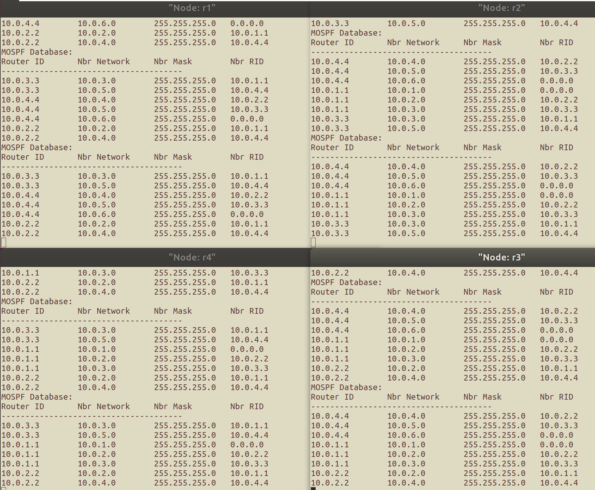
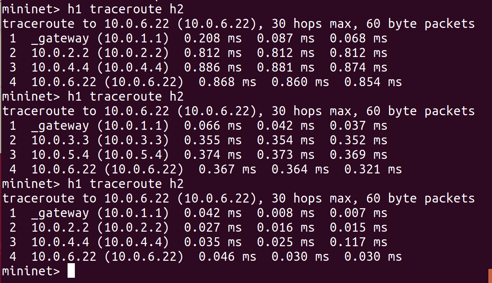
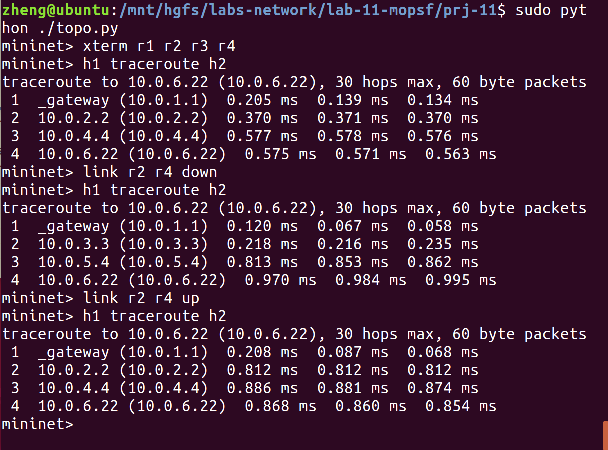

# 网络路由实验<br/>实验报告

<!--实验报告: 模板不限, 内容包括但不限于实验题目、实验内容、实验流程、实验结果及分析-->

## 实验内容

1. 基于已有代码框架, 实现路由器生成和处理 mOSPF Hello/LSU 消息的相关操作, 构建一致性链路状态数据库;
2. 基于实验一, 实现路由器计算路由表项的相关操作.

## 实验流程

### P1: 构建一致性链路状态数据库

总体来说, 链路状态数据库的构建和维护有以下流程:

1. (端口) 收到 mospf hello 消息, 按需维护本端口的 `nbr_list` ;
2. (各端口) 定期发出包含端口信息的 mospf hello 消息;
3. (路由器) 收到 mospf lsu 消息, 按需更新路由器的链路状态数据库;
4. (路由器从各个端口) 定期发出包含所有端口的 `nbr_list` 的 mospf lsu 消息;
5. (各端口) 定期检查 `nbr_list` 成员的时效性;
6. (路由器) 定期检查链路状态数据库表项的时效性.

#### 发送 mospf hello 消息

mospf hello 消息以端口为单位发送:

```c
void *sending_mospf_hello_thread(void *param) {
    while (1) {
        pthread_mutex_lock(&mospf_lock);
        iface_info_t *pos_iface, *q_iface;
        list_for_each_entry_safe(pos_iface, q_iface, &instance->iface_list, list) {
			// TODO: 每个端口都根据本端口信息发送 mospf hello 消息
        }
        pthread_mutex_unlock(&mospf_lock);
        // 每隔 MOSPF_DEFAULT_HELLOINT , 发送一次 mospf hello 消息
        sleep(MOSPF_DEFAULT_HELLOINT);
    }
    return NULL;
}
```

下面介绍上面代码块中的 "TODO" 部分, 也就是发送 mospf hello 消息的过程:

1. 为即将发出的 packet 申请空间, 准备好各个部分的指针

```c
            int len = ETHER_HDR_SIZE + IP_BASE_HDR_SIZE
                      + MOSPF_HDR_SIZE + MOSPF_HELLO_SIZE;
            char *packet = (char *) malloc(len);
            bzero(packet, len);

            struct ether_header *eh = (struct ether_header *) packet;
            struct iphdr *ih = packet_to_ip_hdr(packet);
            struct mospf_hdr *mh =
                (struct mospf_hdr *) ((char *) ih + IP_BASE_HDR_SIZE);
            struct mospf_hello *mHl =
                (struct mospf_hello *) ((char *) mh + MOSPF_HDR_SIZE);
```

2. 初始化各层协议报文及首部, 这里最好是先初始化内层协议报文, 再初始化外层协议报文, 这样做校验和操作时不容易出问题

```c
            mospf_init_hello(mHl, pos_iface->mask); // 初始化 mospf hello
            mospf_init_hdr(mh, MOSPF_TYPE_HELLO,	// 初始化 mospf hdr
                           MOSPF_HDR_SIZE + MOSPF_HELLO_SIZE,
                           instance->router_id,
                           0);
            mh->checksum = mospf_checksum(mh);

            ip_init_hdr(ih, pos_iface->ip,			// 初始化 ip hdr
                        MOSPF_ALLSPFRouters,
                        IP_BASE_HDR_SIZE + MOSPF_HDR_SIZE + MOSPF_HELLO_SIZE,
                        IPPROTO_MOSPF);
            ih->checksum = ip_checksum(ih);

            eh->ether_type = htons(ETH_P_IP);		// 初始化 eh hdr
            memcpy(eh->ether_shost, pos_iface->mac, ETH_ALEN);
            u8 all_route_MAC[ETH_ALEN] = {0x01, 0x00, 0x5e,
                                          0x00, 0x00, 0x05};
            memcpy(eh->ether_dhost, all_route_MAC, ETH_ALEN);

            // 各层报文均填充完毕, 使用 iface_send_packet 发送 mospf hello
		   iface_send_packet(pos_iface, packet, len);
```

#### 处理 mospf hello 消息

首先, 对收到的 mospf hello 消息进行预处理:

1. 获取每一层协议报文对应的首部指针;
2. 解析发包端口的相关信息.

```c
void handle_mospf_hello(iface_info_t *iface, const char *packet, int len) {
    // 获取首部
    struct iphdr *ih = packet_to_ip_hdr(packet);
    struct mospf_hdr *mh = (struct mospf_hdr *) ((char *) ih + IP_HDR_SIZE(ih));
    struct mospf_hello *mHl =
        (struct mospf_hello *) ((char *) mh + MOSPF_HDR_SIZE);
	// 解析信息
    u32 rid = ntohl(mh->rid);
    u32 ip = ntohl(ih->saddr);
    u32 mask = ntohl(mHl->mask);
```

接着, 尝试查找该 hello 是否由已在 `nbr_list` 里的端口发送, 如有, 则更新 alive 值, 并退出 mospf hello 处理函数:

```c
    pthread_mutex_lock(&mospf_lock);

    mospf_nbr_t *pos_nbr, *q_nbr;
    list_for_each_entry_safe(pos_nbr, q_nbr, &iface->nbr_list, list) {
        if (pos_nbr->nbr_id == rid) {
            pos_nbr->alive = 0;
            pthread_mutex_unlock(&mospf_lock);
            return;
        }
    }
	// ...
```

如果该 hello 来自未知端口, 则将相关信息填入新的 `nbr` , 加入本端口的 `nbr_list` :

```
    mospf_nbr_t *new_nbr = (mospf_nbr_t *) malloc(sizeof(mospf_nbr_t));
    new_nbr->alive = 0;
    new_nbr->nbr_id = rid;
    new_nbr->nbr_ip = ip;
    new_nbr->nbr_mask = mask;
    list_add_tail(&new_nbr->list, &iface->nbr_list);
    iface->num_nbr += 1;
    // ...
```

`nbr` 信息更新完成后, 由于端口信息发生变化, 因此在这里也发送一次 mospf lsu 消息:

```c
	// ...
	send_mospf_lsu(NULL);
    pthread_mutex_unlock(&mospf_lock);
}
```

#### 发送 mospf lsu 消息

需要发送 mospf lsu 消息的情况:

1. 链路状态信息变化;
2. 每隔 `instance->lsuint` 时长.

周期性发送 mospf lsu 消息:

```c
void *sending_mospf_lsu_thread(void *param) {
    while (1) {
        pthread_mutex_lock(&mospf_lock);
        send_mospf_lsu(param);
        pthread_mutex_unlock(&mospf_lock);
        sleep(instance->lsuint);
    }
    return NULL;
}
```

单次发送 mospf lsu 消息, 则使用 `send_mospf_lsu` 函数:

1. 统计将发送的 mospf lsu 消息将携带多少个 lsa

```c
void send_mospf_lsu(void *param) {
    int nadv = 0;
    iface_info_t *pos_iface, *q_iface;
    list_for_each_entry_safe(pos_iface, q_iface, &instance->iface_list, list) {
    	nadv += pos_iface->num_nbr ? pos_iface->num_nbr : 1;
    }
```

2. 根据各个端口的 `nbr_list` , 装填所有的 lsa 信息

```c
    struct mospf_lsa *lsaArray =
        (struct mospf_lsa *) malloc(nadv * MOSPF_LSA_SIZE);
    struct mospf_lsa *current = lsaArray;
    list_for_each_entry_safe(pos_iface, q_iface, &instance->iface_list, list) {
        if (pos_iface->num_nbr != 0) {
            mospf_nbr_t *pos_nbr, *q_nbr;
            list_for_each_entry_safe(pos_nbr, q_nbr, &pos_iface->nbr_list, list) {
                current->rid = htonl(pos_nbr->nbr_id);
                current->mask = htonl(pos_nbr->nbr_mask);
                current->network = htonl(pos_nbr->nbr_ip & pos_nbr->nbr_mask);
                current++;
            }
        } else {
            current->rid = htonl(0);
            current->mask = htonl(pos_iface->mask);
            current->network = htonl(pos_iface->ip & pos_iface->mask);
            current++;
        }
    }
```

3. 从顶层到底层 (从内层到外层) 装填各层协议报文内容, 并通过 `ip_send_packet` 发送 mospf lsu 消息

```c
    int len_lsu_pkt = ETHER_HDR_SIZE + IP_BASE_HDR_SIZE+ MOSPF_HDR_SIZE
        			+ MOSPF_LSU_SIZE + MOSPF_LSA_SIZE * nadv;
    list_for_each_entry_safe(pos_iface, q_iface,
                             &instance->iface_list, list) {
        if (!pos_iface->num_nbr) continue;
        mospf_nbr_t *pos_nbr, *q_nbr;
        list_for_each_entry_safe(pos_nbr, q_nbr,
                                 &pos_iface->nbr_list, list) {
            char *packet = (char *) malloc(len_lsu_pkt);
            struct iphdr *ih = packet_to_ip_hdr(packet);
            struct mospf_hdr *mh =
                (struct mospf_hdr *) ((char *) ih + IP_BASE_HDR_SIZE);
            struct mospf_lsu *mLsu =
                (struct mospf_lsu *) ((char *) mh + MOSPF_HDR_SIZE);
            struct mospf_lsa *mLsa =
                (struct mospf_lsa *) ((char *) mLsu + MOSPF_LSU_SIZE);

            memcpy(mLsa, lsaArray, MOSPF_LSA_SIZE * nadv);
            mospf_init_lsu(mLsu, nadv);
            mospf_init_hdr(mh, MOSPF_TYPE_LSU,
                           MOSPF_HDR_SIZE + MOSPF_LSU_SIZE
                           + MOSPF_LSA_SIZE * nadv,
                           instance->router_id, 0);
            mh->checksum = mospf_checksum(mh);

            ip_init_hdr(ih, pos_iface->ip, pos_nbr->nbr_ip,
                        len_lsu_pkt - ETHER_HDR_SIZE, IPPROTO_MOSPF);
            ih->checksum = ip_checksum(ih);

            ip_send_packet(packet, len_lsu_pkt);
        }
    }
	// ...
```

4. 发送结束, 释放本地的 lsa 序列, 并将序列号自增一位

```c
	// ...
    free(lsaArray);
    instance->sequence_num += 1;
}
```

#### 处理 mospf lsu 消息

首先, 对收到的 mospf lsu 消息进行预处理:

1. 获取每一层协议报文对应的首部指针;
2. 解析发包端口的相关信息.

```c
void handle_mospf_lsu(iface_info_t *iface, char *packet, int len) {
    struct iphdr *ih = packet_to_ip_hdr(packet);
    struct mospf_hdr *mh =
            (struct mospf_hdr *) ((char *) ih + IP_HDR_SIZE(ih));
    struct mospf_lsu *mLsu =
            (struct mospf_lsu *) ((char *) mh + MOSPF_HDR_SIZE);
    struct mospf_lsa *mLsaArray =
            (struct mospf_lsa *) ((char *) mLsu + MOSPF_LSU_SIZE);

    u32 rid_pkt = ntohl(mh->rid);
    // 不需要处理的情况: 该 lsu 来自它自身
    if (rid_pkt == instance->router_id) return;
    // ...
```

接着, 开始处理该消息:

1. 丢弃已经失去时效性的消息

```c
    // 开始处理
    pthread_mutex_lock(&mospf_lock);

    u16 seq_pkt = ntohs(mLsu->seq);
    u32 nadv_pkt = ntohl(mLsu->nadv);

    mospf_db_entry_t *pos_db, *q_db, *renew_db = NULL;
    list_for_each_entry_safe(pos_db, q_db, &mospf_db, list) {
        if (pos_db->rid == rid_pkt) {
            if (pos_db->seq >= seq_pkt) {
                // 比较序列号, 丢弃失去时效的 packet
                pthread_mutex_unlock(&mospf_lock);
                return;
            }
            renew_db = pos_db;
        }
    }
```

2. 如果在数据库中找不到相应表项, 则新增数据库表项, 否则更新表项

```c
    if (renew_db == NULL) {
        renew_db = (mospf_db_entry_t *) malloc(sizeof(mospf_db_entry_t));
        renew_db->rid = rid_pkt;
        renew_db->array = (struct mospf_lsa *) malloc(MOSPF_LSA_SIZE * nadv_pkt);
        list_add_tail(&renew_db->list, &mospf_db);
    } else {
        memset(renew_db->array, 0, sizeof(struct mospf_lsa) * renew_db->nadv);
    }

    // 填充相应的数据库表项
    renew_db->alive = 0;
    renew_db->seq = seq_pkt;
    renew_db->nadv = nadv_pkt;
    struct mospf_lsa *to_update = renew_db->array, *ref = mLsaArray;
    for (int i = 0; i < nadv_pkt; ++i) {
        to_update->rid = ntohl(ref->rid);
        to_update->mask = ntohl(ref->mask);
        to_update->network = ntohl(ref->network);
        to_update++; ref++;
    }
    pthread_mutex_unlock(&mospf_lock);
	// ...
```

3. 更新该报文的 TTL, 如果 TTL 大于 0 , 则转发该报文

```c
    // ...
    if (--mLsu->ttl) {
        mh->checksum = mospf_checksum(mh);
        pthread_mutex_lock(&mospf_lock);
        iface_info_t *pos_if, *q_if;
        list_for_each_entry_safe(pos_if, q_if, &instance->iface_list, list) {
            if (pos_if->index == iface->index) continue;

            if (pos_if->num_nbr != 0) {
                mospf_nbr_t *pos_nbr, *q_nbr;
                list_for_each_entry_safe(pos_nbr, q_nbr, &pos_if->nbr_list, list) {
                    char *new_pkt = (char *) malloc(len);
                    memcpy(new_pkt, packet, len);
                    struct iphdr *new_ih = packet_to_ip_hdr(new_pkt);
                    new_ih->saddr = htonl(pos_if->ip);
                    new_ih->daddr = htonl(pos_nbr->nbr_ip);
                    new_ih->checksum = ip_checksum(new_ih);
                    ip_send_packet(new_pkt, len);
                }
            }
        }
        pthread_mutex_unlock(&mospf_lock);
    }
}
```

#### 链路状态数据库表项的老化

1. 每秒运行一次, 将数据库表项的 alive 时长自增 1 , 并将过期的数据库表项清除;
2. 在完成链路状态数据库维护后, 使用最新的链路状态信息重新计算路由表.

```c
void *checking_database_thread(void *param) {
    while (1) {
        mospf_db_entry_t *pos_db, *q_db;
        pthread_mutex_lock(&mospf_lock);

        list_for_each_entry_safe(pos_db, q_db, &mospf_db, list) {
            pos_db->alive += 1;
            if (pos_db->alive <= MOSPF_DATABASE_TIMEOUT) continue;

            list_delete_entry(&pos_db->list);
            free(pos_db);
        }
        dump_mospf_db(NULL); // 展示链路状态数据库

        // 重新计算路由表
        update_rtable_by_db(GRAPH_SIZE);
        print_rtable();

        pthread_mutex_unlock(&mospf_lock);
        sleep(1);
    }
    return NULL;
}
```

#### 端口中 `nbr_list` 的老化

检查每个端口的 `nbr_list` , 将需要老化的 `nbr` 成员从 `list` 中删去:

```c
void *checking_nbr_thread(void *param) {
    while (1) {
        pthread_mutex_lock(&mospf_lock);

        iface_info_t *pos_iface, *q_iface;
        list_for_each_entry_safe(pos_iface, q_iface, &instance->iface_list, list) {
            mospf_nbr_t *pos_nbr, *q_nbr;
            list_for_each_entry_safe(pos_nbr, q_nbr, &pos_iface->nbr_list, list) {
                pos_nbr->alive += 1;
                if (pos_nbr->alive > 3 * pos_iface->helloint) {
                    list_delete_entry(&pos_nbr->list);
                    free(pos_nbr);
                    pos_iface->num_nbr--;
                    send_mospf_lsu(NULL); // 更新链路信息
                }
            }
        }

        pthread_mutex_unlock(&mospf_lock);
        sleep(1);
    }
    return NULL;
}
```

### P2: 实现路由表项的计算

首先介绍更新路由表项的主函数:

1. 加载路由器列表, 将其映射为一张无负权的无向图, 使用 Dijkstra 算法计算最短路径

```c
void update_rtable_by_db(int max_num) {
    /* 加载路由器列表 */
    VerRes_t res = find_vertices(max_num);
    int num = res.size;

    /* 根据链路状态数据库信息, 绘制邻接矩阵 */
    int(*graph)[num] = create_graph(res.verList, num);

    /* 根据邻接矩阵信息, 使用 dijkstra 算法确定单源最短路径 */
    int dist[num], visited[num], prev[num];
    dij(graph, dist, visited, prev, num);

    /* 清除所有由计算得到的路由表项 */
    clear_rtable();
    load_rtable_from_kernel();
	// ...
```

2. 将最短路径结果映射到路由, 更新路由表

```c
	/* 计算并更新路由表 */
    mospf_db_entry_t *pos_db;
    list_for_each_entry(pos_db, &mospf_db, list) {
        for (int i = 0; i < pos_db->nadv; i++) {
            struct mospf_lsa *now = &pos_db->array[i];
            rt_entry_t *renew_rt = dest_mask_to_rtable(now->network, now->mask);
            if (renew_rt) continue;

            // 找不到相应的路由表项, 则继续执行后续操作
            int index;
            if (!now->rid) index = rid_to_index(res.verList, num, pos_db->rid);
            else index = rid_to_index(res.verList, num, now->rid);
            if (index == -1) break;

            // 寻找 "下一跳" (即网关) 和端口信息
            while (dist[index] > 1 && prev[index] >= 0) index = prev[index];
            u32 next_hop_rid = res.verList[index];

            iface_info_t *pos_if; mospf_nbr_t *pos_nbr;
            int flag_search_fi = 0;
            list_for_each_entry(pos_if, &instance->iface_list, list) {
                list_for_each_entry(pos_nbr, &pos_if->nbr_list, list) {
                    if (pos_nbr->nbr_id == next_hop_rid) {
                        flag_search_fi = 1; break;
                    }
                }
                if (flag_search_fi) break;
            }
            if (!flag_search_fi) continue;
            u32 gw = pos_nbr->nbr_ip;

            // 添加路由表项
            renew_rt = new_rt_entry(
                    pos_db->array[i].network, // dest
                    pos_db->array[i].mask,    // mask
                    gw,                       // gw
                    pos_if,                   // iface
                    RT_CLC);
            add_rt_entry(renew_rt);
        }
    }
}
```

#### 子函数: 加载路由器列表

输入列表长度上限 `num` , 将该实例自身的 rid 以及所有邻居的 rid 加入路由器列表, 返回加载结果.

```c
// find vertices for the graph, from mospf_db
VerRes_t find_vertices(int num) {
    VerRes_t ret;
    ret.verList = (u32 *) malloc(num * sizeof(u32));
    memset(ret.verList, 0, num * sizeof(u32));
    // mark head's size
    ret.size = 0;
    // add current instance
    ret.verList[ret.size++] = instance->router_id;
    // add all lsu network
    mospf_db_entry_t *pos_db;
    list_for_each_entry(pos_db, &mospf_db, list) {
        u32 rid = pos_db->rid;
        if (rid == 0) continue;
        if (rid_to_index(ret.verList, ret.size, rid) == -1)
            ret.verList[ret.size++] = rid;
        for (int i = 0; i < pos_db->nadv; ++i) {
            rid = pos_db->array[i].rid;
            if (rid == 0) continue;
            if (rid_to_index(ret.verList, ret.size, rid) == -1)
                ret.verList[ret.size++] = rid;
        }
    }
    return ret;
}
```

#### 子函数: 建立邻接矩阵

输入路由器列表信息, 根据链路状态数据库中的表项指示的连接, 为路由器创建相应的邻接矩阵, 返回矩阵的首部指针.

```c
void *create_graph(u32 *verList, int size) {
    int (*graph)[size] = (int (*)[size]) malloc(sizeof(int) * size * size);
    memset(graph, 0, sizeof(char) * size * size);

    mospf_db_entry_t *pos_db;
    list_for_each_entry(pos_db, &mospf_db, list) {
        int v0 = rid_to_index(verList, size, pos_db->rid), v1;
        for (int i = 0; i < pos_db->nadv; ++i) {
            u32 rid1 = pos_db->array[i].rid;
            if (rid1 == 0) continue;

            v1 = rid_to_index(verList, size, rid1);
            if (v1 == -1) continue;
            graph[v0][v1] = graph[v1][v0] = 1;
        }
    }
    return (void *) graph;
}
```

#### 子函数: dijkstra 算法确定最短路径

```c
void dij(void *in_graph, int dist[], int visited[], int prev[], int num) {
    int (*graph)[num] = in_graph;

    for (int i = 0; i < num; ++i) dist[i] = INT8_MAX;
    memset(visited, 0, sizeof(int) * num);
    memset(prev, (u8) -1, sizeof(int) * num);

    dist[0] = 0;
    for (int i = 0; i < num; ++i) {
        int next = min_dist(dist, visited, num);
        visited[next] = 1;

        for (int j = 0; j < num; ++j) {
            if (visited[j] == 0 && graph[next][j] > 0 &&
                dist[next] + graph[next][j] < dist[j]) {
                dist[j] = dist[next] + graph[next][j];
                prev[j] = next;
            }
        }
    }
}
```

## 实验结果与分析

### P1

按要求完成程序, 在各路由器上启动程序, 过一段时间后检查链路状态数据库, 如图所示:



可以看到, 各节点都生成了正确的链路状态数据库.

### P2

完成路由计算部分后, 尝试了两种改变链路拓扑的方式来进行验证:

1. 去除一个节点;
2. 去除一条链路.

#### 去除一个节点

下面展示了 "正常情况 - 去除 r2 节点 - 重新启动 r2 节点" 的过程中由 h1 到 h2 的 traceroute 结果变化, 符合实验预期.



#### 去除一条链路

下面展示了 "正常情况 - 去除 r2-r4 链路 - 重启 r2-r4 链路" 的过程中由 h1 到 h2 的 traceroute 结果变化, 符合实验预期.



## 思考题

<!-- 请将思考/调研结果写到实验报告中 -->

### 1

> 在构建一致性链路状态数据库中，为什么邻居发现使用组播 (Multicast) 机制，链路状态扩散用单播 (Unicast) 机制？

使用组播, 可以让需要相同数据流的节点共享同一条数据流, 节省服务器的负载. 邻居发现使用的是 mospf hello 消息, 采用组播而不是单播, 可以让需要收到该消息的节共享同一数据流, 减少通信资源的浪费.

使用单播, 可以做到对需要发送的客户进行个性化服务. 链路状态扩散是基于端口中已有的 `nbr_list` 进行的, 因此不是对本地分组而是对端口中记录的所有邻居进行链路状态扩散, 故采用单播更合适. 此外, 组播缺少纠错机制, 在发包出错时难以弥补.

### 2

> 该实验的路由收敛时间大约为 20-30 秒，网络规模增大时收敛时间会进一步增加，如何改进路由算法的可扩展性？

如果认为改进可扩展性=加快实际网络中的收敛速度, 则可以考虑以下几条:

1. 在收敛完成后, 采用 "触发" 方式发送拓扑变化的信息给其他路由器, 并且减小延迟;
2. 调短 hello 的间隔时间, 调短路由计算的时间间隔;
3. 减少 lsa 生成的间隔时间, 减少 lsa 到达的间隔检测时间;
4. 接口减小传输延迟, 加快 lsa 的洪泛速度.

### 3

> 路由查找的时间尺度为~ns，路由更新的时间尺度为~10s，如何设计路由查找更新数据结构，使得更新对查找的影响尽可能小？

考虑一致性, 则在更新期间不能进行路由查找, 查找期间不能进行路由更新. 这是因为这两个操作需要的是同一把管理路由表临界区的锁.

为了减少更新对查找的影响, 可以对路由表进行分区, 更新时只锁定更新部分的路由表, 其余部分的路由表可以继续查找, 也就是将一把锁变为多把锁. 分区的依据可以是按位数划分, 比如对 IP 前八位做直接索引, 每一个索引对应一把锁, 查找时先计算得到某一把锁再尝试获取锁进行查找, 更新时也先获取分区的锁再更新.

## 实验反思

### 调试中出现过的问题

没仔细完成老化步骤, 导致无法删除不再发出 hello 的端口.

### 可能是框架导致的问题

traceroute 时, icmp 消息回传不一定通过路由路径的端口, 只能确保显示的端口属于正确的路由器. 查对抓包结果, 检查框架, 发现回传时 `icmp_send_packet` 通过本地路由表项来决定发包端口, 故认为该问题是不可避免的.

### 其他感想

路由计算部分的设计需要花很多心思, 如果前期设计不好会给后期 debug 带来无穷无尽的麻烦.

## 参考资料

1. [单播、多播（组播）和广播的区别 - 简书](https://www.jianshu.com/p/164ab8a6e6a9)
2. [FAQ- 如何调整加快 OSPF 收敛速度- 华为](https://support.huawei.com/enterprise/zh/knowledge/KB1000068307)

<!--脚注-->
