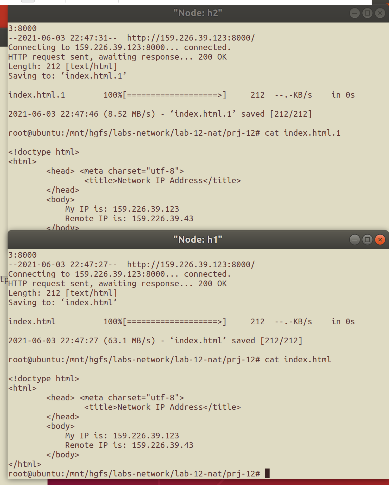
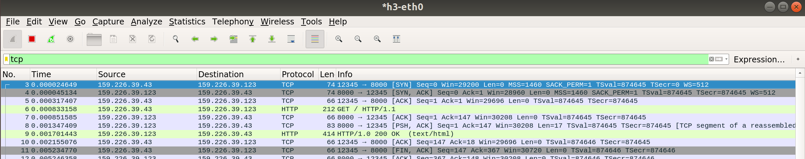
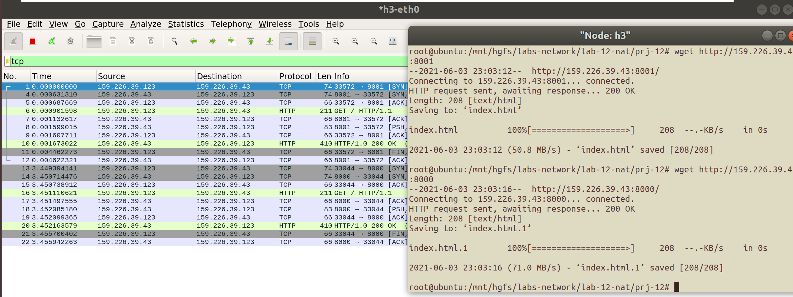
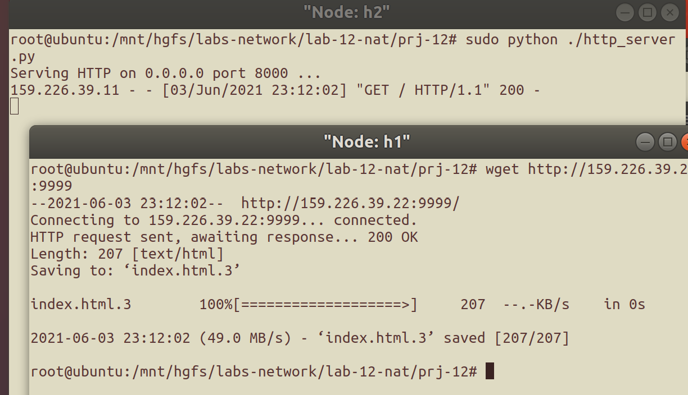
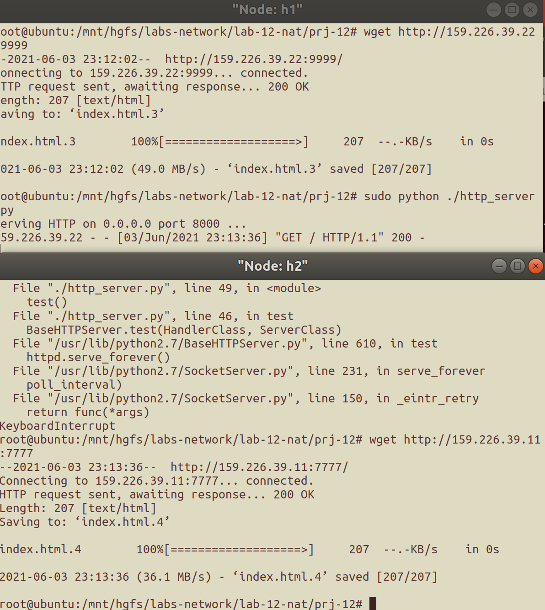

# 网络地址转换实验<br/>实验报告

<!--实验报告: 模板不限, 内容包括但不限于实验题目/实验内容/实验流程/实验结果及分析-->

## 实验内容

1. SNAT 实验
2. DNAT 实验
3. 双 NAT 实验

## 实验流程

补充以下五个函数:

### 确定 pkt 方向

比较 packet 的出入地址和匹配的路由表表项对应的端口 index, 即可判定其方向.

```c
// determine the direction of the packet, DIR_IN / DIR_OUT / DIR_INVALID
static int get_packet_direction(char *packet) {
    // TODO: determine the direction of this packet.
    fprintf(stdout, "TODO: determine the direction of this packet.\n");
    struct iphdr *ih = packet_to_ip_hdr(packet);
    rt_entry_t *rtRes = longest_prefix_match(ntohl(ih->saddr));

    if (rtRes->iface->index == nat.internal_iface->index) {
        return DIR_OUT;
    } else if (rtRes->iface->index == nat.external_iface->index) {
        return DIR_IN;
    } else {
        return DIR_INVALID;
    }
}
```

### pkt 的重写

- 已有连接: 根据方向重写, 发包
- 暂无连接: 尝试添加连接
  - 无法添加 => 发送 ICMP 主机不可达

```c

// do translation for the packet: replace the ip/port, recalculate ip & tcp
// checksum, update the statistics of the tcp connection
void do_translation(iface_info_t *iface, char *packet, int len, int dir) {
    // TODO: do translation for this packet
    fprintf(stdout, "TODO: do translation for this packet.\n");

    // get remote info via dir and pkt_hdr
    struct iphdr *ih = packet_to_ip_hdr(packet);
    u32 dAddr = ntohl(ih->daddr);
    u32 sAddr = ntohl(ih->saddr);
    u32 rmtAddr = (dir == DIR_IN) ? sAddr : dAddr;

    struct tcphdr *th = packet_to_tcp_hdr(packet);
    u16 sPort = ntohs(th->sport);
    u16 dPort = ntohs(th->dport);
    u16 rmtPort = (dir == DIR_IN) ? sPort : dPort;

    // get index by hash8
    char buf[6] = {0};
    strncat(buf, (char *) &rmtAddr, 4);
    strncat(buf + 4, (char *) &rmtPort, 2);
    u8 index = hash8(buf, 6);
    // printf("buf = %u%hu; hash index = %d\n", rmtAddr, rmtPort, index);
    struct list_head *nm_list = &nat.nat_mapping_list[index];

    pthread_mutex_lock(&nat.lock);
    time_t now = time(NULL);

    /* Already have connection */
    struct nat_mapping *pos_nm;
    list_for_each_entry(pos_nm, nm_list, list) {
        // if not the mapping we search, skip
        if (rmtAddr != pos_nm->remote_ip ||
            rmtPort != pos_nm->remote_port) {
            continue;
        }

        if (dir == DIR_IN) {
            if (dAddr != pos_nm->external_ip ||
                dPort != pos_nm->external_port) {
                continue;
            }
            ih->daddr = htonl(pos_nm->internal_ip);
            th->dport = htons(pos_nm->internal_port);
            pos_nm->conn.external_fin =
                    (th->flags & TCP_FIN) ? TCP_FIN : 0;
            pos_nm->conn.external_seq_end = tcp_seq_end(ih, th);
            // if ack
            if (th->flags & TCP_ACK)
                pos_nm->conn.external_seq_end = th->ack;
        } else {
            if (sAddr != pos_nm->internal_ip ||
                sPort != pos_nm->internal_port) {
                continue;
            }

            ih->saddr = htonl(pos_nm->external_ip);
            th->sport = htons(pos_nm->external_port);
            pos_nm->conn.internal_fin =
                    (th->flags & TCP_FIN) ? TCP_FIN : 0;
            pos_nm->conn.internal_seq_end = tcp_seq_end(ih, th);
            // if ack
            if (th->flags & TCP_ACK)
                pos_nm->conn.internal_ack = th->ack;
        }
        // packed and send
        pos_nm->update_time = now;
        th->checksum = tcp_checksum(ih, th);
        ih->checksum = ip_checksum(ih);
        ip_send_packet(packet, len);

        pthread_mutex_unlock(&nat.lock);
        return;
    }

    /* No connection yet */

    // Not DNAT/SNAT => INVALID
    if ((th->flags & TCP_SYN) == 0) {
        fprintf(stdout, "INVALID PACKET\n");
        icmp_send_packet(packet, len,
                         ICMP_DEST_UNREACH, ICMP_HOST_UNREACH);
        free(packet);

        pthread_mutex_unlock(&nat.lock);
        return;
    }

    // Build new connection
    if (dir == DIR_OUT) {
        u16 pid;
        for (pid = NAT_PORT_MIN; pid <= NAT_PORT_MAX; ++pid) {
            if (!nat.assigned_ports[pid]) {
                struct nat_mapping *new_nm =
                        (struct nat_mapping *) malloc(
                                sizeof(struct nat_mapping));
                list_add_tail(&new_nm->list, nm_list);

                new_nm->update_time = now;
                new_nm->remote_ip = rmtAddr;
                new_nm->remote_port = rmtPort;
                new_nm->external_ip = nat.external_iface->ip;
                new_nm->external_port = pid;
                new_nm->internal_ip = sAddr;
                new_nm->internal_port = sPort;
                new_nm->conn.internal_fin =
                        (th->flags & TCP_FIN) ? TCP_FIN : 0;
                new_nm->conn.internal_seq_end = tcp_seq_end(ih, th);
                if (th->flags & TCP_ACK)
                    new_nm->conn.internal_ack = th->ack;

                ih->saddr = htonl(new_nm->external_ip);
                th->sport = htons(new_nm->external_port);
                th->checksum = tcp_checksum(ih, th);
                ih->checksum = ip_checksum(ih);

                ip_send_packet(packet, len);

                pthread_mutex_unlock(&nat.lock);
                return;
            }
        }
    } else {
        struct dnat_rule *posRule;
        list_for_each_entry(posRule, &nat.rules, list) {
            if (dAddr == posRule->external_ip &&
                dPort == posRule->external_port) {
                struct nat_mapping *new_nm =
                        (struct nat_mapping *) malloc(
                                sizeof(struct nat_mapping));
                list_add_tail(&new_nm->list, nm_list);

                new_nm->update_time = now;
                new_nm->remote_ip = rmtAddr;
                new_nm->remote_port = rmtPort;
                new_nm->external_ip = posRule->external_ip;
                new_nm->external_port = posRule->external_port;
                new_nm->internal_ip = posRule->internal_ip;
                new_nm->internal_port = posRule->internal_port;
                new_nm->conn.external_fin =
                        (th->flags & TCP_FIN) ? TCP_FIN : 0;
                new_nm->conn.external_seq_end = tcp_seq_end(ih, th);
                if (th->flags & TCP_ACK)
                    new_nm->conn.external_ack = th->ack;

                ih->daddr = htonl(posRule->internal_ip);
                th->dport = htons(posRule->internal_port);
                th->checksum = tcp_checksum(ih, th);
                ih->checksum = ip_checksum(ih);
                ip_send_packet(packet, len);

                pthread_mutex_unlock(&nat.lock);
                return;
            }
        }
    }


    // CANNOT ALLOCATE PORT
    fprintf(stdout, "NAT OVERLOAD: NO AVAILABLE PORT\n");
    icmp_send_packet(packet, len, ICMP_DEST_UNREACH, ICMP_HOST_UNREACH);
    free(packet);

    pthread_mutex_unlock(&nat.lock);

}
```

### 连接老化

```c
// nat timeout thread: find the finished flows, remove them and free port
// resource
void *nat_timeout() {
    while (1) {
        // TODO: sweep finished flows periodically
        //fprintf(stdout, "TODO: sweep finished flows periodically.\n");

        pthread_mutex_lock(&nat.lock);

        time_t now = time(NULL);
        for (int i = 0; i < HASH_8BITS; ++i) {
            struct nat_mapping *pos_nm, *q_nm;
            list_for_each_entry_safe(
                    pos_nm, q_nm, &nat.nat_mapping_list[i], list) {
                if (now - pos_nm->update_time > TCP_ESTABLISHED_TIMEOUT
                    || is_flow_finished(&pos_nm->conn)) {
                    nat.assigned_ports[pos_nm->external_port] = 0;
                    list_delete_entry(&pos_nm->list);
                    free(pos_nm);
                }
            }
        }

        pthread_mutex_unlock(&nat.lock);

        sleep(1);
    }

    return NULL;
}
```

### conf 文件解析

解析时分为两种:

- 内外端口信息
- DNAT 规则("dnat rule")

解析时对整行做正则匹配, 读取后将相应信息存下.

```c

int parse_config(const char *filename) {
    // TODO: parse config file, including i-iface,
    //  e-iface (and dnat-rules if existing)
    fprintf(stdout,
            "TODO: parse config file, including i-iface, "
            "e-iface (and dnat-rules if existing).\n");

    // open file
    FILE *fptr = fopen(filename, "r");
    if (fptr == NULL) {
        perror("Error(s) occur when accessing data");
        exit(1);
    }
    // single line buffer
    char line[MAX_LINE_LEN], in,
            partA[BUF_LEN], partB[BUF_LEN],
            dnat_ex[BUF_LEN], dnat_in[BUF_LEN];
    // reading
    int loc, flag_eof = 0;
    while (flag_eof == 0) {
        // flush buffer
        loc = 0;
        memset(line, 0, MAX_LINE_LEN);
        memset(partA, 0, BUF_LEN);
        memset(partB, 0, BUF_LEN);
        memset(dnat_in, 0, BUF_LEN);
        memset(dnat_ex, 0, BUF_LEN);

        // get content of current line
        while ((in = fgetc(fptr)) != '\n') {
            if (in == EOF) {
                flag_eof = 1;
                break;
            } else line[loc++] = in;
        }
        // select parsing method and GO!
        if (loc == 0) continue;
        printf("%s\n", line);
        if (strncmp(dnat_str, line, strlen(dnat_str)) == 0) {
            // dnat newRule
            // sample:
            // dnat-rules: 159.226.39.43:8001 -> 10.21.0.2:8000
            struct dnat_rule *newRule = (struct dnat_rule *) malloc(
                    sizeof(struct dnat_rule));
            list_add_tail(&newRule->list, &nat.rules);

            sscanf(line, "%s %s %s %s",
                   partA, dnat_ex, partB, dnat_in);
            u32 ip_ex, ip_in;
            u16 port_ex, port_in;
            u32 ip4, ip3, ip2, ip1;
            sscanf(dnat_ex, "%[^:]:%s", partA, partB);
            port_ex = atoi(partB);
            sscanf(partA, "%u.%u.%u.%u", &ip4, &ip3, &ip2, &ip1);
            ip_ex = (ip4 << 24) | (ip3 << 16) | (ip2 << 8) | (ip1);
            newRule->external_ip = ip_ex;
            newRule->external_port = port_ex;
            fprintf(stdout, "   |---[EX] IP: "IP_FMT" PORT: %hu\n",
                    HOST_IP_FMT_STR(ip_ex), port_ex);

            sscanf(dnat_in, "%[^:]:%s", partA, partB);
            port_in = atoi(partB);
            sscanf(partA, "%u.%u.%u.%u", &ip4, &ip3, &ip2, &ip1);
            ip_in = (ip4 << 24) | (ip3 << 16) | (ip2 << 8) | (ip1);
            newRule->internal_ip = ip_in;
            newRule->internal_port = port_in;
            fprintf(stdout, "   |---[IN] IP: "IP_FMT" PORT: %hu\n",
                    HOST_IP_FMT_STR(ip_in), port_in);
        } else {
            sscanf(line, "%s %s", partA, partB);
            // sample:
            // dnat_in-iface: n1-eth0
            if (strncmp(in_if_str, partA, strlen(in_if_str)) == 0) {
                // in iface
                nat.internal_iface = if_name_to_iface(partB);
                fprintf(stdout, "[Load %s]: %s.\n", partA, partB);
            } else if (strncmp(ex_if_str, partA, strlen(ex_if_str))
                       == 0) {
                // ex iface
                nat.external_iface = if_name_to_iface(partB);
                fprintf(stdout, "[Load %s]: %s.\n", partA, partB);
            }
        }
    }

    // exit normally
    fclose(fptr);
    return 0;
}
```

### NAT 退出

```c
void nat_exit() {
    // TODO: release all resources allocated
    fprintf(stdout, "TODO: release all resources allocated.\n");
    pthread_mutex_lock(&nat.lock);
    for (int i = 0; i < HASH_8BITS; ++i) {
        struct nat_mapping *pos_nm, *q_nm;
        list_for_each_entry_safe(pos_nm, q_nm,
                                 &nat.nat_mapping_list[i], list) {
            list_delete_entry(&pos_nm->list);
            free(pos_nm);
        }
    }
    pthread_kill(nat.thread, SIGTERM);
    pthread_mutex_unlock(&nat.lock);
}
```

## 实验结果与分析

### P1

如下图, 实验结果与预期相同:



wireshark 抓包结果也说明该结果的正确性:



### P2

如下图, 实验结果与预期相同, 两个请求均能正确地被解析和应答:



### P3

自建简单拓扑 (见 stopo.py), 进行双 NAT 实验, 拓扑如下:

```
								h1 - n1 - n2 - h2
```

结果符合预期, 如下所示:

(h1 请求 h2)



(h2 请求 h1)



## 思考题

<!-- 请将思考/调研结果写到实验报告中 -->

### 1

> 实验中的 NAT 系统可以很容易实现支持 UDP 协议, 现实网络中 NAT 还需要对 ICMP 进行地址翻译, 请调研说明 NAT 系统如何支持 ICMP 协议.

对于 ICMP 查询/回复类型消息, NAT 使用 ICMP request Identifiers 来区分 (进行地址翻译), 正如 TCP 或 UDP 协议的消息使用端口号.

对于 ICMP 错误消息 (如"无法到达目的地") , NAT 使用导致错误的 ICMP 数据包首部内部拷贝来寻找 NAT 表的映射.

### 2

> 给定一个有公网地址的服务器和两个处于不同内网的主机, 如何让两个内网主机建立 TCP 连接并进行数据传输.

简单来说, 两个内网主机都通过 NAT 设备与公网服务器连接, 并通过公网服务器来建立 TCP 连接并进行数据传输. 需要注意的是, 穿透 NAT 进行连接, 一定要设置本地 socket 端口可重用.

```
# 假设有 A, B 两个内网主机

A =[SYN]=> B  创建 NAT A 的映射
A <=[SYN]= B  创建 NAT B 的映射
(根据时序, 有且只有一个 SYN 被对方的 NAT 成功接收)
通过 NAT 的 [SYN] 被接收, 完成握手
此时该连接已建立, 且不依赖于服务器
```

## 参考资料

1. [ip address - How does a NAT server forward ping ICMP echo reply packets to users? - Super User](https://superuser.com/questions/135094/how-does-a-nat-server-forward-ping-icmp-echo-reply-packets-to-users)
