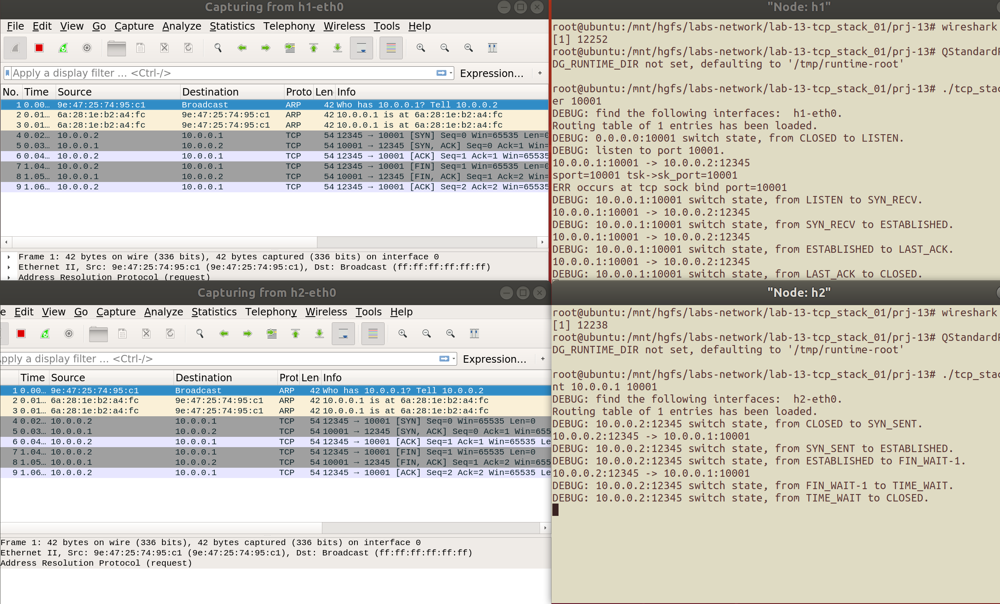
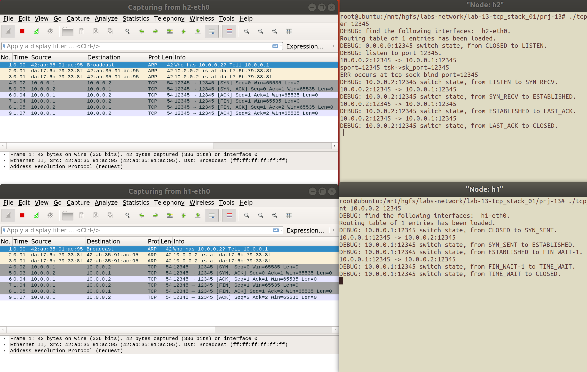

# 网络传输机制实验一<br/>实验报告

<!--实验报告: 模板不限, 内容包括但不限于实验题目/实验内容/实验流程/实验结果及分析-->

## 实验内容

1. 在给定框架中实现最简单的 TCP 连接: 从建立连接到关闭连接.
2. 使用 wireshark 抓包, 验证该连接从建立到关闭过程的正确性.

## 实验流程

### TCP 接收

按照 TCP 状态机, 完成 TCP 接收函数. 由于函数较长, 并且也没有必要展示细节, 故保留主干逻辑展示如下. 控制流中区分了以下 flag(组合):

- SYN
- SYN, ACK
- ACK
- FIN, ACK
- FIN

设计中采用了 switch case 控制流, 更便于阅读, 且更好地模拟了状态机的机制, 避免了使用 if-else 控制流时可能遇到的问题.

```c
void tcp_process(struct tcp_sock *tsk, struct tcp_cb *cb, char *packet) {
    if (!tsk) fprintf(stdout, "No tsk record.\n"); return;

    tsk->snd_una = cb->ack;
    tsk->rcv_nxt = cb->seq_end;

    switch (cb->flags) {
        case TCP_SYN:
            if (tsk->state != TCP_LISTEN) {{...} break;}
            {...} break;
        case (TCP_SYN | TCP_ACK):
            if (tsk->state == TCP_SYN_SENT) wake_up(tsk->wait_connect);
            break;
        case TCP_ACK:
            switch (tsk->state) {
                case TCP_SYN_RECV: {...} break;
                case TCP_FIN_WAIT_1: tcp_set_state(tsk, TCP_FIN_WAIT_2); break;
                case TCP_LAST_ACK: {...} break;
                default:
                    fprintf(stdout, "  [flag=ACK] No rule for %d\n", tsk->state);
            }
            break;
        case (TCP_ACK | TCP_FIN):
            if (tsk->state != TCP_FIN_WAIT_1) {{...} break;}
            {...}
            break;
        case TCP_FIN:
            switch (tsk->state) {
                case TCP_ESTABLISHED: {...} break;
                case TCP_FIN_WAIT_2: {...}break;
                default: fprintf(stdout, "  [flag=FIN] No rule for %d\n",
                            tsk->state);
            }
            break;
        default: fprintf(stdout, "No rule for flag %d\n", cb->flags);
    }
```

### TCP sock 操作

对于传入的 TCP sock, 自减其引用统计域 `ref_cnt` ; 如果该域减为不大于 0 的值, 则释放该 sock 及其所占用的所有资源:

```c
void free_tcp_sock(struct tcp_sock *tsk) {
    // 自减, 检查
    if (--tsk->ref_cnt > 0) return;
    // 符合要求, 释放
    free_wait_struct(tsk->wait_connect);
    free_wait_struct(tsk->wait_accept);
    free_wait_struct(tsk->wait_recv);
    free_wait_struct(tsk->wait_send);
    free_ring_buffer(tsk->rcv_buf);
    free(tsk);
}
```

使用四元组 `(saddr, daddr, sport, dport)` 查找 established table 中匹配的 sock:

```c
struct tcp_sock *tcp_sock_lookup_established(
        u32 saddr, u32 daddr, u16 sport, u16 dport) {
    int id = tcp_hash_function( // 计算索引 (哈希)
             saddr, daddr, sport, dport);
    struct tcp_sock *pos_tsk;
    list_for_each_entry(
            pos_tsk, &tcp_established_sock_table[id],
            hash_list) { // 遍历查找
        if (saddr == pos_tsk->sk_sip // 匹配检查
            && daddr == pos_tsk->sk_dip
            && sport == pos_tsk->sk_sport
            && dport == pos_tsk->sk_dport) {
            return pos_tsk;
        }
    }
    return NULL; // 无功而返
}
```

使用 `sport` 查找 listen table 中匹配的 sock:

```c
struct tcp_sock *tcp_sock_lookup_listen(u32 saddr, u16 sport) {
    int id = tcp_hash_function(  // 计算索引 (哈希)
             0, 0, sport, 0);
    struct tcp_sock *pos_tsk;
    list_for_each_entry(pos_tsk, &tcp_listen_sock_table[id],
                        hash_list) {// 遍历查找
        // 匹配检查
        if (sport == pos_tsk->sk_sport) return pos_tsk;
    }
    return NULL; // 无功而返
}
```

主动发起连接的过程:

```c
int tcp_sock_connect(struct tcp_sock *tsk, struct sock_addr *skaddr) {
    // 四元组初始化
    if (tcp_sock_set_sport(tsk, 0) < 0) {
        fprintf(stdout, "No Available port!\n");
        return -1;
    }
    tsk->sk_sip = ((iface_info_t *) (instance->iface_list.next))->ip;
    tsk->sk_dport = ntohs(skaddr->port);
    tsk->sk_dip = ntohl(skaddr->ip);

    // 将 sock 存入 bind_table
    tcp_hash(tsk);

    // 发送 SYN 包, 转换 state
    tsk->snd_nxt = tsk->iss = tcp_new_iss();
    tcp_set_state(tsk, TCP_SYN_SENT);
    tcp_send_control_packet(tsk, TCP_SYN);
    // 等待接收 SYN 包
    sleep_on(tsk->wait_connect);

    // 等待的 SYN 包到达, 则该过程完成,
    // 转换状态, 发送 ACK 包作为应答
    tcp_set_state(tsk, TCP_ESTABLISHED);
    tcp_send_control_packet(tsk, TCP_ACK);

    return 0;
}
```

监听过程:

1. 根据参数, 设置 tsk 的 backlog 值;
2. 转换状态到 LISTEN, 并将 tsk 存入 listen table.

```c
int tcp_sock_listen(struct tcp_sock *tsk, int backlog) {
    tsk->backlog = backlog;
    tcp_set_state(tsk, TCP_LISTEN);
    return tcp_hash(tsk);
}
```

接受过程:

1. 接收队列空, 则等待接收;
2. 接收队列不空, 则取出队列的第一个 sock, 并接收它

```c
struct tcp_sock *tcp_sock_accept(struct tcp_sock *tsk) {
    while (list_empty(&tsk->accept_queue)) {
        sleep_on(tsk->wait_accept);
    }
    struct tcp_sock *pop_tsk =
            tcp_sock_accept_dequeue(tsk);
    if (pop_tsk != NULL) {
        tcp_set_state(pop_tsk, TCP_ESTABLISHED);
        tcp_hash(pop_tsk);
    }
    return pop_tsk;
}
```

关闭 sock 的过程:

1. 释放占用的资源;
2. 发送 FIN 包;
3. 转换状态到 close.

```c
// close the tcp sock by releasing the resources,
// sending FIN/RST packet to the peer,
// switching TCP_STATE to closed
void tcp_sock_close(struct tcp_sock *tsk) {
    // OK: tcp_sock_close
    if (tsk->parent) {
        while (tsk->state != TCP_CLOSE_WAIT);
    }
    if (tsk->state == TCP_ESTABLISHED) {
        tcp_set_state(tsk, TCP_FIN_WAIT_1);
        tcp_send_control_packet(tsk, TCP_FIN);
    } else if (tsk->state == TCP_CLOSE_WAIT) {
        tcp_set_state(tsk, TCP_LAST_ACK);
        tcp_send_control_packet(tsk, TCP_FIN);
    }
}
```

### TCP 定时器

为 sock 设置 timewait timer, 并将其加入 timer_list.

```c
// set the timewait timer of a tcp sock,
// by adding the timer into timer_list
void tcp_set_timewait_timer(struct tcp_sock *tsk) {
    // OK: tcp_set_timewait_timer
    tsk->timewait.type = 0; // type = timewait
    tsk->timewait.timeout = 0; // prepare for inc op
    list_add_tail(&tsk->timewait.list, &timer_list);
    tsk->ref_cnt += 1;
}
```

扫描定时器列表, 对每一个定时器进行老化, 对 TIMEOUT 的定时器进行处理:

1. 删除计时器;
2. 关闭相应 sock 的 TCP 连接;
3. 如 sock 无 parent, 则将其从 bind_hash 中释放;
4. 释放 sock.

```c
void tcp_scan_timer_list() {
    struct tcp_timer *pos_tt, *q_tt;
    list_for_each_entry_safe(pos_tt, q_tt, &timer_list, list) {
        // 老化
        pos_tt->timeout += TCP_TIMER_SCAN_INTERVAL;
        // 未超时, 跳过
        if (pos_tt->timeout < TCP_TIMEWAIT_TIMEOUT) continue;
        // 超时, 处理释放
        list_delete_entry(&pos_tt->list);
        struct tcp_sock *tsk = timewait_to_tcp_sock(pos_tt);
        tcp_set_state(tsk, TCP_CLOSED);

        if (tsk->parent == NULL) tcp_bind_unhash(tsk);
        tcp_unhash(tsk);
    }
}
```

## 实验结果与分析

将 h1 作为 TCP server, h2 作为 TCP client, 分别执行:

```
h1 # ./tcp_stack server 10001
h2 # ./tcp_stack client 10.0.0.1 10001
```



将 h2 作为 TCP server, h1 作为 TCP client, 分别执行:

```
h2 # ./tcp_stack server 12345
h1 # ./tcp_stack client 10.0.0.2 12345
```



<!-- ## 思考题 -->

<!-- 请将思考/调研结果写到实验报告中 -->

## 实验反思

虽然用 switch-case 控制流来实现 TCP 状态机是很自然而然的想法, 但是也希望了解一下框架作者是怎么设计的.

### 调试中出现过的问题

tcp_process 的 switch-case 中 TCP_SYN 分支中为新 sock 赋值的过程出了一些问题, 导致误报 port in use, 追溯到使用 bind_table 的所有场景后定位 bug 成功.

## 参考资料

对 TCP 状态机的处理参考了以下的两份实验报告中不同控制流的选择:

1. [UCAS-Computer-Network/README.md at master · RenzoTsai/UCAS-Computer-Network](https://github.com/RenzoTsai/UCAS-Computer-Network/blob/master/EXP15-TCP_Stack/README.md)
2. [ucas_network_2020/lab11report.pdf at master · CacaoGatto/ucas_network_2020](https://github.com/CacaoGatto/ucas_network_2020/blob/master/prj11/%E5%AE%9E%E9%AA%8C11%E6%8A%A5%E5%91%8A.pdf)

<!--脚注-->
