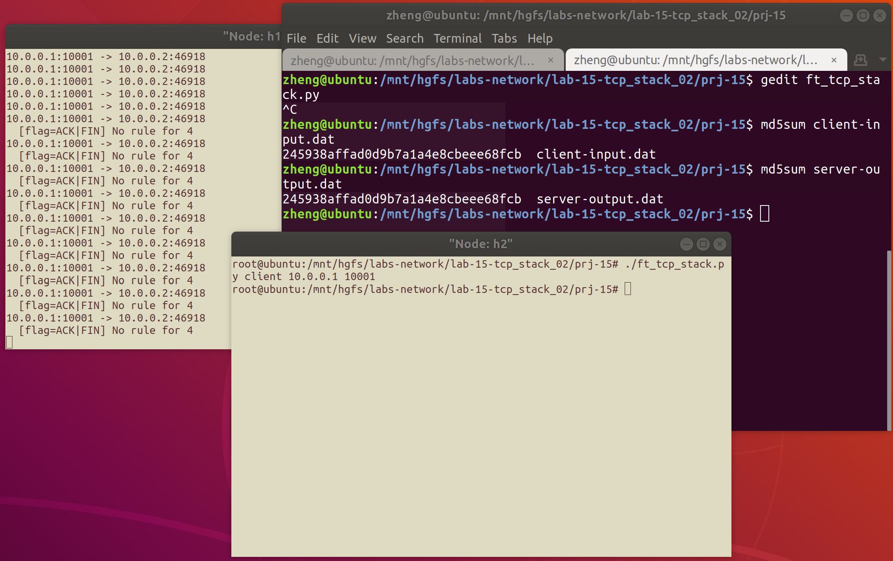

# 网络传输机制实验二<br/>实验报告

<!--实验报告: 模板不限, 内容包括但不限于实验题目/实验内容/实验流程/实验结果及分析-->

## 实验内容

1. 补充 `tcp_sock_read` 和 `tcp_sock_write` ，以实现最简单的数据传输；
2. 调整框架的其他部分，使其适配相关新需求和通用的 API ；
3. 运行指定的网络拓扑，验证程序实现的正确性。

## 实验流程

### `tcp_sock` 读写函数

不论是数据的发送还是接收，为了传输任意长的数据，必然需要一个定长的缓冲区，并围绕其周期性地做数据收发、读写。

下面是 `tcp_sock_write` 函数：

```c
int tcp_sock_write(struct tcp_sock *tsk, char *buf, int len) {
    // 记录信息长度
    int msg_len = min(strlen(buf), len), sent = 0; 
    while (sent < msg_len) { // 发完消息之后退出循环
        // 计算当前 packet 的相关信息
        int not_sent = msg_len - sent;
        int data_len = min(MTU_SIZE, not_sent);
        int pkt_len = TCP_ALL_BASE_SIZE + data_len;
        char *packet = (char *) malloc(pkt_len);
        memcpy(packet + TCP_ALL_BASE_SIZE,
               buf + sent, data_len);
        // 发送本轮循环的 packet
        tcp_send_packet(tsk, packet, pkt_len);
        // 更新已存储数据长度
        sent += data_len;
        // 挂起自己
        sleep_on(tsk->wait_send);
    }
    // 返回发送数据的长度
    return sent;
}
```

接下去是 `tcp_sock_read` 函数，为了保证 ring buffer 的读取不涉及数据竞争，给 ring buffer 加锁：

```c
int tcp_sock_read(struct tcp_sock *tsk, char *buf, int len) {
    // 加锁
    pthread_mutex_lock(&tsk->rcv_buf->rbuf_lock);
    while (ring_buffer_empty(tsk->rcv_buf)) { // 在 ring buffer 非空时开始 read
        pthread_mutex_unlock(&tsk->rcv_buf->rbuf_lock);
        sleep_on(tsk->wait_recv);
        pthread_mutex_lock(&tsk->rcv_buf->rbuf_lock);
    }
    // 退出循环时已经申请到锁
    // 读取 buffer
    int read_len = read_ring_buffer(tsk->rcv_buf, buf, len);
    // 唤醒自己
    wake_up(tsk->wait_recv);
    // 完成操作, 释放锁
    pthread_mutex_unlock(&tsk->rcv_buf->rbuf_lock);
    // 返回读取的长度
    return read_len;
}
```

### TCP 状态机的适配

主要增加了两种情况的处理：

1. 在接收到 ACK 信号时，增加了 sock 为 ESTABLISHED 的情形，在此条件下释放发送等待区的线程；
2. 考虑到 `tcp_send_packet` 发送的 tcp 数据包的标志位为 `PSH` 和 `ACK` ，因此添加应对该情况的状态机。

情况 1：

```c
		case TCP_ACK:
            switch (tsk->state) {
                case ...
                case TCP_ESTABLISHED:
                    wake_up(tsk->wait_send);
                    break;
```

情况 2：

```c
        case (TCP_ACK | TCP_PSH):
            pthread_mutex_lock(&tsk->rcv_buf->rbuf_lock);
            write_ring_buffer(tsk->rcv_buf, cb->payload, cb->pl_len);
            pthread_mutex_unlock(&tsk->rcv_buf->rbuf_lock);
            if (tsk->wait_recv->sleep) wake_up(tsk->wait_recv);
            tcp_send_control_packet(tsk, TCP_ACK);
            if (tsk->wait_send->sleep) wake_up(tsk->wait_send);
            break;
```

### 文件收发相关

增加宏定义 `STRING_DELIVERY` ，支持在编译时刻选择数据传输类型：

- 文件传输
- 字符串传输

服务器端文件接收核心功能：

```c
    fprintf(stdout, "Start receiving file %s from client...\n", DAT_SERVER);
	// 新建文件预备写入，获得指针
    FILE *fp = fopen(DAT_SERVER, "w+"); u32 wlen = 0;
    while (1) {
        // 在文件读取完毕之前不断读入 ring buffer，并写入本地文件
        memset(rbuf, 0, sizeof(rbuf));
        rlen = tcp_sock_read(csk, rbuf, 1000);
        if (rlen == 0) {
            log(DEBUG, "tcp_sock_read return 0, finish transmission."); break;
        } else if (rlen > 0) {
            wlen = fwrite(rbuf, sizeof(char), rlen, fp);
            fflush(fp);
            if (wlen < rlen) {
                fprintf(stdout, "Mistakes during file writing.\n"); break;
            }
        } else {
            log(DEBUG,
                "tcp_sock_read return negative value, something goes wrong.");
            exit(1);
        }
    }
    usleep(100);
    fclose(fp);
```

客户端文件发送核心功能：

```c
	// 尝试打开文件
	FILE *fp = fopen(DAT_CLIENT, "r");
    if (fp) { // 开始读取文件
        fprintf(stdout, "Start sending file %s to the server...\n",
                DAT_CLIENT);
        memset(rbuf, 0, sizeof(rbuf));
        // 不断读取文件，发送文件
        while ((dlen = fread(rbuf, sizeof(char), 1000, fp)) > 0) {
            if (tcp_sock_write(tsk, rbuf, dlen) < 0) {
                fprintf(stdout, "Error encounter when write to buf\n");
                break;
            }
            memset(rbuf, 0, sizeof(rbuf));
            if (feof(fp))break;
            usleep(100);
        }
        // 文件指针指向 EOF，结束读取
        fclose(fp);
        fprintf(stdout, "Finish sending process.\n");
    } else { // 文件获取失败
        fprintf(stdout, "File %s not found.\n", DAT_CLIENT);
    }
```

## 实验结果与分析

### Basic: 字符串传输

功能正常完成，示意图如下：


### 文件传输

功能正常完成，示意图如下：


<!-- ## 思考题 -->

<!-- 请将思考/调研结果写到实验报告中 -->

## 实验反思

### 调试中出现过的问题

在与使用通用 API 的脚本协同测试时遇到过下图中的问题，最终的解决方案是调整 TCP 状态机。从中可以知道，TCP 协议是复杂的，并且我们的实验只是它的一个精简子集，要在框架需求内适配还需要做一些原考虑之外的设计。



## 参考资料

无。

<!--脚注-->
