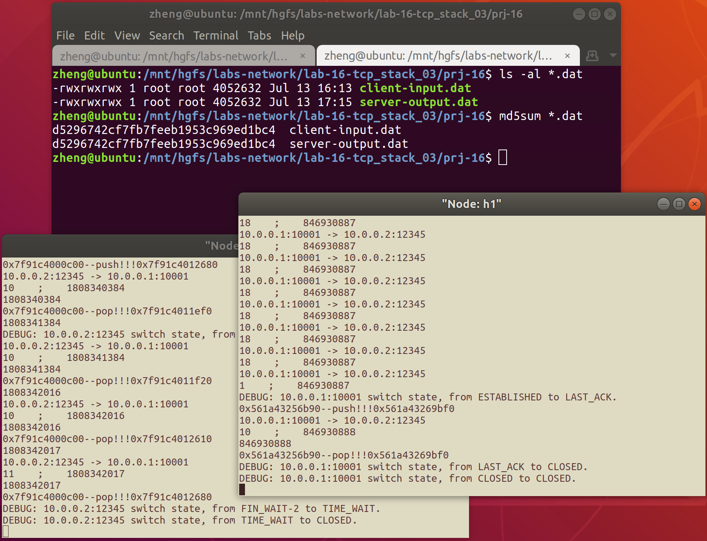

# 网络传输机制实验三<br/>实验报告

<!--实验报告: 模板不限, 内容包括但不限于实验题目/实验内容/实验流程/实验结果及分析-->

## 实验内容

增加超时重传的支持，使节点在有丢包网络中也能建立连接并正确传输数据：

1. 维护 sock 中的重传计时器；
2. 在计时器的基础上实现超时重传机制。

使用有丢包网络拓扑脚本进行测试，验证该实现的正确性。

## 实验流程

### 超时重传机制

#### 重传定时器

为保证 `timer_list` 的操作不出现数据竞争, 引入 `timer_lock` , 每一次操作 `timer_list` 时都需要申请锁.

支持超时重传, 需要添加开启/设置重传计时器的方法:

```c
// set retransmission timer for sock
void tcp_set_retrans_timer(struct tcp_sock *tsk) {
    tsk->retrans_timer.type = 1; // type = retrans
    tsk->retrans_timer.timeout = 0; // prepare for inc op
    pthread_mutex_lock(&timer_lock);
    struct tcp_timer *pos_tmr;
    list_for_each_entry(pos_tmr, &timer_list, list) {
        // 如果该 tsk 的 retrans timer 已经存在, 则不做操作, 退出函数
        if (retranstimer_to_tcp_sock(pos_tmr) == tsk)
            pthread_mutex_unlock(&timer_lock); return;
    }
    list_add_tail(&tsk->retrans_timer.list, &timer_list);
    tsk->ref_cnt += 1;
    pthread_mutex_unlock(&timer_lock);
}
```

同时也需要添加释放 retrans timer 资源的方法:

```c
// unset retransmission timer for sock
void tcp_unset_retrans_timer(struct tcp_sock *tsk) {
    pthread_mutex_lock(&timer_lock);
    // 释放与 retrans timer 有关的资源
    list_delete_entry(&tsk->retrans_timer.list);
    tsk->ref_cnt -= 1;
    pthread_mutex_unlock(&timer_lock);
}
```

#### 定时器扫描/触发

在 `tcp_scan_timer_list` 中, 根据 timer 的种类选择对应的处理方式, 本实验中增加了对重传计时器的处理支持, 如 `case 1` 所示:

```c
case 1: // retrans
    tsk = retranstimer_to_tcp_sock(pos_tt);
    pthread_mutex_lock(&tsk->send_lock);
    struct send_buffer *pos_buf;
    list_for_each_entry(
            pos_buf, &tsk->send_buf, list) {
        pos_buf->timeout -= TCP_TIMER_SCAN_INTERVAL;
        if (!pos_buf->timeout) {
            // 超时, 触发超时重传处理机制
            if (pos_buf->times++ == 3) {
                /* 重传超过 3 次, RST */
                // close sock like:
                // tcp_sock_close(tsk);
                // free_tcp_sock(tsk);
                // ...
            } else { // 重设计时器的时间
                char *tmp = (char *) malloc(
                        pos_buf->len * sizeof(char));
                memcpy(tmp, pos_buf->packet, pos_buf->len);
                ip_send_packet(tmp, pos_buf->len);
                buf->timeout = (2 << buf->times)
                            * TCP_RETRANS_INTERVAL_INITIAL;
            }
        }
    }
    pthread_mutex_unlock(&tsk->send_lock);
    break;
```

### 发送队列维护

- 所有未确认的数据/SYN/FIN 包，在收到其对应的 ACK 之前，都要放在发送队列 send_buffer 中，以备后面可能的重传。
- 发送新的数据时，放到 send_buffer 队尾，打开定时器。
- 收到新的 ACK，将 snd_buffer 中已经确认的数据包移除，并更新定时器。
- 重传定时器触发时，重传 snd_buffer 中第一个数据包，定时器数值翻倍。

根据上面的设计要求, `PushSendBuf` 函数应该在 `tcp_send_packet` (对应数据包) 与 `tcp_send_control_packet` 函数 (对应 SYN/FIN 包) 中使用, 而 `PopSendBuf` 函数则在 TCP 状态机中使用 (依据收到的 ack 信息来判断).

#### 队列维护所用到的工具函数

将 `send_buffer` push 入队列的函数:

```c
void PushSendBuf(struct tcp_sock *tsk, char *packet, int size) {
    char *temp = (char *) malloc(sizeof(char) * size);
    memcpy(temp, packet, sizeof(char) * size);
    struct send_buffer *buf =
            (struct send_buffer *) malloc(sizeof(struct send_buffer));
    buf->packet = temp;
    buf->len = size;
    buf->seq_end = tsk->snd_nxt;
    buf->times = 1;
    buf->timeout = TCP_RETRANS_INT;
    pthread_mutex_lock(&tsk->send_lock);
    list_add_tail(&buf->list, &tsk->send_buf);
    pthread_mutex_unlock(&tsk->send_lock);
    pthread_mutex_lock(&tsk->count_lock);
    tsk->send_buf_count++;
    pthread_mutex_unlock(&tsk->count_lock);
}
```

将 `send_buffer` pop 出队列的函数:

```c
void PopSendBuf(struct tcp_sock *tsk, struct send_buffer *buf) {
    pthread_mutex_lock(&tsk->send_lock);
    list_delete_entry(&buf->list);
    if (buf->packet) free(buf->packet);
    else fprintf(stdout, "[Hint] empty packet!!!");
    free(buf);
    pthread_mutex_unlock(&tsk->send_lock);
    pthread_mutex_lock(&tsk->count_lock);
    tsk->send_buf_count--;
    pthread_mutex_unlock(&tsk->count_lock);
}
```

### 接收队列维护

数据接收方需要维护两个队列:

- 已经连续收到的数据，放在 rcv_ring_buffer 中供 app 读取
- 收到不连续的数据，放到 rcv_ofo_buffer 队列（链表实现）中

TCP 属于发送方驱动传输机制:

- 接收方只负责在收到数据包时回复相应 ACK

收到不连续的数据包时:

- 放在 rcv_ofo_buffer 队列
- 如果队列中包含了连续数据，则将其移到 rcv_ring_buffer 中

以上的处理策略中 ofo buffer 的部分在 TCP 状态机中将以如下的封装函数实现:

```c
static int tcp_recv_psh_ack_tool(struct tcp_sock *tsk, struct tcp_cb *cb) {
    pthread_mutex_lock(&tsk->rcv_buf->rbuf_lock);
    u32 seq_end = tsk->rcv_nxt;
    if (seq_end > cb->seq) {
        pthread_mutex_unlock(&tsk->rcv_buf->rbuf_lock);
        tcp_send_control_packet(tsk, TCP_ACK);
        return 1;
    } else if (seq_end == cb->seq) {
        write_ring_buffer(tsk->rcv_buf,
                          cb->payload, cb->pl_len);
        seq_end = cb->seq_end;
        struct ofo_buffer *pos_ofo, *q_ofo;
        list_for_each_entry_safe(pos_ofo, q_ofo, &tsk->rcv_ofo_buf, list) {
            if (seq_end < pos_ofo->seq) break;
            seq_end = pos_ofo->seq_end;
            write_ring_buffer(pos_ofo->tsk->rcv_buf, pos_ofo->payload,
                              pos_ofo->pl_len);
            list_delete_entry(&pos_ofo->list);
            free(pos_ofo->payload);
            free(pos_ofo);
        }
        tsk->rcv_nxt = seq_end;
    pthread_mutex_unlock(&tsk->rcv_buf->rbuf_lock);

    if (tsk->wait_recv->sleep) wake_up(tsk->wait_recv);
    tcp_send_control_packet(tsk, TCP_ACK);
    if (tsk->wait_send->sleep) wake_up(tsk->wait_send);

    return 0;
}
```

#### 队列维护所用到的工具函数

```c
void WriteOfoBuf(struct tcp_sock *tsk, struct tcp_cb *cb) {
    struct ofo_buffer *buf =
            (struct ofo_buffer *) malloc(sizeof(struct ofo_buffer));
    buf->tsk = tsk;
    buf->seq = cb->seq;
    buf->seq_end = cb->seq_end;
    buf->pl_len = cb->pl_len;
    buf->payload = (char *) malloc(buf->pl_len);
    memcpy(buf->payload, cb->payload, buf->pl_len);
    struct ofo_buffer head_ext;
    head_ext.list = tsk->rcv_ofo_buf;
    int insert = 0;
    struct ofo_buffer *pos, *last = &head_ext;
    list_for_each_entry(pos, &tsk->rcv_ofo_buf, list) {
        if (cb->seq > pos->seq) {
            last = pos;
            continue;
        } else if (cb->seq == pos->seq) return;
        list_insert(&buf->list, &last->list, &pos->list);
        insert = 1;
        break;
    }
    if (!insert) list_add_tail(&buf->list, &tsk->rcv_ofo_buf);
}
```

## 实验结果与分析

如图, 测试结果符合要求:



## 实验反思

在 DEBUG 过程中对编程习惯的反思:

1. 对关键量需要维护好互斥访问机制;
2. 在多线程编程中, 一定要保证互斥量等先初始化再访问.

此外, 本次实验中我意识到 TCP 状态机应该以当前的 sock state 作为主要依据, 在特定 state 下对收到的控制信息 (cb) 做出对应的反馈, 因此把状态机的内外 switch(case) 进行了替换, 这样更加符合设计的控制逻辑, 同时也规避了一些重复的方法和难以想到的 corner case error.
