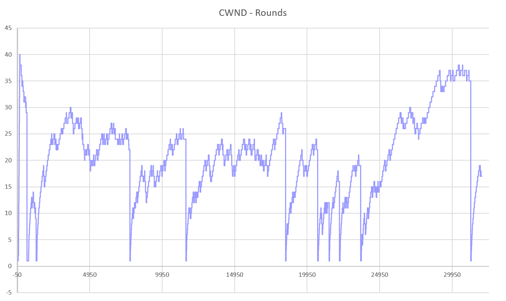

# 网络传输机制实验四<br/>实验报告

<!--实验报告: 模板不限, 内容包括但不限于实验题目/实验内容/实验流程/实验结果及分析-->

## 实验内容

实现 TCP 拥塞控制机制：

1. 维护拥塞控制状态迁移；
2. 根据当前状态控制数据包发送；
3. 实现快重传、快恢复。

使用有丢包网络拓扑脚本进行测试，验证该实现的正确性，并记录 h2 中每次 cwnd 调整的时间和相应值，呈现到二维坐标图中。


## 实验流程

### 拥塞状态机

#### 状态迁移

根据接收的 ACK 消息进行相应的状态转换：

```c
/* 重复 ACK：累计计数，用以判定拥塞 */

// 外层循环省略
if (cb->ack == tsk->snd_una) {
            tsk->rep_ack++;
            switch (tsk->cgt_state) {
                case OPEN:
                    if (tsk->rep_ack > 2) {...} else break;
                case RCVR:
                    if (tsk->rep_ack > 1) {
                        tsk->rep_ack -= 2;
                        tsk->cwnd -= 1;
                        if (tsk->cwnd < 1) tsk->cwnd = 1; // 防止出现负数的trick
                    }
                    break;
                default:
                    break;
            }
```


#### 慢启动与拥塞避免

慢启动 (Slow Start)：

- 每收到一个报文段的 ACK，cwnd 增加 1 MSS，直到 cwnd 超过 ssthresh 值；
- 经过 1 个 RTT，前一个 cwnd 的所有数据被确认后， cwnd 大小翻倍

拥塞避免 (Congestion Avoidance)：

- 超过 ssthresh 后进入该阶段
- 对方每确认一个报文段，cwnd 增加 $\frac{1\ MSS}{CWND}\times 1 \ MSS$
- 经过 1 个 RTT，前一个 cwnd 的所有数据被确认后， cwnd 增加 1 MSS

```c
static inline void tcp_cwnd_inc(struct tcp_sock *tsk) {
    if (tsk->cgt_state != OPEN) return;
    if (tsk->cwnd < tsk->ssthresh) { // 慢启动
        tsk->cwnd += 1;
    } else { // 拥塞避免
        tsk->cwnd_unit++;
        if (tsk->cwnd_unit >= tsk->cwnd) {
            tsk->cwnd_unit = 0;
            tsk->cwnd++;
        }
    }
}
```

#### 快恢复

- 快重传之后立刻进入快恢复
- 若对方确认了进入快恢复状态前发送的所有数据时，进入 OPEN 状态
- 若触发 RTO，进入 LOSS 状态
- 收到 ACK：
  - 确认了新数据，则根据恢复点的情况选择重传或退出快恢复阶段
  - 未确认新数据，则在途数据包自减，允许发送一个新的数据包

```c
			switch (tsk->cgt_state) {
                case RCVR:
                    if (less_or_equal_32b(tsk->recovery_point, cb->ack)) {
                        // 重传包恢复完毕，可以切换回 open
                        tsk->cgt_state = OPEN;
                    } else { // 快恢复
                        char *temp = (char *) malloc(buf->len * sizeof(char));
                        memcpy(temp, buf->packet, buf->len);
                        ip_send_packet(temp, buf->len);
                    }  break;
                case LOSS:
                    if (less_or_equal_32b(tsk->recovery_point, cb->ack)) {
                        // 重传包恢复完毕，可以切换回 open
                        tsk->cgt_state = OPEN;
                    } break;
                default: break;
            }
```

#### 维护恢复点

在快恢复中，需要通过恢复点判断是 partial ACK 还是 full ACK. 

以下是超时重传中恢复点的维护操作：

```c
					// 在超时重传被触发时应当记录恢复点，
				    // 并完成相关操作（切换状态，改变门限值和cwnd等）
					if (tsk->cgt_state != LOSS)
                        tsk->recovery_point = tsk->snd_nxt;
                        tsk->cgt_state = LOSS;
                        tsk->ssthresh = (tsk->cwnd + 1) / 2;
                        tsk->cwnd = 1;
                        tsk->snd_wnd = MTU_SIZE;
```


### 维护发送窗口

以下是根据 tcp 协议栈设计更新发送窗口的操作：

```c
// 更新的 tcp_update_window
	// 通告的接收窗口=控制块记录的接收窗口
	tsk->adv_wnd = cb->rwnd;
	// 发送窗口取 “接收窗口” 和 “本地已知拥塞窗口” 的最小值
    tsk->snd_wnd = min(tsk->adv_wnd, tsk->cwnd * (MTU_SIZE));
```


### 记录拥塞窗口变化

为了方便实现，采用定时 dump 当前轮次序号和 cwnd 的方式进行记录：

```c
struct tcp_sock* time_rec_sock;

void *tcp_record_thread(){
    int round = 1;
    while (1) {
        usleep(1000);
        char line[100];
        sprintf(line, "%d,%d\n", round++, time_rec_sock->cwnd);
        fwrite(line, sizeof(char), strlen(line), record_file);
    }
}
```

实验数据将被存入 `myLog.csv` ，以便后续作图。


## 实验结果与分析

#### 传输正确性

实验中，采用脚本默认的丢包率和 3~60 MB 大小不等的示例数据进行测试，均能够通过 md5sum 检验。

#### 拥塞控制状况

利用实验中嵌入的 “record” 代码，定时记录轮次和当前 CWND 大小并写入 csv 文件，作图后可以得到如下的图表：



以上图表是在测试 60 MB 数据时得到的。由图中可以看到：

1. cwnd 减半：快重传
2. cwnd 降为最低值：超时重传
3. cwnd 增加的斜率变化：慢启动-拥塞避免
4. ……

由于此处 cwnd 的单位是 MSS，因此粒度较粗，细微的变化可能反映不到，这是有些遗憾的，但以上的图表也基本能够反映整个拥塞控制机制在传输中的作用情况了。
